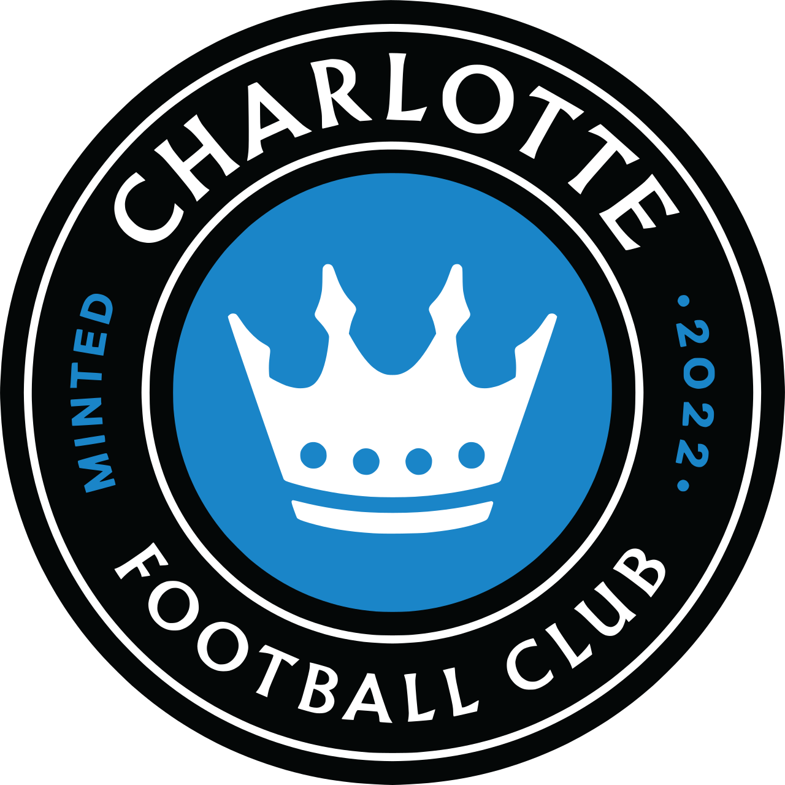
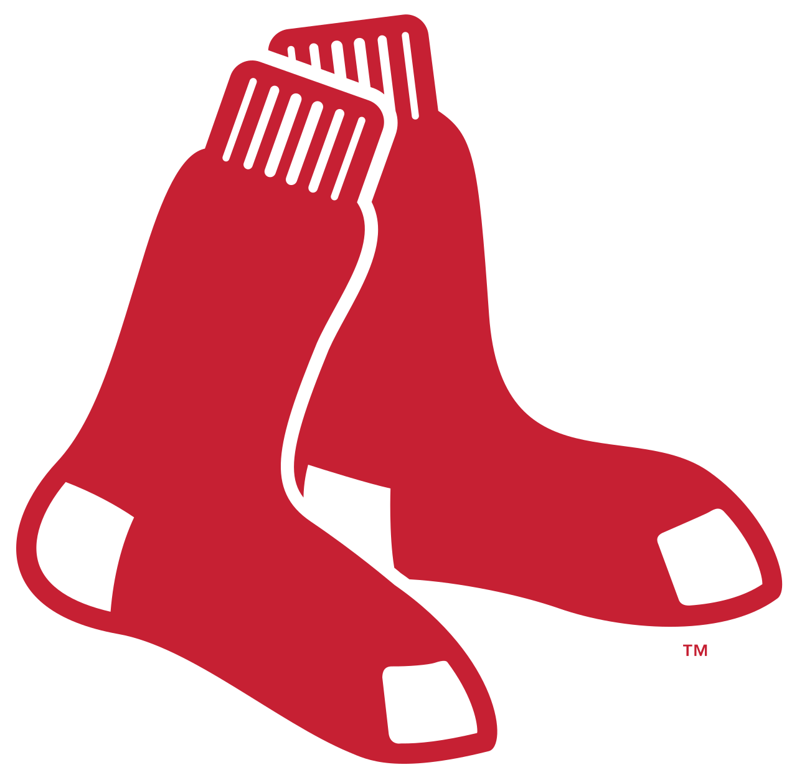
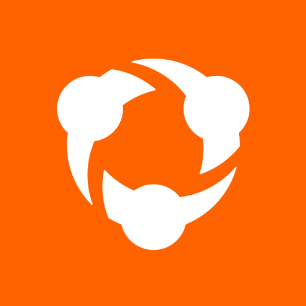

# Introduction

## Plan for today

::: timeline
::: {.event data-label="9:30"}
Opening remarks + program overview
:::

::: {.event data-label="10:45"}
Visit from Jess Paschke
:::

::: {.event data-label="11:00"}
Academic advisor presentation (Glenn)
:::

::: {.event data-label="11:30-12:30"}
Lunch (Baker Hall 129Q)
:::

::: {.event data-label="1:30"}
Lab
:::
:::

## Who are we? 

Erin Franke (preferred form of address: Erin)

* CMSACamp '21
* Intern for Minnesota Twins in Summer '22
* Macalester College '23: Statistics major, CS & Econ minors
* Statistical Programmer @ Mayo Clinic
* Research at CMU: applications in wastewater-based epidemiology, education, psychology, sports analytics (marathon)

## Who are we? 

Sara Colando (preferred form of address: Sara)

* CMSACamp '23
* Pomona College '24: Math and Philosophy double major

## Who are we? 

* TAs: Princess Allotey, Yuchen Chen, JungHo Lee

* CMSACamp Director: Ron Yurko

* CMSACamp Advisor: Glenn Clune

* CMSACamp Coordinator: Jess Paschke

## Meet the students! 

Let's first go around and share

* Name 
* Where you call home
* College + year in school
* Major
* Favorite sport
* What you are most excited for about CMSACamp

# About CMSACamp

## Goals

* Develop fundamentals research skills: data wrangling, visualization, modeling, communication

* Become familiar with `R`, `tidyverse`, Quarto (Markdown syntax), Git/GitHub

* Become familiar with cutting-edge statistical machine learning techniques

* Create a portfolio of projects and practice reproducible research

* Network with academic researchers and industry professionals

* Help navigate your next steps---industry vs. graduate school

* Optionally, present at CMSAConference in October!

## Project advisors this year include

:::: {.columns}

::: {.column width="20%"}

:::

::: {.column width="20%"}

:::

::: {.column width="20%"}

:::

::: {.column width="20%"}

:::

::: {.column width="20%"}

:::

::::

...and some more pending
  
## Resources to save

* [Website](https://36-SURE.github.io/2026)

* [Google Calendar](https://calendar.google.com/calendar/u/0?cid=Y19hNjQ5YzM2YjAxNTlkOWVmZWJiMjhiNmEzZTYzMGU2NzEyNmNlNTkyNjNkNWFlMjdhNDA5OTEwYTQwMGIyYjYzQGdyb3VwLmNhbGVuZGFyLmdvb2dsZS5jb20)

* [Slack](https://join.slack.com/t/cmsacamp2026/shared_invite/zt-3yarqs513-jUxV5sVoujcnwPYQI1baKQ)

* Email

Check these frequently!

# Schedule (subject to change)

## A typical day 

* Lectures 

* Speaker/webinar sessions

* Labs

Optional

* *Lunch: ~1x week, will be updated on calendar as we have more information.*

* Office Hours
  
  * Erin: 11-12, Tuesdays
  * Glenn: 12-1, Tuesdays
  * Sara: 11-12, Thursdays

## Lectures

**Mon--Fri, 9:30--11:00am, Scaife 236**

. . .

* First ~2 weeks: EDA, basic data science tasks

. . .
  
* Next ~4 weeks: statistical modeling, machine learning

. . .
  
* After that: special topics, guest lectures

<!-- . . . -->

. . .

A few scheduling notes:

* Holidays: Juneteenth (Friday June 19) and Independence Day break (July 2--3 + weekend)

. . .

* Thursday July 9: Pirates vs. Braves game at PNC Park

## Labs

**Mon--Fri, 1:30--3pm**

**Scaife 236**
  
* Demo labs (Mon-Wednesday this week) + 1-2 later on

* Project labs

    * will begin with a mini EDA project
    
    * then shift to focus on main capstone project

## Speaker/webinar sessions

**Check calendar! Either mid-day (in between lecture and lab) or after lab**

**Scaife 236 / Zoom, depending on speaker**

Lots of project pitches this week and next week, then guest lectures as summer goes on

## EDA project

* Practice understanding the structure of a dataset and perform basic EDA tasks (e.g., data wrangling, data visualization) in `R`, and using GitHub for collaboration

* Work in groups of 2--3

* Timeline

  *   Release date: Thursday, June 4
  
  *   6-minute presentation (no notes/scripts) on Tuesday, June 16 during lab 

## Capstone project

* Work with a external advisor to analyze a dataset and answer a research question that is relevant in the respective sport.

* Work in groups of 2--3

* Presentation checkpoint(s) (no notes/scripts)

* Deliverables (more details will be provided later on)

  * Report
  * Poster 
  * Presentation

## Reminders

* Fill out the survey forms (Communication and Data Science Background)

* Reset CMU wifi password (for non-CMU students)

* Check Calendar, Slack, email often

## Tips

* This is a *research* program. Feel free to go above and beyond & explore things that aren't taught in lectures

. . .

* Focus on principles, tools are incidental (i.e. it's more important to get how things work first over just how to do things)

. . .

* Don’t expect to get all the concepts in one go (instead, repetition... do more & read more)

## Expectations

* In-person attendance

  * Be on time. PLEASE. 
  
  * This applies to lectures, labs, other sessions (e.g., webinars, guest speakers, other activities)
  
  * This is part of the Code of Conduct
  
* Participate and ask questions

* Work together. Help and support each other.

* Enjoy, learn and grow

## Exploring Pittsburgh

