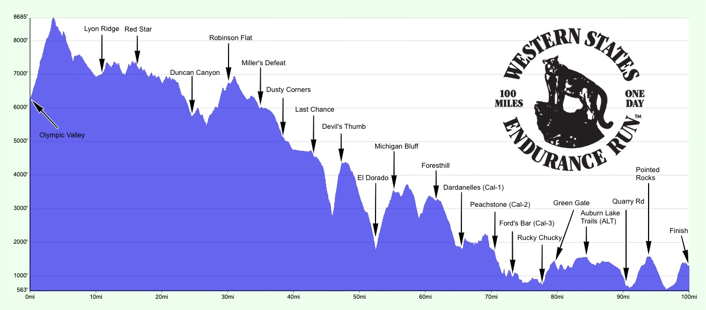

```{r}
#| include: false
knitr::opts_chunk$set(
  echo = TRUE,
  message = FALSE,
  warning = FALSE,
  fig.align = "center"
)
```

# Background

## Quantitative data

Two different versions of quantitative data:

**Discrete**: countable and has clear space between values (i.e. whole number only)

- Examples: number of goals scored in a game, number of children in a family

**Continuous**: can take any value within some interval

- Examples: price of houses in Pittsburgh, water temperature, wind speed

## Data

We will explore [ultra trail running data](https://github.com/rfordatascience/tidytuesday/blob/main/data/2021/2021-10-26/readme.md) courtesy of TidyTuesday and Benjamin Nowak of the [International Trail Running Association (ITRA)](https://itra.run/Races/FindRaceResults).

The data was pre-processed for this lecture (steps shown in appendix). 

```{r}
library(tidyverse)
ggplot2::theme_set(ggplot2::theme_light(base_size = 20)) # setting the ggplot theme

runs <- read_csv("https://raw.githubusercontent.com/36-SURE/2026/main/data/ultra_running.csv") 
race_stats_2019 <- read_csv("https://raw.githubusercontent.com/36-SURE/2026/main/data/ultra_races_2019.csv")
```

## Western States Endurance Run

For the majority of the lecture, we will be using race results from the [Western States Endurance Run](https://www.wser.org/). 

```{r}
wser <- runs |>
  filter(event == "Western States Endurance Run")
```

{width=70%}

[Highlights from Western States 2024](https://www.youtube.com/watch?v=jRwNQjOhkcM)

# 1D quantitative data

## Summarizing 1D quantitative data

- Center: mean, median, number and location of modes

. . .

- Spread: range, variance, standard deviation, IQR, etc.

. . .

- Shape: skew vs symmetry, outliers, heavy vs light tails, etc.

. . .

Compute various statistics in `R` with `summary()`, `mean()`, `median()`, `quantile()`, `range()`, `sd()`, `var()`, etc.

. . .

Example: Summarizing the finishing time (in hours) of Western States runners

```{r}
summary(wser$time_in_hours)

sd(wser$time_in_hours, na.rm = TRUE)
```

## Boxplots visualize summary statistics

::::: columns
::: {.column width="50%" style="text-align: left;"}
Pros:

- Displays outliers, percentiles, spread, skew

- Useful for side-by-side comparison

Cons:

- Does not display the full distribution shape

- Does not display modes

:::

::: {.column width="50%" style="text-align: left;"}
```{r}
#| fig-height: 4
wser |> 
  ggplot(aes(x = time_in_hours)) +
  geom_boxplot() +
  theme(axis.text.y = element_blank())+
  labs(x= 'Time (hours)')
```
:::
:::::

## Histograms display 1D continuous distributions

::::: columns
::: {.column width="50%" style="text-align: left;"}
$\displaystyle \text{# total obs.} = \sum_{j=1}^k \text{# obs. in bin }j$

Pros:

- Displays full shape of distribution

- Easy to interpret

Cons:

- Have to choose number of bins and bin locations (will revisit later)
:::

::: {.column width="50%" style="text-align: left;"}
```{r}
#| fig-height: 9
wser |> 
  ggplot(aes(x = time_in_hours)) +
  geom_histogram()+
  labs(x= "Time (hours)")
```
:::
:::::

## Density plots are a smoothed, continuous version of a histogram

::::: columns
::: {.column width="50%" style="text-align: left;"}
Pros:

- Bin-free

- Excellent for comparing multiple categories at once

- Easy to view full shape of distribution

Cons:

- No individual data points or frequency count

- Smooth curve can sometimes extend into ranges where no real data exists 
  
:::

::: {.column width="50%" style="text-align: left;"}
```{r}
wser |> 
  ggplot(aes(x = time_in_hours)) +
  geom_density()+
  labs(x= "Time (hours)")
```
:::
:::::

We will talk more about density estimation on Monday!

## Display the data points directly with beeswarm plots

::::: columns
::: {.column width="50%" style="text-align: left;"}
Pros:

- Displays each data point

- Easy to view full shape of distribution

Cons:

- Can be overbearing with large datasets

- Which algorithm for arranging points? 
  - [A few different methods](https://github.com/eclarke/ggbeeswarm#alternative-methods-1)
  
:::

::: {.column width="50%" style="text-align: left;"}
```{r}
library(ggbeeswarm)
wser |> 
  ggplot(aes(x = time_in_hours, y = "")) +
  geom_beeswarm(cex = 1, size = 0L)+
  labs(x= "Time (hours)", y="")
```
:::
:::::

## Smooth summary with violin plots

::::: columns
::: {.column width="50%" style="text-align: left;"}
Pros:

- Displays full shape of distribution

- Can easily layer...

:::

::: {.column width="50%" style="text-align: left;"}
```{r}
wser |> 
  ggplot(aes(x = time_in_hours, y = "")) +
  geom_violin()+
  labs(x= "Time (hours)", y ="")
```
:::
:::::

## Smooth summary with violin plots + box plots

::::: columns
::: {.column width="50%" style="text-align: left;"}
Pros:

- Displays full shape of distribution

- Can easily layer... with box plots on top

Cons:

- Summary of data via density estimate (no sample size)

- Mirror image is duplicate information

- May be harder to interpret for general audience
:::

::: {.column width="50%" style="text-align: left;"}
```{r}
wser |> 
  ggplot(aes(x = time_in_hours, y = "")) +
  geom_violin() +
  geom_boxplot(width = 0.25)+
  labs(x= "Time (hours)", y = "")
```
:::
:::::

## What do visualizations of continuous distributions display?

Probability that continuous variable $X$ takes a particular value is 0

e.g. $P($ `time_in_hours` $= 24) = 0$ (why?)

For continuous variables, the cumulative distribution function (CDF) is $$F(x) = P(X \leq x)$$

For $n$ observations, the empirical CDF (ECDF) can be computed based on the observed data $$\hat{F}_n(x)  = \frac{\text{# obs. with variable} \leq x}{n} = \frac{1}{n} \sum_{i=1}^{n} I (x_i \leq x)$$

where $I()$ is the indicator function, i.e. `ifelse(x_i <= x, 1, 0)`

## Display full distribution with ECDF plot

::::: columns
::: {.column width="50%" style="text-align: left;"}
Pros:

- Displays all of your data at once

- As $n \rightarrow \infty$, the ECDF $\hat F_n(x)$ converges to the true CDF $F(x)$

Cons:

- What are the cons?

:::

::: {.column width="50%" style="text-align: left;"}
```{r}
#| fig-height: 9
wser |> 
  ggplot(aes(x = time_in_hours)) +
  stat_ecdf()+
  labs(x= "Time (hours)")
```
:::
:::::

## Zooming in on our ECDF

::::: columns
::: {.column width="50%" style="text-align: left;"}

- On the previous plot, we have enough data points that the ECDF looks like a smooth curve 

- Keep in mind, however, while the CDF is a curve, the ECDF is a step function 

  - Each jump size of $1/n$ is a single observed point 

:::

::: {.column width="50%" style="text-align: left;"}

```{r}
#| fig-height: 9
wser |> 
  ggplot(aes(x = time_in_hours)) +
  stat_ecdf()+
  coord_cartesian(xlim = c(16, 17), ylim = c(0.01, 0.03))+
  labs(x= "Time (hours)")
```
:::
:::::

## Rug plots display raw data

::::: columns
::: {.column width="50%" style="text-align: left;"}
Pros:

- Displays raw data points

- Useful supplement for summaries and 2D plots

Cons:

- Can be overbearing for large datasets
:::

::: {.column width="50%" style="text-align: left;"}
```{r}
#| fig-height: 9
wser |> 
  ggplot(aes(x = time_in_hours)) +
  geom_rug(alpha = 0.3)+
  labs(x= "Time (hours)")
```
:::
:::::

## Rug plots supplement other displays

::::: columns
::: {.column width="50%" style="text-align: left;"}
```{r}
#| fig-height: 9
wser |> 
  ggplot(aes(x = time_in_hours, y = "")) +
  geom_violin() +
  geom_rug(alpha = 0.3)+
  labs(x= "Time (hours)")
```
:::

::: {.column width="50%" style="text-align: left;"}
```{r}
#| fig-height: 9
wser |> 
  ggplot(aes(x = time_in_hours)) +
  stat_ecdf() +
  geom_rug(alpha = 0.3)+
  labs(x= "Time (hours)")
```
:::
:::::

# 2D quantitative data

## Summarizing 2D quantitative data

- Direction/trend (positive, negative)

- Strength of the relationship (strong, moderate, weak)

- Linearity (linear, non-linear)

. . .

Big picture

- Scatterplots are by far the most common visual

- Regression analysis is by far the most popular analysis (coming in *t - 2* weeks!)

- Relationships may vary across other variables, e.g., categorical variables

**Note**: for this section, we will be using our `race_stats_2019` dataset to compare 80+ ultramarathon races that took place in 2019!

## Making scatterplots

::::: columns
::: {.column width="50%" style="text-align: left;"}
- Use `geom_point()`: each point is a race

- Displaying the joint (bivariate) distribution

- Adjust transparency with `alpha` to visualize overlap

  - Provides better understanding of joint frequency
  
  - Especially important with larger datasets
  
  - See also: [`ggblend`](https://mjskay.github.io/ggblend/)
:::

::: {.column width="50%" style="text-align: left;"}
```{r}
#| fig-height: 9
race_stats_2019 |> 
  ggplot(aes(x = elevation_gain, y = mean_finish_time)) +
  geom_point(color = "navy", size = 4, alpha = 0.5)+
  scale_x_continuous(labels = scales::label_comma())+
  labs(x = "Elevation Gain (m)", y = "Avg finish time (hrs)")
```
:::
:::::

## Summarizing 2D quantitative data

::::: columns
::: {.column width="50%" style="text-align: left;"}

```{r}
#| echo: false
#| fig-height: 9
race_stats_2019 |> 
  ggplot(aes(x = elevation_gain, y = mean_finish_time)) +
  geom_point(color = "navy", size = 4, alpha = 0.5)+
  scale_x_continuous(labels = scales::label_comma())+
  labs(x = "Elevation Gain (m)", y = "Avg finish time (hrs)")
```
:::

::: {.column width="50%" style="text-align: left;"}
Correlation coefficient

```{r}
cor(race_stats_2019$elevation_gain, 
    race_stats_2019$mean_finish_time, 
    use = "complete.obs")
```

Note: the default correlation you get from `cor()` is Pearson correlation coefficient

Other correlations:

- [Spearman's correlation](https://en.wikipedia.org/wiki/Spearman's_rank_correlation_coefficient)

- [Kendall rank correlation coefficient](https://en.wikipedia.org/wiki/Kendall_rank_correlation_coefficient)

- and more
:::
:::::

## Displaying trend line: linear regression<br>(a preview)

::::: columns
::: {.column width="50%" style="text-align: left;"}
- Display regression line for<br>`mean finish time ~ elevation gain`

- 95% confidence intervals by default

- Estimating the conditional expectation of `mean finish time` \| `elevation gain`

  - $\mathbb{E}[$ `mean finish time` $\mid$ `elevation gain` $]$
:::

::: {.column width="50%" style="text-align: left;"}
```{r}
#| fig-height: 9
race_stats_2019 |> 
  ggplot(aes(x = elevation_gain, y = mean_finish_time)) +
  geom_point(color = "navy", size = 4, alpha = 0.5)+
  geom_smooth(method = "lm", linewidth = 2)+
  labs(x = "Elevation Gain (m)", y = "Avg finish time (hrs)")
```
:::
:::::

## Summarizing 2D quantitative data

::::: columns
::: {.column width="50%" style="text-align: left;"}
Add rug plots to supplement scatterplot

```{r}
#| eval: false
race_stats_2019 |> 
  ggplot(aes(x = elevation_gain, y = mean_finish_time)) +
  geom_point(color = "navy", size = 4, alpha = 0.5) +
  geom_rug(alpha = 0.4)+
  labs(x = "Elevation Gain (m)", y = "Avg finish time (hrs)")
```
:::

::: {.column width="50%" style="text-align: left;"}
```{r}
#| echo: false
#| fig-height: 9
race_stats_2019 |> 
  ggplot(aes(x = elevation_gain, y = mean_finish_time)) +
  geom_point(color = "navy", size = 4, alpha = 0.5)+
  geom_rug(alpha = 0.4)+
  labs(x = "Elevation Gain (m)", y = "Avg finish time (hrs)")
```
:::
:::::

## Pairs plot

```{r}
#| fig-height: 7.5
library(GGally)
race_stats_2019 |> 
  ungroup() |>
  select(elevation_gain, elevation_loss, mean_finish_time, n_finishers) |> 
  ggpairs(aes(alpha=0.3)) # note: alpha in aes() here, even though it is not a variable
```

# Continuous by categorical data

## Continuous by categorical: side by side plots

::::: columns
::: {.column width="50%" style="text-align: left;"}

```{r, eval=F}
#| fig-height: 8
wser <- wser |>
  mutate(age_grp = case_when(age <= 39 ~ "22-39", 
                             age > 39 & age <= 49 ~ "40-49", 
                             age > 49 & age <= 59 ~ "50-59", 
                             age > 59 ~ "60+"))
  
wser |> 
  ggplot(aes(x = time_in_hours, y = age_grp))+
  geom_boxplot()+
  labs(x = "Time (hours)", y = "Age group")
```

:::

::: {.column width="50%" style="text-align: right;"}

```{r, echo=F}
#| fig-height: 8
wser <- wser |>
  mutate(age_grp = case_when(age <= 39 ~ "22-39", 
                             age > 39 & age <= 49 ~ "40-49", 
                             age > 49 & age <= 59 ~ "50-59", 
                             age > 59 ~ "60+"))
  
wser |> 
  ggplot(aes(x = time_in_hours, y = age_grp))+
  geom_boxplot()+
  labs(x = "Time (hours)", y = "Age group")
```
:::
:::::

## Continuous by categorical: ECDF

```{r}
#| fig-height: 8
wser |> 
  ggplot(aes(x = time_in_hours, color = age_grp)) +
  stat_ecdf(linewidth = 1) +
  theme(legend.position = "bottom")+
  scale_color_viridis_d()+
  labs(x = "Time (hours)", color = "Age group")
```

## Continuous by categorical: density plot

```{r}
#| fig-height: 8
 wser |> 
  ggplot(aes(x = time_in_hours, color = age_grp)) +
  geom_density() +
  scale_color_viridis_d()+
  labs(color = "Age group", x = "Time (hours)")
```

## Continuous by categorical: ridgeline plot 

For more, see [this tutorial](https://cran.r-project.org/web/packages/ggridges/vignettes/introduction.html)

```{r}
#| fig-height: 8
library(ggridges)
wser |> 
  ggplot(aes(x = time_in_hours, y = age_grp, fill = age_grp)) +
  geom_density_ridges(scale = 1.5)+
  scale_fill_viridis_d()+
  labs(x = "Time (hours)", y = "Age group")+
  theme(legend.position = "none")
```

## What about for histograms?

```{r}
#| fig-height: 8
 wser |> 
  ggplot(aes(x = time_in_hours, fill = age_grp)) +
  geom_histogram(bins = 15) +
  scale_fill_viridis_d(alpha = 0.6)+
  labs(fill = "Age group", x = "Time (hours)")
```

## What about facets?

[Difference between `facet_wrap` and `facet_grid`](https://ggplot2-book.org/facet)

```{r}
#| fig-height: 5
#| fig-width: 15
wser |>
  ggplot(aes(x = time_in_hours)) +
  geom_histogram(bins = 15) +
  facet_wrap(~ age_grp, nrow = 1)+
  labs(x= "Time (hours)")
```

## What about facets?

```{r}
#| fig-height: 8
#| fig-width: 7
wser |> 
  ggplot(aes(x = time_in_hours)) +
  geom_histogram(bins = 15) +
  facet_grid(age_grp ~ ., margins = TRUE)+
  labs(x = "Time (hours)")
```

## Appendix: Pre-processing steps

```{r, eval=F}
ultra_rankings <- read_csv('https://raw.githubusercontent.com/rfordatascience/tidytuesday/master/data/2021/2021-10-26/ultra_rankings.csv')
race <- read_csv('https://raw.githubusercontent.com/rfordatascience/tidytuesday/master/data/2021/2021-10-26/race.csv')

# join race results with course information 
runs <- ultra_rankings |> 
  # include race information for each race completed by a runner
  left_join(race, by = "race_year_id") |> 
  # remove incomplete races or races < ~100 miles
  filter(!is.na(time_in_seconds) & distance > 150) |> 
  # convert time in seconds to hours
  mutate(time_in_hours = (time_in_seconds/60)/60) 

# 2019 ultramarathon race course information 
race_stats_2019 <- runs |> 
  # only keep results from 2019 (courses can change year to year)
  filter(year(date) == 2019) |>
  # a race may have multiple events, so we group by both variables 
  group_by(race, event) |> 
  # number of finishers for particular race event 
  mutate(n_finishers = n()) |> 
  # only keep race events with at least 50 finishers
  filter(n_finishers >= 50) |> 
  # average time of finishers for particular race event
  mutate(mean_finish_time = mean(time_in_hours)) |>
  # collapse across individuals: we only want course information
  distinct(race, event, elevation_gain, elevation_loss, n_finishers, mean_finish_time) 

```

<!-- ::: columns -->

<!-- ::: {.column width="50%" style="text-align: left;"} -->

<!-- c1 -->

<!-- ::: -->

<!-- ::: {.column width="50%" style="text-align: left;"} -->

<!-- c2 -->

<!-- ::: -->

<!-- ::: -->
