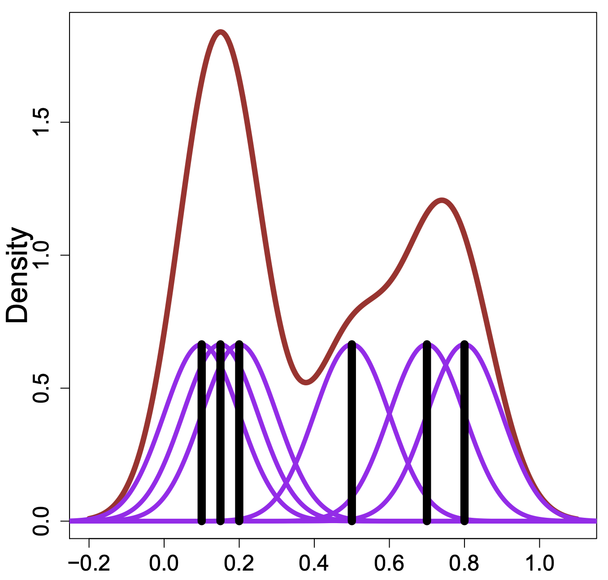

```{r}
#| include: false
knitr::opts_chunk$set(
  echo = TRUE,
  message = FALSE,
  warning = FALSE,
  fig.align = "center"
)
# ggplot2::theme_set(ggplot2::theme_light(base_size = 20))
```

# Background

## Data: A'ja Wilson's shots

Shot attempts by the [A'ja Wilson](https://en.wikipedia.org/wiki/A%27ja_Wilson) in the 2025 WNBA season using [`wehoop`](https://wehoop.sportsdataverse.org/)

```{r}
#| warning: false
#| message: false
library(tidyverse)
theme_set(theme_light())
wilson_shots <- read_csv("https://raw.githubusercontent.com/36-SURE/2026/main/data/wilson_shots.csv")
glimpse(wilson_shots)
```

```{r}
#| echo: false
ggplot2::theme_set(ggplot2::theme_light(base_size = 20))
```

. . .

-   Each row is a shot attempt by A'ja Wilson in the 2025 WNBA season

-   **Categorical**/qualitative variables: `scoring_play`, `shot_type`

-   **Continuous**/quantitative variables: `shot_x`, `shot_y`, `shot_distance`, `score_value`

## Revisiting [histograms](https://ggplot2.tidyverse.org/reference/geom_histogram.html)

```{r}
#| label: shot-dist-hist
#| eval: false
wilson_shots |>
  ggplot(aes(x = shot_distance)) +
  geom_histogram()
```

::: columns
::: {.column width="50%" style="text-align: left;"}
-   Split observed data into **bins**

-   **Count** number of observations in each bin

**Need to choose the number of bins**, adjust with:

-   `bins`: number of bins (default is 30)

-   `binwidth`: width of bins (overrides `bins`), various [rules of thumb](https://en.wikipedia.org/wiki/Histogram)

-   `breaks`: vector of bin boundaries (overrides both `bins` and `binwidth`)
:::

::: {.column width="50%" style="text-align: left;"}
```{r}
#| ref-label: "shot-dist-hist"
#| fig-height: 9
#| echo: false
```
:::
:::

## Adjusting the binwidth

::: columns
::: {.column width="50%" style="text-align: left;"}
**Small** `binwidth` $\rightarrow$ undersmooth/spiky

```{r}
#| label: shot-dist-hist-small
#| fig-height: 9
wilson_shots |>
  ggplot(aes(x = shot_distance)) +
  geom_histogram(binwidth = 0.5)
```
:::

::: {.column width="50%" style="text-align: left;"}
**Large** `binwidth` $\rightarrow$ oversmooth/flat

```{r}
#| label: shot-dist-hist-large
#| fig-height: 9
wilson_shots |>
  ggplot(aes(x = shot_distance)) +
  geom_histogram(binwidth = 5)
```
:::
:::

## Adjusting the binwidth

-   A binwidth that is too narrow shows too much detail

    - too many bins: low bias, high variance
    
. . .

-   A binwidth that is too wide hides detail

    - too few bins: high bias, low variance
    
. . .    

-   Always pick a value that is "just right" ([The Goldilocks principle](https://en.wikipedia.org/wiki/Goldilocks_principle))

**Try several values, the `ggplot2` default is NOT guaranteed to be an optimal choice**

## A subtle point about the histogram code...

::: columns
::: {.column width="50%" style="text-align: left;"}
By default the bins are centered on the integers

-   left-closed, right-open intervals
-   starting at -0.5 to 0.5, 0.5 to 1.5, ...

```{r}
#| fig-height: 8
wilson_shots |>
  ggplot(aes(x = shot_distance)) +
  geom_histogram(binwidth = 1)
```
:::

::: {.column width="50%" style="text-align: left;"}
**Specify center of one bin** (e.g. 0.5)

-   Use `closed = "left"`

```{r}
#| label: shot-dist-hist-shift
#| fig-height: 8
wilson_shots |>
  ggplot(aes(x = shot_distance)) +
  geom_histogram(binwidth = 1, center = 0.5,
                 closed = "left")
```
:::
:::

## How do histograms relate to the PDF & CDF?

* Remember: we use the **probability density function (PDF)** to provide a **relative likelihood**

* PDF is the **derivative** of the cumulative distribution function (CDF)

* Histograms approximate the PDF with bins, and **points are equally likely within a bin**


::: columns
::: {.column width="50%" style="text-align: left;"}
```{r}
#| label: shot-dist-hist-left
#| echo: false
#| fig-height: 7
wilson_shots |>
  ggplot(aes(x = shot_distance)) + 
  geom_histogram(binwidth = 1, center = 0.5, closed = "left") +
  geom_rug(alpha = 0.3) +
  labs(x = "Shot distance (in feet)",
       y = "Number of shot attempts")
```
:::

::: {.column width="50%" style="text-align: left;"}
```{r}
#| label: shot-dist-ecdf-right
#| echo: false
#| fig-height: 7
wilson_shots |>
  ggplot(aes(x = shot_distance)) + 
  stat_ecdf() +
  geom_rug(alpha = 0.3) +
  labs(x = "Shot distance (in feet)",
       y = "Proportion of shot attempts")
```
:::
:::

# Density estimation
    
## Kernel density estimation: intuition
    
*  smooth each data point into a small density bumps
*  sum all these small bumps together to obtain the final density estimate

Check out this great [interactive tutorial](https://mathisonian.github.io/kde/)

```{r}
#| echo: false

```

## Kernel density estimation (KDE)

**Overarching Goal**: estimate the PDF $f(x)$ for all possible values (assuming it is smooth)

. . .

The kernel density estimator (KDE) is $\displaystyle \hat{f}(x) = \frac{1}{n} \sum_{i=1}^n \frac{1}{h} K_h(x - x_i) = \frac{1}{n} \sum_{i=1}^n \frac{1}{h} K \left(\frac{x-x_i}{h}\right)$

. . .

-   $n$: sample size

-   $h$: **bandwidth**, analogous to histogram binwidth, ensures $\hat{f}(x)$ integrates to 1

-   $x$: location where we want to estimate the density $f(x)$: does not have to be in dataset!
  
    - Example: $x=3$: how much evidence do the observed data points provide for probability density around 3?

-   $x_i$: $i$th observation in the dataset

## Kernel density estimation (KDE)

**Overarching Goal**: estimate the PDF $f(x)$ for all possible values (assuming it is smooth)

The kernel density estimator (KDE) is $\displaystyle \hat{f}(x) = \frac{1}{n} \sum_{i=1}^n \frac{1}{h} K \left(\frac{x-x_i}{h}\right)$

::: {.incremental}
- $|x - x_i|$: how far evaluation point $x$ is from observation $x_i$

- $\frac{x - x_i}{h}$: expresses distance in units of bandwidth

  - If $h=2$, then being 1 unit away is considered "closer" than in each $h = 0.5$

- $K\left(\frac{x - x_i}{h}\right)$: **kernel** function, creates a **weight** from the scaled distance

  - weight is large when $x_i$ is close to $x$
  
  - As $h$ becomes large, the weight of one data point $x_i$ becomes indistinguishable from the influence of any other data point 
  
- The $\frac{1}{h}$ outside of the kernel function rescales kernel so that it remains a valid density integrating to 1, regardless of bandwidth. 
  
:::
    
## Choice of [kernel](https://en.wikipedia.org/wiki/Kernel_(statistics))

The Gaussian (normal) kernel is typically used, but there are many other choices

```{r}
#| echo: false
#| out-width: 60%
knitr::include_graphics("https://scikit-learn.org/stable/_images/sphx_glr_plot_kde_1d_002.png")
```

## Visualizing KDE

::: columns
::: {.column width="50%" style="text-align: left;"}
-   We make **kernel density estimates** with [`geom_density()`](https://ggplot2.tidyverse.org/reference/geom_density.html)

```{r}
#| label: curve
#| eval: false 
wilson_shots |>
  ggplot(aes(x = shot_distance)) + 
  geom_density() +
  geom_rug(alpha = 0.3)
```

-   **Pros**:
    -   Displays full shape of distribution
    -   Can easily layer
    -   Add categorical variable with color
-   **Cons**:
    -   Need to pick bandwidth and kernel...
:::

::: {.column width="50%" style="text-align: left;"}
```{r, ref.label="curve", echo=FALSE, fig.height=9}

```
:::
:::

## What about the bandwidth?

See `?geom_density` for the default bandwidth

Modify the bandwidth using the `adjust` argument (value to multiply default bandwidth by)

::: columns
::: {.column width="50%" style="text-align: left;"}
```{r curve-noisy, fig.height=8}
wilson_shots |>
  ggplot(aes(x = shot_distance)) + 
  geom_density(adjust = 0.5) +
  geom_rug(alpha = 0.3)
```
:::

::: {.column width="50%" style="text-align: left;"}
```{r curve-smooth, fig.height=8}
wilson_shots |>
  ggplot(aes(x = shot_distance)) + 
  geom_density(adjust = 2) +
  geom_rug(alpha = 0.3)
```
:::
:::

## Notes on density estimation

For the same data, multiple factors affect the shape of the density curve!

. . .

*   If the bandwidth is too small, the density estimate can become overly peaky and the main trends in the data may be obscured

. . .

*   If the bandwidth is too large, then smaller features in the distribution of the data may disappear

. . . 

*   The choice of the kernel can affect the shape of the density curve.

    *   A Gaussian kernel typically gives density estimates that look bell-shaped (ish)

    *   A rectangular kernel can generate the appearance of steps in the density curve  

    *   Kernel choice matters less with more data points
    
. . . 
    
**Density plots are often reliable and informative for large datasets but can be misleading for smaller ones.**

## Use density curves and ECDFs together

```{r shot-dist-curve-ecdf, echo = FALSE, fig.width=16, fig.align='center', fig.height=7}
library(cowplot)

wilson_shot_dens <- wilson_shots |>
  ggplot(aes(x = shot_distance)) + 
  geom_density() +
  geom_rug(alpha = 0.3) +
  theme_bw() +
  labs(x = "Shot distance (in feet)",
       y = "Number of shot attempts")

wilson_shot_ecdf <- wilson_shots |>
  ggplot(aes(x = shot_distance)) + 
  stat_ecdf() +
  geom_rug(alpha = 0.3) +
  theme_bw() +
  labs(x = "Shot distance (in feet)",
       y = "Proportion of shot attempts")

# library(patchwork)
# wilson_shot_dens + wilson_shot_ecdf
plot_grid(wilson_shot_dens, wilson_shot_ecdf)
```

## Code interlude: arranging multiple figures

Use the [`cowplot`](https://wilkelab.org/cowplot/index.html) package to easily arrange your plots (see also [`patchwork`](https://patchwork.data-imaginist.com/))

```{r ref.label='shot-dist-curve-ecdf', eval = FALSE}

```

## Use density curves and ECDFs together

```{r shot-dist-curve-ecdf-color, echo = FALSE, fig.width=20, fig.align='center', fig.height=9}
wilson_shot_dens_made <- wilson_shots |>
  ggplot(aes(x = shot_distance, 
             color = scoring_play)) + 
  geom_density() +
  geom_rug(alpha = 0.3) +
  labs(x = "Shot distance (in feet)",
       y = "Number of shot attempts")

wilson_shot_ecdf_made <- wilson_shots |>
  ggplot(aes(x = shot_distance,
             color = scoring_play)) + 
  stat_ecdf() +
  geom_rug(alpha = 0.3) +
  labs(x = "Shot distance (in feet)",
       y = "Proportion of shot attempts")

library(patchwork)
wilson_shot_dens_made + wilson_shot_ecdf_made + plot_layout(guides = "collect")
```

## Another code interlude: [collect the legends](https://patchwork.data-imaginist.com/articles/guides/layout.html#controlling-guides) with `patchwork`

```{r ref.label='shot-dist-curve-ecdf-color', eval = FALSE}

```

## Ridgeline plots

::: columns
::: {.column width="50%" style="text-align: left;"}

* Check out the [`ggridges`](https://cran.r-project.org/web/packages/ggridges/vignettes/introduction.html) package for a variety of customization options

```{r ridges, eval = FALSE}
library(ggridges)
wilson_shots |>
  ggplot(aes(x = shot_distance, y = shot_type)) + 
  geom_density_ridges(rel_min_height = 0.01) 
```

* Useful to display conditional distributions across many levels

* Also check out [`ggdist`](https://mjskay.github.io/ggdist/) 

:::

::: {.column width="50%" style="text-align: left;"}
```{r ref.label = 'ridges', echo = FALSE, fig.height=10}
```
:::
:::

## Going from 1D to 2D density estimation

In 1D: estimate density $f(x)$, assuming that $f(x)$ is _smooth_:

$$
\hat{f}(x) = \frac{1}{n} \sum_{i=1}^n \frac{1}{h} K\left(\frac{x - x_i}{h}
\right)
$$

. . .

In 2D: estimate joint density $f(x_1, x_2)$

$$\hat{f}(x_1, x_2) = \frac{1}{n} \sum_{i=1}^n \frac{1}{h_1h_2} K\left(\frac{x_1 - x_{i1}}{h_1}\right) K\left(\frac{x_2 - x_{i2}}{h_2}\right)$$

. . .

In 1D there's one bandwidth, now __we have two bandwidths__

* $h_1$: controls smoothness as $X_1$ changes, holding $X_2$ fixed
* $h_2$: controls smoothness as $X_2$ changes, holding $X_1$ fixed

Think of it like going from each observation contributing a bump on a line to a bump on a plane.

## Display densities for 2D data: contour plots

Best known in topography: outlines (contours) denote levels of elevation

```{r, echo = FALSE, out.width="60%", fig.align='center'}
knitr::include_graphics("https://images.squarespace-cdn.com/content/v1/5cb6391f7980b3404bf57113/1573157765676-YX6XBYP01AORIHYCTUSR/3d+Topp+Greenbelly.co.png")
```


## 2D density estimation

We can visualize all of the shot locations: (`shot_x`, `shot_y`)

::: columns
::: {.column width="50%" style="text-align: left;"}
```{r}
#| label: shot-loc-points
#| eval: false
wilson_shots |>
  ggplot(aes(x = shot_x, y = shot_y)) +
  geom_point(size = 4, alpha = 0.3)
```

Adjust transparency with `alpha` for overlapping points
:::

::: {.column width="50%" style="text-align: left;"}
```{r ref.label = 'shot-loc-points', echo = FALSE, fig.height=9}
# ref
```
:::
:::

## Create contours of 2D kernel density estimate

::: columns
::: {.column width="50%" style="text-align: left;"}
-   Use [`geom_density2d()`](https://ggplot2.tidyverse.org/reference/geom_density_2d.html) to display contour lines

```{r}
#| label: shot-loc-points-contour
#| eval: false
wilson_shots |>
  ggplot(aes(x = shot_x, y = shot_y)) + 
  geom_point(size = 4, alpha = 0.3) + 
  geom_density2d() +
  coord_fixed() +
  theme(legend.position = "bottom")
```

-   Inner lines denote "peaks"

-   `coord_fixed()` forced a fixed ratio

:::

::: {.column width="50%" style="text-align: left;"}
```{r}
#| ref-label: "shot-loc-points-contour"
#| echo: false
#| fig-height: 9
```
:::
:::

## Create contours of 2D kernel density estimate

::: columns
::: {.column width="50%" style="text-align: left;"}

Similar with 1D KDE, we can use `adjust` to modify the multivariate bandwidth

```{r}
#| label: shot-loc-points-contour-adjust
#| eval: false
wilson_shots |>
  ggplot(aes(x = shot_x, y = shot_y)) + 
  geom_point(size = 4, alpha = 0.3) + 
  geom_density2d(adjust = 0.3) +
  coord_fixed() +
  theme(legend.position = "bottom")
```

:::

::: {.column width="50%" style="text-align: left;"}
```{r}
#| ref-label: "shot-loc-points-contour-adjust"
#| echo: false
#| fig-height: 9
```
:::
:::

## Contours are difficult... what about heatmaps?

::: columns
::: {.column width="50%" style="text-align: left;"}

Divide the space into a grid and color the grid according to high/low values

```{r}
#| label: shot-loc-points-heatmap-tile
#| eval: false
wilson_shots |>
  ggplot(aes(x = shot_x, y = shot_y)) + 
  stat_density2d(aes(fill = after_stat(density)),
                 h = c(0.6, 0.6), bins = 100, contour = FALSE,
                 geom = "raster") +
  scale_fill_gradient(low = "midnightblue", 
                      high = "gold") +
  theme(legend.position = "bottom", 
        legend.key.size = unit(1.5, "cm")) +
  coord_fixed()
```
:::

::: {.column width="50%" style="text-align: left;"}
```{r}
#| ref-label: "shot-loc-points-heatmap-tile"
#| echo: false
#| fig-height: 9
```
:::
:::

## Hexagonal binning is a nice alternative

::: columns
::: {.column width="50%" style="text-align: left;"}
-   Use [`geom_hex()`](https://ggplot2.tidyverse.org/reference/geom_hex.html) to make **hexagonal heatmaps**

-   Need to have the [`hexbin`](https://cran.r-project.org/web/packages/hexbin/index.html) package installed

-   2D version of histogram

-   Can specify `binwidth` in both directions

-   Avoids limitations from smoothing

```{r}
#| label: shot-loc-points-hex
#| eval: false
wilson_shots |>
  ggplot(aes(x = shot_x, y = shot_y)) + 
  geom_hex(binwidth = c(1, 1)) +
  scale_fill_gradient(low = "midnightblue", 
                      high = "gold") + 
  theme(legend.position = "bottom") +
  coord_fixed()
```
:::

::: {.column width="50%" style="text-align: left;"}
```{r}
#| ref-label: "shot-loc-points-hex"
#| echo: false
#| fig-height: 9
```
:::
:::

## What about shooting efficiency?

Can compute a function of another variable inside hexagons with [`stat_summary_hex()`](https://ggplot2.tidyverse.org/reference/stat_summary_2d.html)

::: columns
::: {.column width="50%" style="text-align: left;"}
```{r}
#| label: shot-loc-hex-make
#| eval: false
wilson_shots |>
  ggplot(aes(x = shot_x, y = shot_y, 
             z = scoring_play, group = 1)) +
  stat_summary_hex(binwidth = c(2, 2), fun = mean, 
                   color = "black", linewidth = 0.05) +
  scale_fill_gradient(low = "midnightblue", 
                      high = "gold") + 
  theme(legend.position = "bottom", 
        legend.key.size = unit(1.5, "cm")) +
  coord_fixed()
```
:::

::: {.column width="50%" style="text-align: left;"}
```{r}
#| ref-label: "shot-loc-hex-make"
#| echo: false
#| fig-height: 9
```
:::
:::

## Appendix: Making shot charts and drawing courts with [`sportyR`](https://sportyr.sportsdataverse.org/)

```{r}
#| fig-height: 7
library(sportyR)
wnba_court <- geom_basketball("wnba", display_range = "offense", rotation = 270, x_trans = -41.5)
wnba_court +
  geom_hex(data = wilson_shots, aes(x = shot_x, y = shot_y), binwidth = c(1, 1)) + 
  scale_fill_gradient(low = "midnightblue", high = "gold")
```

## Appendix: Density estimation in Erin's CMSACamp project

[Presentation](https://sarahsult.github.io/cmsacamp_baseball_project/Presentations/CMSAConference%20Presentation/CMSAConference_presentation.html#5)


## Appendix: Code to build dataset

```{r}
#install.packages("wehoop")
library(wehoop)
wnba_pbp <- load_wnba_pbp(2025)
wilson_shots <- wnba_pbp |> 
  filter(shooting_play == T) |> 
  filter(str_detect(text, "A'ja Wilson")) |> 
  filter(!str_detect(text, "A'ja Wilson assists")) |> 
  filter(!str_detect(text, "free throw")) |> 
  mutate(
    shot_x = coordinate_x_raw - 25,
    shot_y = coordinate_y_raw,
    shot_distance = sqrt((abs(shot_x) ^ 2) + shot_y ^ 2), 
    shot_type = type_text,
    scoring_play,
    score_value,
    .keep = "none"
  )
```