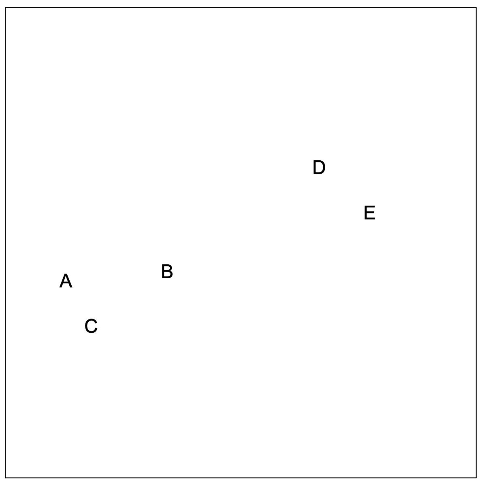
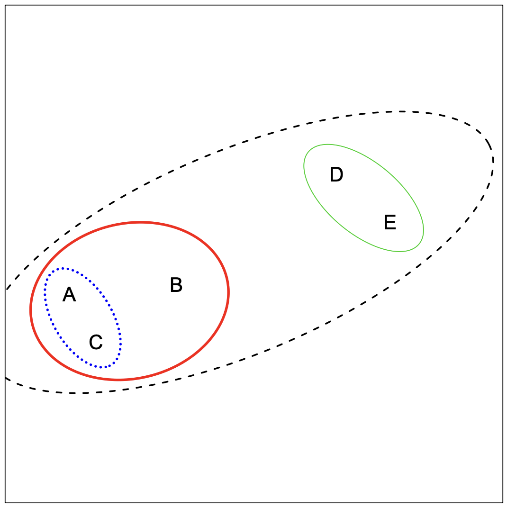
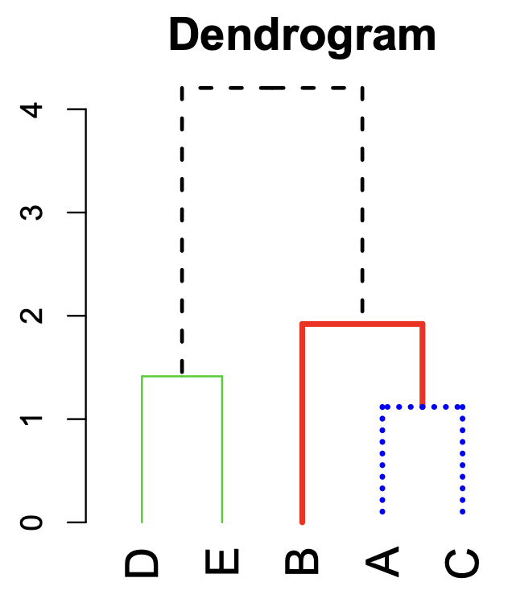

```{r}
#| include: false
knitr::opts_chunk$set(
  echo = TRUE,
  message = FALSE,
  warning = FALSE,
  fig.align = "center"
)
set.seed(101)
```

# Background

## The big picture

* $k$-means clustering: partition the observations into a pre-specified number of clusters

::: {.incremental}
* Hierarchical clustering: does not require commitment to a particular choice of clusters

  *   In fact, we end up with a tree-like visual representation of the observations, called a dendrogram
  
  *   This allows us to view at once the clusterings obtained for each possible number of clusters
  
  *   Common approach: agglomerative (bottom-up) hierarchical clustering: build a dendrogram starting from the leaves and combining clusters up to the trunk
  
  *   There's also divisive (top-down) hierarchical clustering: start with one large cluster and then break the cluster recursively into smaller and smaller pieces
  
:::

## The big picture: visually

```{r}
#| echo: false
#| out-width: 60%
knitr::include_graphics("https://towardsdatascience.com/wp-content/uploads/2021/05/1VvOVxdBb74IOxxF2RmthCQ.png")
```

## Data: NBA player statistics per 100 possessions (2025-26 regular season)

```{r load-data, warning = FALSE, message = FALSE}
library(tidyverse)
theme_set(theme_light())
nba_players <- read_csv("https://raw.githubusercontent.com/36-SURE/2026/main/data/nba_players.csv")
glimpse(nba_players)
```

```{r}
#| echo: false
ggplot2::theme_set(ggplot2::theme_light(base_size = 20))
```

## General setup

::: columns
::: {.column width="50%" style="text-align: left;"}

-   Given a dataset with $p$ variables (columns) and $n$ observations (rows) $x_1,\dots,x_n$

-   Compute the **distance/dissimilarity** between observations

-   e.g. **Euclidean distance** between observations $i$ and $j$

$$d_{ij} = \sqrt{(x_{i1}-x_{j1})^2 + \cdots + (x_{ip}-x_{jp})^2}$$

**What are the distances between these players using `x3pa` (3-point attempts) and `trb` (total rebounds)?**

```{r}
#| label: nba-start-plot
#| eval: false
#| echo: false
nba_players |> 
  ggplot(aes(x = x3pa, y = trb)) +
  geom_point(size = 4, alpha=0.7)
```
:::

::: {.column width="50%" style="text-align: left;"}

<br>

```{r}
#| ref-label: nba-start-plot
#| fig-height: 7
```
:::
:::

## Remember to standardize!

::: columns
::: {.column width="50%" style="text-align: left;"}

```{r}
#| label: nba-std-plot
#| eval: false
nba_players <- nba_players |> 
  mutate(
    std_x3pa = as.numeric(scale(x3pa)),
    std_trb = as.numeric(scale(trb))
  )

nba_players |> 
  ggplot(aes(x = std_x3pa, y = std_trb)) +
  geom_point(size = 4) +
  coord_fixed()
```
:::

::: {.column width="50%" style="text-align: left;"}
```{r}
#| ref-label: nba-std-plot
#| echo: false
#| fig-height: 9
```
:::
:::

## Compute the distance matrix using `dist()`

-   Compute pairwise Euclidean distance

```{r}
players_dist <- nba_players |> 
  select(std_x3pa, std_trb) |> 
  dist()
```

-   Returns an object of `dist` class... but not a `matrix`

-   Convert to a matrix, then set the row and column names:

```{r}
players_dist_matrix <- as.matrix(players_dist)
rownames(players_dist_matrix) <- nba_players$player
colnames(players_dist_matrix) <- nba_players$player
players_dist_matrix[1:4, 1:4]
```

# Hierarchical clustering

## Hierarchical clustering in simple terms

::: columns
::: {.column width="70%" style="text-align: left;"}

* Key idea: Builds a hierarchy in a agglomerative/bottom-up fashion

* Algorithm (informal version)

  * Start with each point in its own cluster

  * Identify the closest two clusters and merge them

  * Repeat

  * Ends when all points are in a single cluster
  
:::

::: {.column width="30%" style="text-align: left;"}

Toy example

```{r}
#| echo: false
#| out-width: 80%

```

:::
:::

## Toy example

::: columns
::: {.column width="50%" style="text-align: left;"}

```{r}
#| echo: false
#| out-width: 90%

```
  
:::

::: {.column width="50%" style="text-align: left;"}

```{r}
#| echo: false
#| out-width: 70%

```


:::
:::


## Hierarchical clustering

Start with all observations in their own cluster

. . .

-   Step 1: Compute the pairwise dissimilarities between each cluster

    -   e.g., distance matrix on previous slides (using Euclidean distance)
    
    -   In practice, we can also try out different types of distance

. . .

-   Step 2: Identify the pair of clusters that are **least dissimilar**

. . .

-   Step 3: Fuse these two clusters into a new cluster

. . .

-   **Repeat Steps 1 to 3 until all observations are in the same cluster**

. . .

**"Bottom-up"**, agglomerative clustering that forms a **tree/hierarchy** of merging

No mention of any randomness! And no mention of the number of clusters $k$!


## Dissimilarity between clusters

* We know how to compute distance/dissimilarity between two observations

. . .

* But what about distance/dissimilarity between a cluster and an observation, or between two clusters?

. . .

* We need to choose a **linkage function**. Clusters are built up by **linking them together**


## Linkages

* Linkage: function $d(C_1, C_2)$ that takes two groups (clusters) $C_1$ and $C_2$ and returns a dissimilarity score between them

. . .

* First, compute all pairwise dissimilarities between the observations in the two clusters (i.e., compute the distance matrix between observations)

. . .

* Agglomerative clustering, given the linkage:

  * Start with all points in their own cluster

  * Until there is only one cluster, repeatedly: merge the two clusters $C_1$, $C_2$ such that $d(C_1, C_2)$ is the smallest
  
. . .

* There are different types of linkage: complete, single, average,...

## Complete linkage

In complete linkage, we use the largest dissimilarity between two points of different clusters (**maximal** inter-cluster dissimilarity) $$d_\text{complete}(C_1, C_2) = \underset{i \in C_1, j \in C_2}{\text{max}} d_{ij}$$

Below, the complete linkage score $d_\text{complete}(C_1, C_2)$ is the distance of the furthest pair

<center>

</center>

## Single linkage

In single linkage, we use the smallest dissimilarity between two points of different clusters (**minimal** inter-cluster dissimilarity) $$d_\text{single}(C_1, C_2) = \underset{i \in C_1, j \in C_2}{\text{min}} d_{ij}$$

Below, the single linkage score $d_\text{single}(C_1, C_2)$ is the distance of the closest pair

<center>

</center>

## Average linkage

In average linkage, we use the average dissimilarity over all points of different clusters
(**mean** inter-cluster dissimilarity) $$d_\text{average}(C_1, C_2) = \frac{1}{|C_1||C_2|} \sum_{i \in C_1, j \in C_2} d_{ij}$$

In short, the average linkage score $d_\text{average}(C_1, C_2)$ is the average distance across all pairs (of different clusters)


```{r}
#| echo: false
#| out-width: 90%
knitr::include_graphics("https://dataaspirant.com/wp-content/uploads/2020/12/12-Average-Linkage-Method-1024x881.png")
```

## Complete linkage example

::: columns
::: {.column width="50%" style="text-align: left;"}
-   Use `hclust()` with a `dist()` object

-   Use `complete` linkage by default

```{r}
nba_complete <- players_dist |> 
  hclust(method = "complete")
```

-   Use `cutree()` to return cluster labels

-   Returns compact clusters (similar to $k$-means)

```{r}
#| eval: false
nba_players |> 
  mutate(
    cluster = as.factor(cutree(nba_complete, k = 3))
  ) |>
  ggplot(aes(x = std_x3pa, y = std_trb,
             color = cluster)) +
  geom_point(size = 4) + 
  ggthemes::scale_color_colorblind() +
  theme(legend.position = "bottom")
```


:::

::: {.column width="50%" style="text-align: left;"}


```{r}
#| echo: false
#| fig-height: 9
nba_players |> 
  mutate(
    cluster = as.factor(cutree(nba_complete, k = 3))
  ) |>
  ggplot(aes(x = std_x3pa, y = std_trb,
             color = cluster)) +
  geom_point(size = 4) + 
  ggthemes::scale_color_colorblind() +
  theme(legend.position = "bottom")
```
:::
:::

## What are we cutting? Dendrograms

::: columns
::: {.column width="50%" style="text-align: left;"}

Use the [`ggdendro`](https://cran.r-project.org/web/packages/ggdendro/index.html) package (instead of `plot()`)

```{r}
#| label: complete-dendro
#| eval: false
library(ggdendro)
nba_complete |> 
  ggdendrogram(labels = FALSE, 
               leaf_labels = FALSE,
               theme_dendro = FALSE) +  
  labs(y = "Dissimilarity between clusters") +
  theme(axis.text.x = element_blank(), 
        axis.title.x = element_blank(),
        panel.grid = element_blank())
```

-   Each **leaf** is one observation

-   **Height of branch indicates dissimilarity between clusters**

    -   (After first step) Horizontal position along x-axis means nothing
:::

::: {.column width="50%" style="text-align: left;"}
```{r}
#| ref-label: complete-dendro
#| echo: false
#| fig-height: 10
```
:::
:::

## Some notes on dendrograms

* Dendrograms are often misinterpreted

. . .

* Conclusions about the distance/dissimilarity between two observations should not be implied by their relationship on the horizontal axis!

. . .

* Rather, the height at which an observation joins a cluster indicates the distance between that observation and the cluster with which it is merged

## Toy example

* Consider observations 9 and 2. They appear close on the dendrogram

* But their closeness on the dendrogram imply they are approximately the same distance measure from the cluster that they are fused to (observations 5, 7, 8)

* It by no means implies that observation 9 and 2 are close to one another.

```{r}
#| out-width: "80%"
#| echo: false
knitr::include_graphics("https://bradleyboehmke.github.io/HOML/19-hierarchical_files/figure-html/comparing-dendrogram-to-distances-1.png")
```

## Cut dendrograms to obtain cluster labels

::: columns
::: {.column width="50%" style="text-align: left;"}
Specify the height to cut with `h` (instead of `k`)

```{r}
#| label: complete-dendro-cut
#| echo: false
#| fig-height: 10
nba_complete |> 
  ggdendrogram(labels = FALSE, 
               leaf_labels = FALSE,
               theme_dendro = FALSE) +  
  geom_hline(yintercept = 4, linetype = "dashed", color = "darkred") +
  labs(y = "Dissimilarity between clusters") +
  theme(axis.text.x = element_blank(), 
        axis.title.x = element_blank(),
        panel.grid = element_blank())
```
:::

::: {.column width="50%" style="text-align: left;"}

For example, `cutree(nba_complete, h = 4)`

```{r}
#| label: nba-complete-cut-plot
#| echo: false
#| fig-height: 10
nba_players |> 
  mutate(
    cluster = as.factor(cutree(nba_complete, h = 4))
  ) |> 
  ggplot(aes(x = std_x3pa, y = std_trb, color = cluster)) +
  geom_point(size = 4) + 
  ggthemes::scale_color_colorblind() +
  theme(legend.position = "bottom")
```
:::
:::

## Single linkage example

::: columns
::: {.column width="50%" style="text-align: left;"}
Change the `method` argument to `single`

```{r}
#| label: single-dendro-cut
#| echo: false
#| fig-height: 10
nba_single <- players_dist |> 
  hclust(method = "single")
nba_single |> 
  ggdendrogram(labels = FALSE, 
               leaf_labels = FALSE,
               theme_dendro = FALSE) +  
  labs(y = "Dissimilarity between clusters") +
  theme(axis.text.x = element_blank(), 
        axis.title.x = element_blank(),
        panel.grid = element_blank())
```
:::

::: {.column width="50%" style="text-align: left;"}
Results in a **chaining** effect

```{r}
#| label: nba-single-plot
#| echo: false
#| fig-height: 10
nba_players |> 
  mutate(cluster = 
           as.factor(cutree(nba_single, k = 3))) |> 
  ggplot(aes(x = std_x3pa, y = std_trb, color = cluster)) +
  geom_point(size = 4) + 
  ggthemes::scale_color_colorblind() +
  theme(legend.position = "bottom")
```
:::
:::

## Average linkage example

::: columns
::: {.column width="50%" style="text-align: left;"}
Change the `method` argument to `average`

```{r}
#| label: average-dendro-cut
#| echo: false
#| fig-height: 10
nba_average <- players_dist |> 
  hclust(method = "average")
nba_average |> 
  ggdendrogram(labels = FALSE, 
               leaf_labels = FALSE,
               theme_dendro = FALSE) +  
  labs(y = "Dissimilarity between clusters") +
  theme(axis.text.x = element_blank(), 
        axis.title.x = element_blank(),
        panel.grid = element_blank())
```
:::

::: {.column width="50%" style="text-align: left;"}

Closer to `complete` but varies in compactness

```{r}
#| label: nba-average-plot
#| echo: false
#| fig-height: 10
nba_players |> 
  mutate(cluster = 
           as.factor(cutree(nba_average, k = 3))) |> 
  ggplot(aes(x = std_x3pa, y = std_trb, color = cluster)) +
  geom_point(size = 4) + 
  ggthemes::scale_color_colorblind() +
  theme(legend.position = "bottom")
```
:::
:::

## Shortcomings of different types of linkage

* Single linkage suffers from **chaining**

  * In order to merge two groups, only need one pair of points to be close, irrespective of all others
  
  * Therefore clusters can be too spread out, and not compact enough
  
. . .
  
* Complete linkage avoids chaining, but suffers from **crowding**

  * Because its score is based on the maximum dissimilarity between pairs, a point can be closer to points in other clusters than to points in its own cluster
  
  * Clusters are compact, but not far enough apart
  
. . .

* Average linkage tries to strike a balance

  * It uses average pairwise dissimilarity, so clusters tend to be relatively compact and relatively far apart
  
  * But it is not clear what properties the resulting clusters have when we cut an average linkage tree at given height. 
  
  * Single and complete linkage trees each has simple interpretations
  
## Complete linkage interpretation

* Cutting the tree at $h = 5$ gives the clustering assignments marked by colors

* Cut interpretation: for each point $x_i$, every other point $x_j$ in its cluster satisfies $d_{ij} \le 5$


## Single linkage interpretation

* Cutting the tree at $h = 0.9$ gives the clustering assignments marked by colors

* Cut interpretation: for each point $x_i$,  there is another point $x_j$ in its cluster satisfies $d_{ij} \le 0.9$


## More linkage functions

-   **Centroid linkage**: Computes the dissimilarity between the centroid for cluster 1 and the centroid for cluster 2

    -   i.e. distance between the averages of the two clusters

    -   use `method = centroid`

. . .

-   **Ward's linkage**: Merges a pair of clusters to minimize the within-cluster variance (damage cluster homogeneity the least)

    -   i.e. aim is to minimize the objection function from $k$-means

    -   can use `ward.D` or `ward.D2` (different algorithms)

## Post-clustering analysis

* For context, how does position relate clustering results?

* Two-way table to compare the clustering assignments with player positions

* (What’s the way to visually compare these two variables?)

```{r}
table("Cluster" = cutree(nba_complete, k = 3), "Position" = nba_players$pos)
```

* Takeaway: positions tend to fall within particular clusters

## Examples of clustering use in other sports 

**Important**: You can be strategic about leaving variables out of your clustering analysis to see if groups naturally differ in some meaningful statistic without data leakage

* Baseball: cluster players on swing metrics (e.g. exit velocity, launch angle, barrel rate, whiff rate)

  - Get distribution of wOBA for each cluster

* NBA: cluster teams on pace of play, 3-point attempt rate, turnover rate, etc. 

  - Compare win percentage 
  
* Football: cluster QBs on average depth of target, time to throw, scramble rate, etc. 

  - Compare touchdown rate, EPA/play 
  
* Ultimate frisbee: cluster on time remaining, score difference

  - Compare completion rate, throw difference


## Include more variables

::: columns
::: {.column width="50%" style="text-align: left;"}

* It's easy to **include more variables** - just change the distance matrix

```{r}
nba_players_features <- nba_players |> 
  select(x3pa, x2pa, fta, trb, ast, stl, blk, tov)
  
player_dist_mult_features <- nba_players_features |> 
  dist(method = "euclidean") # can try out other methods
```

* Then perform hierarchical clustering  as before

```{r}
nba_players_hc_complete <- player_dist_mult_features |> 
  hclust(method = "complete") # can try out other methods
```

* Visualize with dendrogram

```{r}
#| eval: false
nba_players_hc_complete |> 
  ggdendrogram(labels = FALSE, 
               leaf_labels = FALSE,
               theme_dendro = FALSE) +
  labs(y = "Dissimilarity between clusters") +
  theme(axis.text.x = element_blank(), 
        axis.title.x = element_blank(),
        panel.grid = element_blank())
```

:::

::: {.column width="50%" style="text-align: left;"}

```{r}
#| echo: false
#| fig-height: 10  
nba_players_hc_complete |> 
  ggdendrogram(labels = FALSE, 
               leaf_labels = FALSE,
               theme_dendro = FALSE) +
  labs(y = "Dissimilarity between clusters") +
  theme(axis.text.x = element_blank(), 
        axis.title.x = element_blank(),
        panel.grid = element_blank())
```


:::

:::

## Choosing number of clusters

* Just like $k$-means, there are heuristics for choosing the number of clusters for hierarchical clustering

* Options: elbow method, silhouette, gap statistic (but again, use these with caution)

```{r}
#| echo: true
#| fig-height: 7
library(factoextra)
nba_players_features |> 
  fviz_nbclust(FUN = hcut, method = "silhouette")
```


## Practical issues

* What dissimilarity measure should be used?

* What type of linkage should be used?

* How many clusters to choose?

* Which features should we use to drive the clustering?
  
  *   Categorical variables?

* Hard clustering vs. soft clustering 

  *   Hard clustering ($k$-means, hierarchical): assigns each observation to exactly one cluster
  
  *   Soft (fuzzy) clustering: assigns each observation a probability of belonging to a cluster

# Appendix

## Code to build dataset

```{r}
#| eval: false
library(tidyverse)
library(rvest)
nba_url <- "https://www.basketball-reference.com/leagues/NBA_2026_per_poss.html"
nba_players <- nba_url |> 
  read_html() |> 
  html_element(css = "#per_poss") |> 
  html_table() |> 
  janitor::clean_names() |> 
  group_by(player) |> 
  slice_max(g) |> 
  ungroup() |> 
  filter(mp >= 200) # keep players with at least 200 minutes played
```
