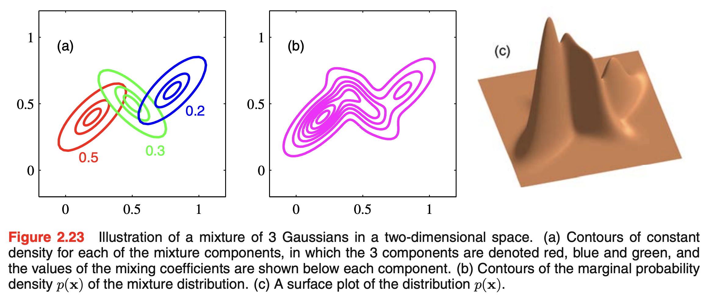

```{r}
#| include: false
knitr::opts_chunk$set(
  echo = TRUE,
  message = FALSE,
  warning = FALSE,
  fig.align = "center",
  fig.height = 9
)
library(tidyverse)
ggplot2::theme_set(ggplot2::theme_light(base_size = 20))
```

# Background

## Previously: clustering

**Clustering goal**: partition observations into subgroups/cluster, where observations within a cluster are more *similar* than observations between clusters

. . .

- **$k$-means** and **hierarchical clustering** output *hard* assignments, where  observations are only assigned to one cluster

. . .

- What about **soft** assignments that incorporate **uncertainty** into the clustering results?

  - Assigns each observation a probability of belonging to a cluster

  - Incorporate statistical modeling into clustering

. . .

*Welcome to the world of mixture models!*

<center>{width="60%"}</center>

## Motivating figure

<br>


## Model-based (parametric) clustering

* Moves beyond hard cluster assignments and allows for flexible and probabilistic soft assignments

. . .

* **Key idea**: data are considered as coming from a mixture of underlying probability distributions

  - Assume data are sample from a population with underlying density
    
  - Estimate density
    
  - Use its characteristics to determine clustering structure

. . .

* Most popular method: **Gaussian mixture model (GMM)**

  *   Each observation is assumed to be distributed as one of $K$ multivariate normal distributions

  *   $K$ is the number of clusters/components
  
. . .  
  
* Other variations: skewed normal, t-distributions, beta, etc. (as long as it can be estimated)

# Mixture models

## Mixture models in general

We assume the distribution $f(x)$ is a mixture of $K$ component (*cluster*) distributions:

$$\displaystyle f(x) = \sum_{k=1}^K \tau_k f_k(x),$$

. . .

where $\tau_k$ are **mixture proportions (or weights)**, with $\tau_k \ge 0$ and $\sum_{k=1}^K \tau_k = 1$

. . .

<br>

This is a **data generating process**, meaning to generate a new point:

1. Pick a distribution/component among our $K$ options, by introducing a new categorical variable saying which group the new point is from:

$$
\displaystyle z \sim \text{Multinomial}(\tau_1, \dots, \tau_K),
$$

2. Generate an observation $x$ with that distribution/component: $x \mid z \sim f_z$

## So, what do we use for each $f_k$?

Assume a **parametric mixture model** (with **parameters** $\theta_k$ for the $k$th component):

$$
f(x) = \sum_{k=1}^K \tau_k f_k(x; \theta_k)
$$

. . .

Most often the mixture component densities are assumed to be **Gaussian/Normal** with parameters $\theta_k = \{\mu_k, \sigma_k^2\}$. *In the 1D case:*

$$
\displaystyle f_k(x; \theta_k) = \mathcal{N}(x; \mu_k, \sigma^2_k) = \frac{1}{\sqrt{2\pi \sigma_k^2}} \exp \left(- \frac{(x - \mu_k)^2}{2 \sigma^2_k} \right)
$$

. . .

*So, we need to:* 

* Choose the number of components (clusters) $K$

* Estimate the weights $\tau_1, \dots, \tau_K$ and the parameters $\theta_1,\dots,\theta_K$

## Let's pretend we only have one component...

- Suppose we have $n$ observations from a single Normal distribution

. . .

- We estimate the distribution parameters using the **likelihood function** (i.e., the joint probability/density of observing the data given the parameters):

. . .

$$
\mathcal{L}(\mu, \sigma^2 \mid x_1, \dots, x_n) = f(x_1, \dots, x_n \mid \mu, \sigma^2) = \prod_{i = 1}^n \frac{1}{\sqrt{2 \pi \sigma^2}} \exp \left(- \frac{(x - \mu)^2}{2 \sigma^2} \right)
$$

. . .

We can compute the **maximum likelihood estimators (MLEs)** for $\mu$ and $\sigma^2$:

- $\displaystyle \hat{\mu}_{MLE} = \frac{1}{n} \sum_{i = 1}^n x_i$, aka the *sample mean*

- $\displaystyle \hat{\sigma}^2_{MLE} = \frac{1}{n} \sum_{i = 1}^n (x_i - \mu)^2$, aka the *sample variance* (plug in $\hat{\mu}_{MLE}$)

## The problem with more than one component

:::{columns}

:::{.column width="60%" style="text-align: left;"}

- **We don't know which component (or cluster) an observation belongs to**

:::{.incremental}

- *If we did know*, then we could compute each component's MLEs as before


- But we don't know because $z$ is a **latent variable**. So, what is its distribution given the observed data? Using [Bayes Theorem](https://en.wikipedia.org/wiki/Bayes%27_theorem):

:::{.fragment}

$$
\begin{aligned}
\displaystyle
P(z_i = k \mid x_i) &= \frac{P(x_i \mid z_i = k)P(z_i = k)}{P(x_i)} \\
&= \frac{\tau_k \cdot \mathcal{N}(\mu_k, \sigma^2_k)}{\sum_{k = 1}^K \tau_k \cdot \mathcal{N}(\mu_k, \sigma^2_k)}
\end{aligned}
$$
:::

- **But we do NOT know these parameters!**

:::
:::

:::{.column width="40%" style="text-align: left;"}

```{r}
#| echo: false
#| fig-height: 11
library(tidyverse)
# mixture components
mu_true <- c(5, 13)
sigma_true <- c(1.5, 2)
# determine Z_i
z <- rbinom(500, 1, 0.75)
# sample from mixture model
x <- rnorm(10000, mean = mu_true[z + 1], 
           sd = sigma_true[z + 1])

tibble(xvar = x) %>%
  ggplot(aes(x = xvar)) +
  geom_histogram(color = "black",
                 fill = "darkblue",
                 alpha = 0.3) +
  theme_light(base_size = 20) +
  labs(x = "Simulated variable",
       y = "Count") 
```


:::
:::

## Expectation-maximization (EM) algorithm

*Expectation-maximization (EM) algorithm involves alternating between the following:*

- *Pretending* to know the parameters of the components, to estimate the probability each observation belong to each component/cluster

- *Pretending* to know the probability each observation belongs to each group, to estimate the parameters of the components

. . .

*Concretely:*

1. We randomly initialize the component parameters ($\mu_k, \sigma^2_k, \tau_k$) for each component $k$

. . .

2. Repeat until nothing changes:

  * **Expectation**: calculate $\hat{z}_{ik}$, i.e., the *soft membership* of observation $i$ belonging to component/cluster $k$
  
  * **Maximization**: re-estimate the model parameters ($\mu_k, \sigma^2_k, \tau_k$) for each component/cluster $k$ that maximize the updated likelihood function that uses $\hat{z}_{ik}$.


## Is this familiar?

In GMMs, we're essentially: 

  * Guessing how much we think each Gaussian component generates each observation
    
  * Pretending to know the parameters to perform maximum likelihood estimation

. . .

::: columns
::: {.column width="50%" style="text-align: left;"}

This resembles the $k$-means algorithm!

  *   The cluster centroids are chosen at random, and then recomputed/updated
    
  *   This is repeated until the cluster assignments stop changing
    
:::

::: {.column width="50%" style="text-align: left;"}

<center>    
<iframe src="https://giphy.com/embed/KEYEpIngcmXlHetDqz" width="420" height="223" style="" frameBorder="0" class="giphy-embed" allowFullScreen></iframe><p><a href="https://giphy.com/gifs/jesseling-kronk-emperors-new-groove-its-all-coming-together-KEYEpIngcmXlHetDqz"></a></p>
</center>

:::
:::
    
. . .

*Instead of assigning each point to a single cluster, we “softly” assign them in GMMs so they contribute fractionally to each cluster*


## How does this relate back to clustering?

From the EM algorithm: $\hat{z}_{ik}$ is the *soft membership* of observation $i$ belonging to component/cluster $k$

- We can assign observation $i$ to the cluster with the largest $\hat{z}_{ik}$  ($\text{max}_{k} \hat{z}_{ik}$)

- We can measure the cluster assignment **uncertainty** for observation $i$ as: $1 - \text{max}_{k} \hat{z}_{ik}$

<br>

. . .

**Our parameters determine the type of cluster**

. . .

*In 1D, we only have two options:*

1. Each cluster is **assumed to have equal variance** (spread): $\sigma^2_1 = \cdots = \sigma^2_K$

2. Each cluster is **allowed to have a different variance**

. . .

*But that is only 1D... what happens in multiple dimensions?*


## Multivariate GMMs

A multivariate GMM assumes the following distribution:

$$
\displaystyle f(x) = \sum_{k = 1}^K \tau_k f_k(x; \theta_k),
$$

where $f_k(x;\theta_k) \sim \mathcal{N}(x; \boldsymbol{\mu}_k, \boldsymbol{\Sigma}_k)$

. . .

<br>

That is, each component/cluster is a **multivariate normal distribution**:

- $\boldsymbol{\mu}_k$ is a $p$-dimensional vector of means 

- $\boldsymbol{\Sigma}_k$ is a $p \times p$ **covariance** matrix -- describes the joint variability between pairs of variables


$$
\displaystyle \boldsymbol{\Sigma}_k =
\begin{bmatrix}
\sigma^2_1 & \sigma_{1,2} & \cdots & \sigma_{1,p} \\
\sigma_{2,1} & \sigma^2_2 & \cdots & \sigma_{2,p} \\
\vdots & \vdots & \ddots & \vdots \\
\sigma_{p,1} & \sigma_{p,2} & \cdots & \sigma^2_p
\end{bmatrix}
$$

## Covariance constraints

$$
\displaystyle \boldsymbol{\Sigma}_k =
\begin{bmatrix}
\sigma^2_1 & \sigma_{1,2} & \cdots & \sigma_{1,p} \\
\sigma_{2,1} & \sigma^2_2 & \cdots & \sigma_{2,p} \\
\vdots & \vdots & \ddots & \vdots \\
\sigma_{p,1} & \sigma_{p,2} & \cdots & \sigma^2_p
\end{bmatrix}
$$

As we increase the number of dimensions ($p$), model fitting and estimation become increasingly difficult 

. . .

<br>

We can place **constraints** on multiple aspects of the $k$ covariance matrices to help:

  * **Volume**: size of the clusters (*number of observations*)

  * **Shape**: direction of variance (*which variables display more variance*)

  * **Orientation**: aligned with axes (*low covariance*) versus tilted (*due to relationships between variables*)

## Covariance constraints

Three letters in model name denote (in order) the **volume**, **shape**, and **orientation** across clusters

<center>
{height=510}
</center>

## Covariance constraints: summary table

```{r}
#| echo: false
library(tibble)
library(gt)

model_table <- tribble(
  ~Model, ~Distribution, ~Volume, ~Shape, ~Orientation,
  "EII", "Spherical", "Equal", "Equal", "—",
  "VII", "Spherical", "Variable", "Equal", "—",
  "EEI", "Diagonal", "Equal", "Equal", "Coordinate axes",
  "VEI", "Diagonal", "Variable", "Equal", "Coordinate axes",
  "EVI", "Diagonal", "Equal", "Variable", "Coordinate axes",
  "VVI", "Diagonal", "Variable", "Variable", "Coordinate axes",
  "EEE", "Ellipsoidal", "Equal", "Equal", "Equal",
  "EVE", "Ellipsoidal", "Equal", "Variable", "Equal",
  "VEE", "Ellipsoidal", "Variable", "Equal", "Equal",
  "VVE", "Ellipsoidal", "Variable", "Variable", "Equal",
  "EEV", "Ellipsoidal", "Equal", "Equal", "Variable",
  "VEV", "Ellipsoidal", "Variable", "Equal", "Variable",
  "EVV", "Ellipsoidal", "Equal", "Variable", "Variable",
  "VVV", "Ellipsoidal", "Variable", "Variable", "Variable"
)

model_table |>
  gt() |>
  tab_options(
    table.font.size = px(22),
    data_row.padding = px(4),
    heading.title.font.size = px(24),
    column_labels.font.weight = "bold"
  ) |>
  cols_align(
    align = "left",
    columns = c(Model, Volume, Shape, Orientation)
  ) |>
  opt_vertical_padding(scale = 0.8)
```

## How do we decide what constraints to use?

This is a statistical model:

$$
f(x) = \sum_{k = 1}^K \tau_k f_k(x; \theta_k), \quad f_k(x; \theta_k) \sim \mathcal{N}(x; \boldsymbol{\mu}_k, \boldsymbol{\Sigma}_k)
$$

. . .

So, we can use a **model selection** procedure for determining which best characterizes the data 

. . .

<br>

One option is the **Bayesian Information Criterion (BIC)**, which is a penalized likelihood measure:

$$
\displaystyle BIC = 2 \log \mathcal{L}(x; \theta) - m \log n
$$

where:

  * $L(x \mid \theta)$ is likelihood of the considered model

  * $m$ is number of parameters (*VVV has the most parameters*) and $n$ is number of observations

. . .

*Note*: the BICs are calculated for *all* candidate models (different combinations of $K$ and covariance constraints), and we select one final model that gives the *optimum* BIC value


# Example

## Data: NBA player statistics per 100 possessions (2023-24 regular season)

```{r load-data, warning = FALSE, message = FALSE}
library(tidyverse)
theme_set(theme_light())

nba_players <- read_csv("https://raw.githubusercontent.com/36-SURE/2026/main/data/nba_players_2024.csv")

glimpse(nba_players)
```

```{r}
#| echo: false
ggplot2::theme_set(ggplot2::theme_light(base_size = 20))
```


## Implementation with [`mclust`](https://cran.r-project.org/web/packages/mclust/vignettes/mclust.html) package

Use `Mclust()` function to search over 1 to 9 clusters (by default) and the different covariance constraints (i.e. models) 

```{r nba-mclust}
library(mclust)
# x3pa: 3pt attempts per 100 possessions
# trb: total rebounds per 100 possessions

nba_mclust <- nba_players |> 
  select(x3pa, trb) |> 
  Mclust()

summary(nba_mclust)
```

## View clustering summary

```{r}
library(broom)
library(gt)

gt(tidy(nba_mclust))
```

## View clustering assignments

```{r}
#| fig-width: 12
nba_mclust |> 
  augment() |> 
  ggplot(aes(x = x3pa, y = trb, color = .class, size = .uncertainty)) +
  geom_point(alpha = 0.6) +
  ggthemes::scale_color_colorblind()
```


## Display the BIC for each model and number of clusters

::: columns
::: {.column width="50%" style="text-align: left;"}

```{r nba-bic, fig.align = 'center', fig.height=9}
nba_mclust |> 
  plot(what = "BIC", 
       legendArgs = list(x = "bottomright", ncol = 4))
```

:::


::: {.column width="50%" style="text-align: left;"}

```{r nba-cluster-plot, fig.height=9} 
nba_mclust |> 
  plot(what = "classification")
```

:::
:::

## How do the cluster assignments compare to the positions?

Two-way table to compare the clustering assignments with player positions

*Question: What's the way to visually compare the two labels?*

```{r nba-table}
table("Clusters" = nba_mclust$classification, "Positions" = nba_players$pos)
```

. . .

<br>

**Takeaway:** positions tend to fall within particular clusters


## What about the cluster probabilities?

```{r nba-probs, fig.width=18, fig.height=6}
nba_player_probs <- nba_mclust$z
colnames(nba_player_probs) <- str_c("cluster", 1:3)

nba_player_probs <- nba_player_probs |>
  as_tibble() |>
  mutate(player = nba_players$player) |>
  pivot_longer(-player, names_to = "cluster", values_to = "prob")

nba_player_probs |>
  ggplot(aes(prob)) +
  geom_histogram() +
  facet_wrap(~cluster)
```


## Which players have the highest uncertainty?

::: columns
::: {.column width="50%" style="text-align: left;"}

<br>

```{r nba-uncertainty, eval = FALSE}
nba_players |>
  mutate(cluster = nba_mclust$classification,
         uncertainty = nba_mclust$uncertainty) |> 
  group_by(cluster) |>
  slice_max(uncertainty, n = 5) |> 
  mutate(player = fct_reorder(player, uncertainty)) |> 
  ggplot(aes(x = uncertainty, y = player)) +
  geom_point(size = 3) +
  facet_wrap(~cluster, scales = "free_y", nrow = 3)
```

:::

::: {.column width="50%" style="text-align: left;"}
```{r ref.label='nba-uncertainty', echo=FALSE, fig.height=9}
```

:::
:::

## Challenges and resources

*   *What if the data are not normal (ish) and instead are skewed?*

    *   Apply a transformation, then perform GMM
    
    *   [Multivariate $t$ mixture model](https://link.springer.com/article/10.1007/s11222-011-9272-x)
    
    *   GMM on principal components of data 
    
*   [Review paper](https://www.annualreviews.org/content/journals/10.1146/annurev-statistics-033121-115326): Model-Based Clustering

*   [Book](https://math.univ-cotedazur.fr/~cbouveyr/MBCbook/): Model-Based Clustering and Classification for Data Science
    
*   [Adrian Raftery's website](https://sites.stat.washington.edu/raftery/Research/mbc.html)

## Appendix: Mixtures of Gaussians in 1D

```{r}
#| message: false
#| echo: false
#| fig-height: 8
#| results: hide
set.seed(1)
plot(mixtools::normalmixEM(faithful$waiting), which=2)
lines(density(faithful$waiting), lty=2, lwd=2)
```

## Appendix: Mixtures of Gaussians in 2D

<br>


