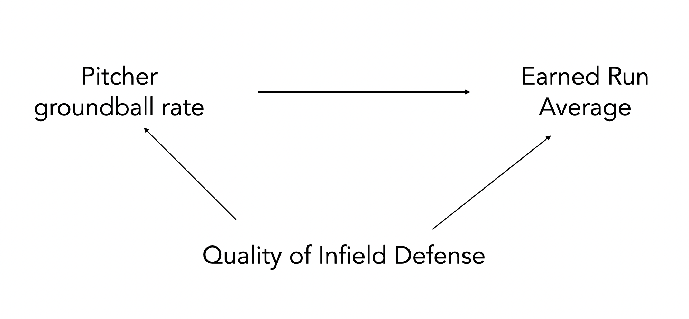

```{r}
#| include: false
knitr::opts_chunk$set(
  echo = TRUE,
  message = FALSE,
  warning = FALSE,
  fig.align = "center",
  fig.height = 9
)
ggplot2::theme_set(ggplot2::theme_light(base_size = 20))
```

## The setting 

Suppose we wish to learn a linear model. Our estimate (denoted by hats) is

$$\hat Y = \hat \beta_0 + \hat \beta_1 X_1 + \dots + \hat \beta_p X_p$$

Why would we wish to select a **subset** of the $p$ variables?

. . . 

- To improve prediction accuracy 
  - Eliminating uninformative predictors can lead to lower variance in the test-set MSE, at the expense of a slight increase in bias 
  
. . . 

- To improve model interpretability 
  - Eliminating uninformative predictors is obviously a good thing when your goal is to tell the story of how your predictors are associated with your response. 
  - Think of multiple linear regression interpretation: *Holding $X_2$ , $X_3$ , ... , $X_p$ constant, each additional unit of $X_1$ is associated with...*

## Best subset selection (not recommended)

:::{.incremental}

- Start with just null model $\mathcal{M}_0$ that has no predictors

- Fit every possible 1 variable model, save the one with the *best* results 

  - Best can be defined with a variety of metrics: e.g. lowest RSS, highest $R^2$ or adjusted $R^2$

- Fit every possible 2 variable model, save the one with the "best" results

- Repeat this process for all subset sizes $p$ 

- Pick the single best model among $\mathcal{M}_0, \dots, \mathcal{M}_P$ 

::: 
. . . 

**This is not typically used in research!**

- Only practical with a smaller number of variables (10 variables = $2^{10} = 1024$ models)

- Arbitrary way of defining *best* and ignores prior knowledge about potential predictors 

## Stepwise selection (not recommended)

Forward stepwise selection

:::{.incremental}

- Start with the null model, containing no predictors

- Fit all one-predictor models: select the predictor whose addition to the model produces the smallest p-value. 

- Add that predictor to the model

- From the remaining predictors, fit all models obtained by adding one additional predictor to the current model. Select the predictor whose addition gives the smallest p-value.

- Repeat this process until a stopping criterion is met (e.g. the smallest p-value among the remaining candidate predictors exceeds 0.05, the improvement in AIC/BIC is no longer sufficient)

:::

. . . 

Backward stepwise selection has a similar process, you just start with all predictors in the model.

. . .

Both algorithms are **greedy**: make short-sighted, localized decisions that maximize the model's immediate fit, without considering how that choice will impact the final model in later stages.

## Instead, use the shoe leather approach

- **Variable selection is a difficult problem!** Like much of statistics, there is no one right answer

- **Idea**: use your brain instead of algorithms

- Justify which predictors used in modeling based on:

  - domain knowledge
  - context
  - extensive EDA
  - model assessment based on holdout predictions

## Confounding variables 

- A **confounding variable** (or lurking variable) is one that is influences both the treatment/predictor of interest ($X$) and the outcome ($Y$) 

- When a confounder is present, we may observe a spurious correlation between the $X$ and $Y$, even if no direct causal relationship exists

  -  If a causal relationship does exist, the presence of the confounder can lead us to overestimate or underestimate the true effect.

- So, it is important to stop and think about whether there are confounding variables which could be explaining the association instead

## Confounding variables (example)

::: columns
::: {.column width="50%" style="text-align: left;"}

```{r}
#| echo: false
#| out-width: 90%
knitr::include_graphics("https://miro.medium.com/v2/resize:fit:1400/format:webp/1*_jmWQaN0_jBEeYQ5rN6YMQ.png")
```


:::
::: {.column width="50%" style="text-align: left;"}

```{r}
#| echo: false
#| out-width: 90%
knitr::include_graphics("https://miro.medium.com/v2/resize:fit:1400/format:webp/1*jYON8L4oAIVNZeWjrBNxaw.png")
```
:::
:::

In reality, there is no causal relationship between ice cream sales and shark attacks: changing one will not cause a change in the other. *Temperature influences both variables simultaneously.*

## Correlation and causation

```{r}
#| echo: false
#| out-width: 70%
knitr::include_graphics("https://imgs.xkcd.com/comics/correlation_2x.png")
```

## Confounding variables (baseball) {.smaller}

Does a pitcher with a high groundball rate inherently prevent more runs?

```{r}
#| echo: false
#| out-width: 90%

```

Including *quality of infield defense* in the model may help to reduce bias in estimating the relevent effect of *groundball rate*.

## In summary, variable selection is complicated!

```{r}
#| echo: false
#| out-width: 70%
knitr::include_graphics("https://imgs.xkcd.com/comics/confounding_variables.png")
```

## Covariance and correlation

:::{.incremental}

- Covariance is a measure of the linear dependence between two variables
  
  - Measures how two variables change together, indicating the direction of their relationship
  
  - Independence implies zero covariance (knowing the value of one tells you nothing about the probability distribution of the other)
  
  - Zero covariance does not guarantee independence: only means there is no *linear* correlation between the variables 
  
:::

. . . 

- Correlation is a **normalized** form of covariance, ranges from -1 to 1

  - -1 means one variable linearly decreases absolutely in value while the other increases in value

  - 0 means no linear dependence
  
  - 1 means one variable linearly increases absolutely while the other increases
  
## Data: MLB batting 

A subset of batting statistics for all MLB players with at least 500 plate appearances in 2025. Obtained from [Baseball Savant](https://baseballsavant.mlb.com/leaderboard/custom?year=2025&type=batter&filter=&min=q&selections=pa%2Ck_percent%2Cbb_percent%2Cwoba%2Cxwoba%2Csweet_spot_percent%2Cbarrel_batted_rate%2Chard_hit_percent%2Cavg_best_speed%2Cavg_hyper_speed%2Cwhiff_percent%2Cswing_percent&chart=false&x=pa&y=pa&r=no&chartType=beeswarm&sort=xwoba&sortDir=desc).

```{r}
library(tidyverse)
batting_2025 <- read_csv("https://raw.githubusercontent.com/36-SURE/2026/main/data/player_hitting_2025.csv")
```

## Modeling MLB wOBA

::: columns
::: {.column width="50%" style="text-align: left;"}

```{r}
#| label: score-diff
#| eval: false
batting_2025 |> 
  ggplot(aes(x = woba)) +
  geom_histogram(color = "black", 
                 fill = "darkblue",
                 alpha = 0.3) +
  theme_bw() +
  labs(x = "wOBA")+
  theme(axis.text = element_text(size =15),
        axis.title =element_text(size = 18))
```
:::

::: {.column width="50%" style="text-align: left;"}
```{r}
#| ref-label: score-diff
#| echo: false
#| fig-height: 9
```
:::
:::

## Correlation matrix of wOBA and candidate predictors

- Interested in relationship between batting statistics with wOBA

- View the correlation matrix with `ggcorrplot`

::: columns
::: {.column width="50%" style="text-align: left;"}

```{r}
#| label: score-diff-corr
#| eval: false
library(ggcorrplot)
mlb_model_data <- batting_2025 |>
  dplyr::select(woba,
    barrel_batted_rate,
                hard_hit_percent, 
                whiff_percent, k_percent, swing_percent, bb_percent)
mlb_cor_matrix <- cor(mlb_model_data)
ggcorrplot(mlb_cor_matrix)
```
:::

::: {.column width="50%" style="text-align: left;"}
```{r}
#| ref-label: score-diff-corr
#| echo: false
#| fig-height: 9
```
:::
:::

## Customize the appearance of the correlation matrix

::: columns
::: {.column width="50%" style="text-align: left;"}

- Avoid redundancy by only using one half of matrix with type

- Add correlation value labels using lab (but round first!)

- Can arrange variables based on clustering...

```{r}
#| label: score-diff-corr-clean
#| eval: false
round_cor_matrix <-  round(cor(mlb_model_data), 2)
ggcorrplot(round_cor_matrix, 
           hc.order = TRUE,
           type = "lower",
           lab = TRUE)
```
:::

::: {.column width="50%" style="text-align: left;"}
```{r}
#| ref-label: score-diff-corr-clean
#| echo: false
#| fig-height: 9
```
:::
:::

## Building a linear regression 

Let's say we are interested in understanding the relationship between quality of contact and wOBA. We might measure quality of contact in two ways:

- `hard_hit_percent`: ball struck at least 95 mph
- `barrel_batted_rate`: ball struck at least 98 mph with a launch angle between 26-30 degrees. As exit velocity increases, the launch angle range widens. 
  - A barrel is a subset of a hard hit

::: columns
::: {.column width="50%" style="text-align: left;"}

```{r}
library(gtsummary)
hh_mod <- lm(data= mlb_model_data, woba ~ hard_hit_percent)
tbl_regression(hh_mod, estimate_fun = label_style_sigfig(digits = 3))
```
:::

::: {.column width="50%" style="text-align: left;"}
```{r}
barrel_mod <- lm(data= mlb_model_data, woba ~ barrel_batted_rate)
tbl_regression(barrel_mod, estimate_fun = label_style_sigfig(digits = 3))
```
:::
:::

## Adding both variables to the regression

```{r}
combined <- lm(data = mlb_model_data, woba ~ barrel_batted_rate + hard_hit_percent)
tbl_regression(combined, estimate_fun = label_style_sigfig(digits = 3))
```

After accounting for Barrel%, Hard Hit% provides almost no additional information about wOBA. 

  - The coefficient in multiple regression represents the effect of a predictor holding the other predictors fixed.
  - What does it mean to compare two hitters with the same Barrel% but different Hard Hit%?

## What do we do about this?

- **Inference**: if we are trying to understand *does the quality of contact affect wOBA?* we can roughly consider Barrel% and Hard Hit% as two measures of the same underlying construct 

  - Fair to remove one in this scenario, as
  
    - "holding Barrel% fixed while changing Hard Hit%" is not practical in baseball
    
    - Hard Hit% is not necessarily a confounding variable, rather, Barrel% is a subset of Hard Hit%
    
. . .

- **Prediction**: if we are trying to build a linear regression model to predict a new player's wOBA from their Hard Hit% and Barrel%, it could go either way 

  - Collinearity is a problem insofar as it creates high prediction variance
  
  - But maybe, given Barrel%, Hard Hit% still explains a enough variance in the outcome to counteract this
  
  - One option is to use cross validation to see!
  
## General notes about collinearity to keep in mind 

Courtesy of [Alex Reinhart's regression notes](https://www.refsmmat.com/courses/707/lecture-notes/regression-assumptions.html#sec-collinearity): 

- Be very careful with the interpretation of your coefficients

  - $\beta_1$ is the change in the mean of $Y$ when increasing $X_1$ while holding $X_2$ fixed. 
  
  - If $X_1$ and $X_2$ have a strong correlation, that may be very different than the change in the mean of $Y$ when increasing $X_1$ *without* holding $X_2$ fixed.
  
- The question to ask when we have collinearity is “Have we chosen the correct predictors for the research question?” 

  - If we have, there is little to be done; if we have not, we can reconsider our choice of predictors and perhaps eliminate the collinear ones.
  
  - In other words, if you have a confounding variable that is collinear with your variable of interest, leave it in the model and move on. 


## Cross-validation (review)

* Randomly split the observations into $K$ (roughly) equal-sized folds (usually $K=5$ or $K=10$)

. . .
  
* For each fold $k=1,2,\dots,K$
  
  * Fit the model on data excluding observations in fold $k$
    
  * Obtain predictions for fold $k$
  
  * Compute performance measure (e.g. MSE) for fold $k$
  
. . .
    
* Aggregate performance measure across folds
  
  * e.g., compute average MSE, including standard error

. . .    

We can justify model choice (e.g. model selection/comparison, variable selection, tuning parameter selection) using any performance measure we want with CV

. . .

Why do we typically choose $K=5$ or $K=10$? Think about: What's the smallest and largest $K$ could be? And what's the trade-off? 

## Some additional notes on cross-validation

* Recall that the typical cross-validation procedure randomly assigns individual observations to different folds

. . .

* In more complex data settings (e.g. correlated data, nested data), figuring out the appropriate way to split the observations into folds can require careful thoughts

. . .

* For example, if the data are spatially or temporally dependent, we can’t simply assign individual observations to folds (which may result in data leakage)

. . .

* To preserve any dependence structure of the data, we can assign groups/blocks of observations together into different folds

## Implementing cross-validation: fold assignment

* Perform 5-fold cross-validation to assess model performance

* Create a column of test fold assignments to our dataset with the `sample()` function

* Always remember to `set.seed()` prior to performing cross-validation

```{r}
set.seed(2026)
N_FOLDS <- 5
batting_2025 <- batting_2025 |>
  mutate(fold = sample(rep(1:N_FOLDS, length.out = n())))

table(batting_2025$fold)
```

## Model comparison based on out-of-sample performance

Function to perform cross-validation

```{r}
batting_cv <- function(x) {
  
  # get test and training data
  test_data <- batting_2025 |> filter(fold == x)                     
  train_data <- batting_2025 |> filter(fold != x)
  
  # fit models to training data
  barrel_fit <- lm(woba ~ barrel_batted_rate, data = train_data)
  combined_fit <- lm(woba ~ barrel_batted_rate + hard_hit_percent, data = train_data)
  
  # return test results
  out <- tibble(
    barrel_pred = predict(barrel_fit, newdata = test_data),
    combined_pred = predict(combined_fit, newdata = test_data),
    test_actual = test_data$woba,
    test_fold = x
  )
  return(out)
}
```

```{r}
batting_test_preds <- map(1:N_FOLDS, batting_cv) |> 
  bind_rows()
```

## Model comparison based on out-of-sample performance

Compute RMSE across folds with standard error intervals

```{r}
batting_test_summary <- batting_test_preds |>
  pivot_longer(barrel_pred:combined_pred, names_to = "model", values_to = "test_pred") |>
  group_by(model, test_fold) |>
  summarize(rmse = sqrt(mean((test_actual - test_pred)^2)))

batting_test_summary |> 
  group_by(model) |> 
  summarize(avg_cv_rmse = mean(rmse),
            sd_rmse = sd(rmse),
            k = n()) |>
  mutate(se_rmse = sd_rmse / sqrt(k),
         lower_rmse = avg_cv_rmse - se_rmse,
         upper_rmse = avg_cv_rmse + se_rmse) |> 
  select(model, avg_cv_rmse, lower_rmse, upper_rmse)
```

## Visualizing model performance results

::: columns
::: {.column width="50%" style="text-align: left;"}

```{r}
batting_test_summary |> 
  ggplot(aes(x = model, y = rmse)) + 
  geom_point(size = 4, alpha=0.6) +
  stat_summary(fun = mean, geom = "point", 
               color = "red", size = 4) + 
  stat_summary(fun.data = mean_se, geom = "errorbar", 
               color = "red", width = 0.2)
```

:::


::: {.column width="50%" style="text-align: left;"}

* Whether or not you include Hard Hit%, model performance is essentially the same

* If anything, performance is *slightly* better without Hard Hit% 

* We will discuss more about prediction and correlated covariates tomorrow!

:::

:::

## Data analysis workflow: before looking at data

*This data analysis workflow is adapted from Valérie Ventura's 36-617 class.*

0) Formulate a question. Some of you have very well-defined projects, some not quite as much. This step can take a while!

1) Determine what sort of analysis is needed: are we doing inference? Prediction? 

2) Identify the data you'd *want* to have to answer your question: this will not only help you determine the analysis you want to do, but also the potential limitations of your data. 
  
3) Understand the data you do have.

  - Research each variable to make sure you know exactly what it means, whether you expect it to take discrete or continuous values, etc. 
  
4) Identify your response variable: sometimes there are several available response variables. Which one will you work with? Why?

## Data analysis workflow: before looking at data

5) Identify covariate(s) of **main** interest.

6) Identify covariates that also (partially) cause the response variable.

  - These may explain variability in the response variable or be confounding variables. 

7) Do you anticipate having to create new covariates? What about an interaction in your model?

8) Think about limitations: will your analysis be limited in any way because the data is insufficient, maybe because it contains the wrong variables, it is missing variables, etc.?

## Data analysis workflow: before looking at data

9) Go back to question 1 and finalize your analysis plan: what type of model will you fit? Note: several analyses may be required to answer fully the question(s) of interest. 

  - Why is your model(s) appropriate for the problem? 
  
    - For simplicity and explanability purpose? (Why do you prefer a simpler model over a black box?)
    
    - For complexity and flexibility purpose? (Why do you prefer a black box over a simpler model?)
  
  - How do you evaluate your model?

    - Do you compare it with other models? Do you have a baseline model?

    - Do you compare it with alternative specifications (e.g. different set of predictors)?

## Data analysis workflow: now look at the data!

1) One-dimensional EDA: create plots and summaries of all relevant variables, look for missing data and outliers.
  
2) Two-dimensional EDA: plot all important variables against each other. 
  
  - This will help you identify an appropriate regression function. 
  - It may also reveal *weird* points not obvious in the 1D analysis.
  
3) Create any new covariates you previously identified. 

4) Try to answer your question of interest through plots. This will help inform and justify your modeling choices. 

5) You are now ready to start modeling!

## Make sure to report uncertainty for whatever you’re estimating

Don't just say "we find a statistically significant association between Y and X..."

* What do those coefficient estimates tell you? Interpret in context
  
  - How large/small is the effect size? Consider practical significance in addition to statistical significance

* What's the margin of error?

* Did the model also adjust for other potential meaningful predictors?
    
. . .

This also applies to ($k$-fold) cross-validation results

* Report the average of the performance measure (e.g. MSE, accuracy, etc.) across the $k$ test set along with standard errors

* In some cases, all $k$ folds yield similar results, but in other cases, the results are vastly different across the folds

* Without some indication of uncertainty, no one will have a clue of how reliable your results are

## Appendix: making tables 

```{r, echo = F}
movies <- read_csv("https://raw.githubusercontent.com/36-SURE/2024/main/data/movies.csv")
all_fit <- lm(
  AudienceScore ~ RottenTomatoes + TheatersOpenWeek + OpeningWeekend + Budget + DomesticGross + ForeignGross, 
  data = movies
)
```


```{r}
library(gt)
library(broom)
all_fit |> 
  tidy() |> 
  gt() |> 
  fmt_number(columns = where(is.numeric), decimals = 2) |> 
  cols_label(term = "Term",
             estimate = "Estimate",
             std.error = "SE",
             statistic = "t",
             p.value = md("*p*-value"))
```

## Appendix: gtsummary

```{r}
library(gtsummary)
all_fit |> 
  tbl_regression() |> 
  bold_p() |> 
  bold_labels()
```

## Appendix: a gt example

```{r}
# https://bradcongelio.com/nfl-analytics-with-r-book/04-nfl-analytics-visualization.html
cpoe <- read_csv("http://nfl-book.bradcongelio.com/pure-cpoe")
cpoe_gt <- cpoe |> 
  select(passer, season, total_attempts, mean_cpoe) |> 
  gt(rowname_col = "passer") |> 
  fmt_number(columns = c(mean_cpoe), decimals = 2) |>
  data_color(columns = c(mean_cpoe),
             fn = scales::col_numeric(palette = c("#FEE0D2", "#67000D"), domain = NULL)) |> 
  cols_align(align = "center", columns = c("season", "total_attempts")) |> 
  tab_stubhead(label = "Quarterback") |> 
  cols_label(season = "Season",
             total_attempts = "Attempts",
             mean_cpoe = "Mean CPOE") |> 
  tab_header(title = md("**Average CPOE in Pure Passing Situations**"),
             subtitle = md("*For seasons between 2010 and 2022*")) |> 
  tab_source_note(source_note = md("Example adapted from the book<br>*An Introduction to NFL Analytics with R*")) |> 
  gtExtras::gt_theme_espn()

# gtsave(cpoe_gt, "cpoe_gt.png")
```

## Appendix: a gt example

```{r, echo=F}
cpoe_gt
```

