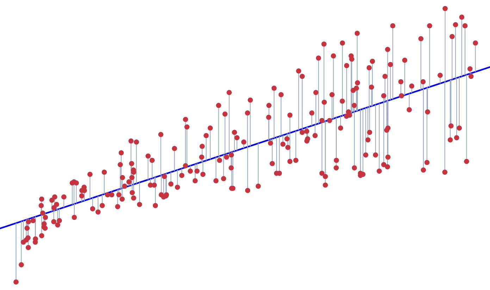
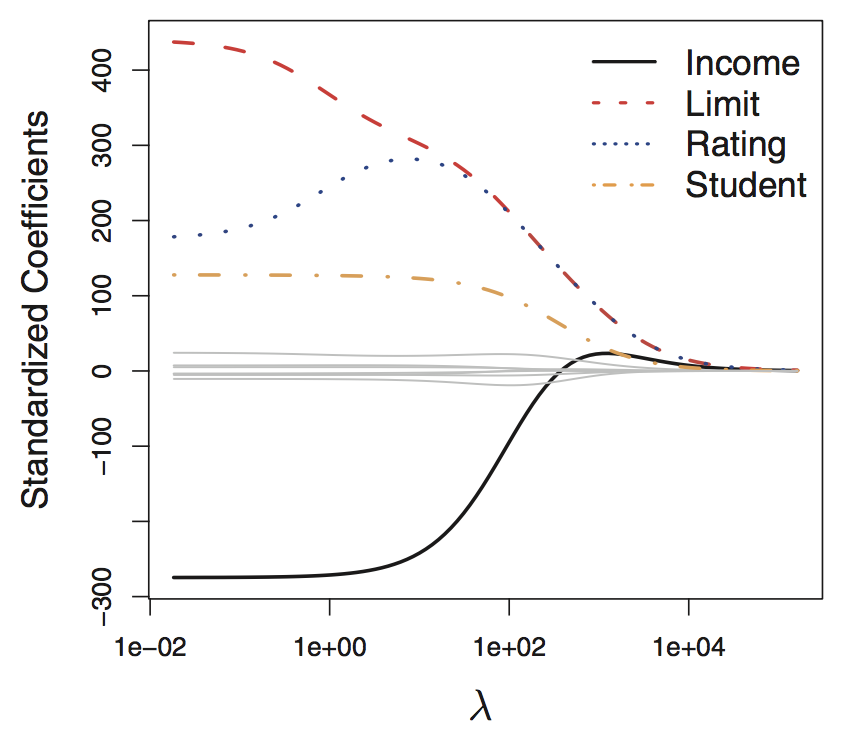
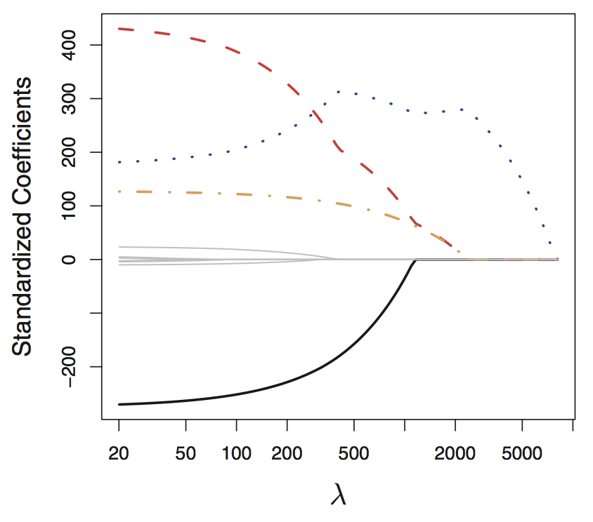
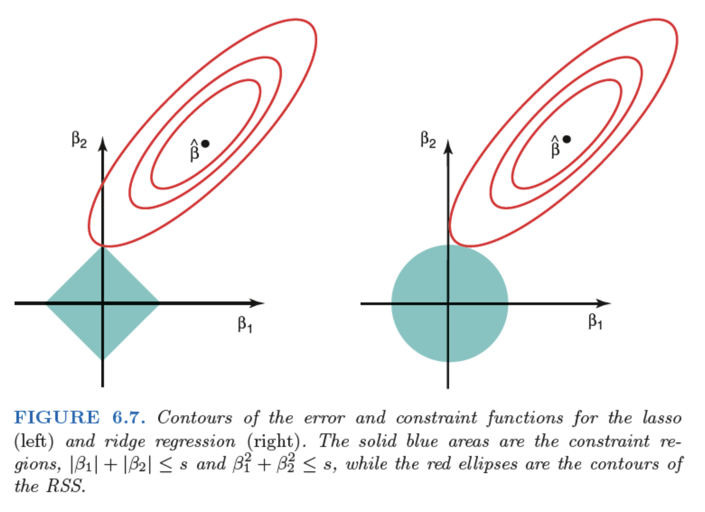

```{r}
#| include: false
knitr::opts_chunk$set(
  echo = TRUE,
  message = FALSE,
  warning = FALSE,
  fig.align = "center",
  fig.height = 9
)
set.seed(101)
```

# Background

## Shortcomings of linear regression

* Predictability

  * Recall that we can decompose estimation (prediction) error into squared bias and variance
  
  * Linear regression: high bias, low variance
  
. . .
  
* Variable selection

  * With a large number of predictors, it can be helpful to identify a  subset of relevant features and eliminate uninformative ones
  
  * Linear regression “freely” assigns a coefficient to each predictor variable
  
  * Can we have a model fitting procedure that make only a subset of the coefficients large, and others small (or even better, zero)?

## The big picture

Regularized/shrinkage/penalized regression

* Involves fitting a model containing all $p$ predictors

. . .

* However, the estimated coefficients are shrunken towards zero relative to the least squares estimates of vanilla linear regression

. . .

* This "shrinkage" (also known as regularization) has the effect of reducing variance

. . .

* Depending on what type of regularization is performed, some coefficient estimates can be exactly zero

. . .

* Thus, regularization methods (e.g. LASSO) can perform variable selection

## Recap: linear regression

* __Linear regression__ (least squares) estimates coefficients by minimizing 

$$\text{RSS} = \sum_{i=1}^n \big(Y_i - \beta_0 -  \sum_{j=1}^p \beta_j X_{ij}\big)^2$$

<center>



</center>

# Ridge regression

## Linear regression vs ridge regression

* __Linear regression__ (least squares) estimates coefficients by minimizing 

$$\text{RSS} = \sum_{i=1}^n \big(Y_i - \beta_0 -  \sum_{j=1}^p \beta_j X_{ij}\big)^2$$

. . .

* __Ridge regression__ introduces a shrinkage penalty term and minimizes

$$\sum_{i=1}^n \big(Y_i - \beta_0 -  \sum_{j=1}^p \beta_j X_{ij}\big)^2 + \lambda \sum_{j=1}^p \beta_j^2 = \text{RSS} + \lambda \sum_{j=1}^p \beta_j^2$$

. . .

* Ridge regression uses a (squared) $\ell_2$ penalty (hence ridge is also known as $\ell_2$ regularization)

  * The $\ell_2$ norm of a coefficient vector $\beta$ is given by $\displaystyle \Vert \beta \Vert_2 = \sqrt{\sum_{j=1}^p \vert \beta_j \vert ^2}$


## Ridge regression: more details

* Recall that __ridge regression__ minimizes

$$\sum_{i=1}^n \big(Y_i - \beta_0 -  \sum_{j=1}^p \beta_j X_{ij}\big)^2 + \lambda \sum_{j=1}^p \beta_j^2 = \text{RSS} + \lambda \sum_{j=1}^p \beta_j^2$$

. . .

* Here, $\lambda \ge 0$ is a **tuning parameter**, which controls the strength of the penalty term

. . .

* Use cross-validation to __tune__ $\lambda$ (for a fixed value of $\lambda$, ridge regression fits only a single model)

. . .

* As $\lambda$ increases, flexibility of models decreases (bias increases, variance decreases)

  * When $\lambda = 0$, it's just linear regression
  
  * When $\lambda \rightarrow \infty$, the coefficient estimates approach 0
  
  * For $\lambda$ in between, we are balancing two ideas: fitting a linear model and shrinking the coefficients


## Ridge regression: textbook example

* Notice how the magnitude of the coefficients for the 4 highlighted variables trend as $\lambda \rightarrow \infty$

* The coefficients __shrink towards zero__, but never actually reach it

```{r out.width='20%', echo = FALSE, fig.align='center'}

```

# Lasso & sparsity

## Moving from ridge to lasso

* Ridge never sets coefficients to exactly zero (i.e., always keeps all variables)

. . .

* Therefore ridge regression cannot perform variable selection

. . .

* But we may believe there is a __sparse__ solution (i.e., a model involving only a subset of the variables)

. . .

* Entering the lasso (least absolute shrinkage and selection operator)

. . .

* Compared to ridge, one big advantage of lasso/sparsity: it performs variable selection in the linear model, so we can understand which relevant features the model relies on for prediction

## Linear regression vs ridge vs lasso

* __Linear regression__ (least squares) estimates coefficients by minimizing 

$$\text{RSS} = \sum_{i=1}^n \big(Y_i - \beta_0 -  \sum_{j=1}^p \beta_j X_{ij}\big)^2$$

. . .

* __Ridge regression__ minimizes

$$\sum_{i=1}^n \big(Y_i - \beta_0 -  \sum_{j=1}^p \beta_j X_{ij}\big)^2 + \lambda \sum_{j=1}^p \beta_j^2 = \text{RSS} + \lambda \sum_{j=1}^p \beta_j^2$$

. . .

* **Lasso regression** enables variable selection by minimizing

$$\sum_{i=1}^n \big(Y_i - \beta_0 -  \sum_{j=1}^p \beta_j X_{ij}\big)^2 + \lambda \sum_{j=1}^p\vert  \beta_j \vert = \text{RSS} + \lambda \sum_{j=1}^p \vert \beta_j \vert$$

## The lasso: more details

* Recall that the lasso minimizes

$$\sum_{i=1}^n \big(Y_i - \beta_0 -  \sum_{j=1}^p \beta_j X_{ij}\big)^2 + \lambda \sum_{j=1}^p\vert  \beta_j \vert = \text{RSS} + \lambda \sum_{j=1}^p \vert \beta_j \vert$$

. . .

* Lasso uses an $\ell_1$ penalty (hence also known as $\ell_1$ regularization)

  * The $\ell_1$ norm of a coefficient vector $\beta$ is given by $\displaystyle \Vert \beta \Vert_1 = \sum_{j=1}^p \vert \beta_j \vert$
  
  
. . .

* The only difference between lasso and ridge is that ridge uses a (squared) $\ell_2$ penalty $\Vert \beta \Vert_2^2$, while lasso uses an $\vert \ell_1 \vert$ penalty 

. . .

* Importantly, although these two problems look relatively similar, their solutions behave very differently


## The lasso: more details

* Recall that the lasso minimizes

$$\sum_{i=1}^n \big(Y_i - \beta_0 -  \sum_{j=1}^p \beta_j X_{ij}\big)^2 + \lambda \sum_{j=1}^p\vert  \beta_j \vert = \text{RSS} + \lambda \sum_{j=1}^p \vert \beta_j \vert$$

. . .

* Here, $\lambda \ge 0$ is a **tuning parameter**, which controls the strength of the penalty (like ridge)

. . .

* Use cross-validation to __tune__ $\lambda$ (for a fixed value of $\lambda$, lasso regression fits only a single model)

. . .

* As $\lambda$ increases, flexibility of models decreases (bias increases, variance decreases)

  * When $\lambda = 0$, it's just linear regression
  
  * When $\lambda \rightarrow \infty$, the coefficient estimates approach 0
  
  * For $\lambda$ in between, we are balancing two ideas: fitting a linear model and shrinking the coefficients
  
  * But the nature of the $\ell_1$ penalty allows some coefficients to be shrunken to zero exactly

. . .

* Lasso can handle the $p > n$ case, i.e. more variables than observations
 
## Shrinkage methods: lasso regression

* Lasso regression __performs variable selection__ yielding __sparse__ models (i.e. models that involve only a subset of the variables)

* We get different models with different number of predictors at different values of $\lambda$

* The coefficients shrink towards and __eventually equal zero__

```{r out.width='20%', echo = FALSE, fig.align='center'}

```


## Lasso and ridge as optimization problems {visibility="hidden"}

Why does the lasso, unlike ridge, result in coefficient estimates that are exactly 0?

* Lasso

$$
\underset{\beta}{\text{minimize}} \sum_{i=1}^n \left(Y_i - \beta_0 - \sum_{j=1}^p\beta_j X_{ij} \right)^2 \quad \text{subject to} \quad \sum_{j=1}^p|\beta_j| \le s
$$

* Ridge

$$
\underset{\beta}{\text{minimize}} \sum_{i=1}^n \left(Y_i - \beta_0 - \sum_{j=1}^p\beta_j X_{ij} \right)^2 \quad \text{subject to} \quad \sum_{j=1}^p \beta_j ^2 \le s
$$

## Why doesn't ridge set coefficients equal to 0? 

::: {.incremental}

- **Ridge minimizes** $\text{RSS} + \lambda \sum_{j=1}^p \beta_j^2$

- Taking the derivative of the objective function: $\frac{d}{d\beta_j}(\text{RSS} + \lambda \sum_{j=1}^p \beta_j^2) = \frac{d\text{RSS}}{d\beta_j} + 2\lambda \beta_j$

- Near zero: As $\beta_j \rightarrow 0$, $2\lambda \beta_j \rightarrow 0$, so the penalty exerts almost no force near zero.

- Idea: The penalty pulls coefficients toward zero, but the pull becomes weaker as coefficients get smaller, so coefficients are rarely exactly zero.

:::

## Why does lasso set coeffcients equal to 0?

::: {.incremental}

- LASSO minimizes $\text{RSS} + \lambda \sum_{j=1}^p \vert \beta_j \vert$

- Taking the derivative of the objective function: $\frac{d}{d\beta_j}(\text{RSS} + \lambda \sum_{j=1}^p |\beta_j|) = \frac{d\text{RSS}}{d\beta_j} + \lambda \text{sign}(\beta_j)$

- The derivative (think of it as how strong the penalty pull is) stays the same no matter how close $\beta_j$ gets to 0.

- The consequence is that if $\Big| \frac{d \text{RSS}}{d\beta_j} \Big| < \lambda$, the improvement in fit is too small to overcome the penalty, and the optimal solution is $\beta_j = 0$. 

- Idea: Lasso applies a constant pull toward zero. Variables with only a weak contribution to model fit are pulled all the way to exactly zero.

:::


# Elastic net
 
## Best of both worlds: elastic net

* Motivation: when developing models, there are often strong correlations among the features

. . .

* The lasso penalty is somewhat indifferent to the choice among a set of strong but correlated features

. . .

* The ridge penalty tends to shrink the coefficients of correlated features toward each other

. . .

* The elastic net penalty is a compromise, aiming to

  * encourages highly correlated features to be average
  
  * encourages a sparse solution in the coefficients of these averaged features
  
. . .

* From the original paper's abtract: 

> ... the elastic net encourages a grouping effect, where strongly correlated predictors tend to be in or out of the model together.

## Ridge vs lasso vs elastic net

* **Ridge** minimizes

$$\sum_{i=1}^n \big(Y_i - \beta_0 -  \sum_{j=1}^p \beta_j X_{ij}\big)^2 + \lambda \sum_{j=1}^p \beta_j^2 = \text{RSS} + \lambda \sum_{j=1}^p \beta_j^2$$

. . .

* **Lasso** minimizes

$$\sum_{i=1}^n \big(Y_i - \beta_0 -  \sum_{j=1}^p \beta_j X_{ij}\big)^2 + \lambda \sum_{j=1}^p\vert  \beta_j \vert = \text{RSS} + \lambda \sum_{j=1}^p \vert \beta_j \vert$$

. . .

* **Elastic net** compromises between ridge and lasso

$$\sum_{i=1}^{n}\left(Y_{i}-\beta_{0}-\sum_{j=1}^{p} \beta_{j} X_{i j}\right)^{2}+\lambda\left(\frac{1-\alpha}{2}\|\beta\|_{2}^{2}+\alpha\|\beta\|_{1} \right)$$

## Elastic net: more details

* **Elastic net** minimizes

$$\sum_{i=1}^{n}\left(Y_{i}-\beta_{0}-\sum_{j=1}^{p} \beta_{j} X_{i j}\right)^{2}+\lambda\left(\frac{1-\alpha}{2}\|\beta\|_{2}^{2}+\alpha\|\beta\|_{1} \right)$$

. . .

* Penalty terms: $\lambda \cdot (1 - \alpha) / 2$ (ridge) and $\lambda \cdot \alpha$ (lasso)

  * $\alpha$ controls the __mixing__ between the two types, ranges from 0 to 1

  * $\alpha = 1$ returns lasso, $\alpha = 0$ return ridge
  
. . .

* $\lambda$ and $\alpha$ are __tuning parameters__; use cross-validation to tune

## Scaling of predictors

- In linear regression, the (least squares) coefficient estimates are scale equivariant

  -   Multiplying $X_j$ by a constant c simply leads to a scaling of the least squares coefficient estimates by a
factor of $1/c$

  -   i.e., regardless of how the $j$th predictor is scaled, $X_j \hat \beta_j$ will remain the same
  
. . .

- For ridge, lasso, and elastic net: __standardize the predictors__

  -  The coefficient estimates can change substantially when multiplying a given predictor by a constant, due to the sum of squared coefficients term in the penalty
  
  -  For each predictor column, subtract off the mean, and divide by the standard deviation $$\tilde{x}_{ij} = \frac{x_{ij} - \bar{x}_j}{s_{x,j}}$$

## Data: NFL teams summary 

Dataset summarizes NFL team performances from 1999 to 2021

```{r}
library(tidyverse)
theme_set(theme_light())

nfl_teams_data <- read_csv("http://www.stat.cmu.edu/cmsac/sure/2022/materials/data/sports/regression_examples/nfl_team_season_summary.csv")
nfl_model_data <- nfl_teams_data %>%
  mutate(score_diff = points_scored - points_allowed) %>%
  filter(season >= 2006) %>% # Only use rows with air yards
  dplyr::select(-wins, -losses, -ties, -points_scored, -points_allowed, -season, -team)
```

```{r}
#| echo: false
ggplot2::theme_set(ggplot2::theme_light(base_size = 20))
```

## Introduction to `glmnet`

Fit ridge, lasso, and elastic net models with `glmnet`. To start, create predictor matrix and response vector:

```{r}
library(glmnet)

# predictors
model_x <- nfl_model_data |> 
  dplyr::select(-score_diff) |>
  as.matrix()

# response
model_y <- nfl_model_data |> 
  pull(score_diff)
```

## Vanilla linear regression model

::: columns
::: {.column width="50%" style="text-align: left;"}

- What do the initial regression coefficients look like?

- Use [`broom`](https://broom.tidymodels.org/reference/tidy.cv.glmnet.html) to tidy model output for plotting

```{r init-lm, eval = FALSE}
init_reg_fit <- lm(score_diff ~ ., data = nfl_model_data)
library(broom)
init_reg_fit |> 
  tidy() |> 
  mutate(term = fct_reorder(term, estimate)) |> 
  ggplot(aes(x = estimate, y = term, 
             fill = estimate > 0)) +
  geom_col(color = "white", show.legend = FALSE) +
  scale_fill_manual(values = c("darkred", "darkblue"))
```

:::

::: {.column width="50%" style="text-align: left;"}

```{r ref.label = 'init-lm', echo = FALSE}

```

:::
:::

## Coefficient plot (w/ uncertainty) {visibility="hidden"}

::: columns
::: {.column width="50%" style="text-align: left;"}

```{r, eval = FALSE}
init_reg_fit |> 
  tidy(conf.int = TRUE) |> 
  filter(term != "(Intercept)") |> 
  ggplot(aes(x = estimate, y = term))  +
  geom_point(size = 4) +
  geom_errorbar(aes(xmin = conf.low, 
                    xmax = conf.high, 
                    width = 0.2)) +
  geom_vline(xintercept = 0, 
             linetype = "dashed", 
             color = "red")
```

:::

::: {.column width="50%" style="text-align: left;"}

```{r, echo = FALSE}
init_reg_fit |> 
  tidy(conf.int = TRUE) |> 
  filter(term != "(Intercept)") |> 
  ggplot(aes(x = estimate, y = term))  +
  geom_point(size = 4) +
  geom_errorbar(aes(xmin = conf.low, 
                    xmax = conf.high, 
                    width = 0.2)) +
  geom_vline(xintercept = 0, 
             linetype = "dashed", 
             color = "red")
```

:::
:::


:::aside
Other names: dot-and-whisker plot or forest plot or blobbogram
:::

## Ridge regression

Perform ridge regression using `glmnet` with `alpha = 0`

By default, predictors are standardized and models are fitted across a range of $\lambda$ values
  
```{r init-ridge-ex, fig.align='center', fig.width=12}
init_ridge_fit <- glmnet(model_x, model_y, alpha = 0)
plot(init_ridge_fit, xvar = "lambda")
```

## Ridge regression

Use cross-validation to select $\lambda$ with `cv.glmnet()` which uses 10 folds by default

Specify ridge regression with `alpha = 0`

```{r, fig.width=12}
fit_ridge_cv <- cv.glmnet(model_x, model_y, alpha = 0)
plot(fit_ridge_cv)
```

## Tidy ridge regression

::: columns
::: {.column width="50%" style="text-align: left;"}

```{r tidy-ridge-ex, eval = FALSE}
tidy_ridge_coef <- tidy(fit_ridge_cv$glmnet.fit)
tidy_ridge_coef |> 
  ggplot(aes(x = lambda, y = estimate, group = term)) +
  scale_x_log10() +
  geom_line(alpha = 0.75) +
  geom_vline(xintercept = fit_ridge_cv$lambda.min) +
  geom_vline(xintercept = fit_ridge_cv$lambda.1se, 
             linetype = "dashed", color = "red")+
  labs(y = "Coefficients")
```

Could easily add color with legend for variables...

:::

::: {.column width="50%" style="text-align: left;"}

```{r ref.label='tidy-ridge-ex', echo = FALSE, fig.align='center', fig.height=9}

```

:::
:::


## Tidy ridge regression

::: columns
::: {.column width="50%" style="text-align: left;"}

```{r tidy-ridge-ex2, eval = FALSE}
tidy_ridge_cv <- tidy(fit_ridge_cv)
tidy_ridge_cv |> 
  ggplot(aes(x = lambda, y = estimate)) +
  geom_line() + 
  scale_x_log10() +
  geom_ribbon(aes(ymin = conf.low, ymax = conf.high), 
              alpha = 0.2) +
  geom_vline(xintercept = fit_ridge_cv$lambda.min) +
  geom_vline(xintercept = fit_ridge_cv$lambda.1se,
             linetype = "dashed", color = "red")+
   labs(y = "MSE")
```

:::


::: {.column width="50%" style="text-align: left;"}
```{r ref.label='tidy-ridge-ex2', echo = FALSE, fig.align='center', fig.height=9}

```

:::
:::


## Ridge regression coefficients


::: columns
::: {.column width="50%" style="text-align: left;"}

Coefficients using the __one-standard-error rule__

(select the model with estimated test error within 1 SE of the minimum test error)


```{r ridge-coef-ex, eval = FALSE}
#ridge_final <- glmnet(
#  model_x, model_y, alpha = 0,
#  lambda = fit_ridge_cv$lambda.1se,
#)
#library(vip)
#ridge_final |>
#  vip()

tidy_ridge_coef |>
  filter(lambda == fit_ridge_cv$lambda.1se) |>
  mutate(term = fct_reorder(term, estimate)) |>
  ggplot(aes(x = estimate, y = term, 
             fill = estimate > 0)) +
  geom_col(color = "white", show.legend = FALSE) +
  scale_fill_manual(values = c("darkred", "darkblue"))
```

:::

::: {.column width="50%" style="text-align: left;"}

```{r ref.label='ridge-coef-ex', echo = FALSE, fig.align='center'}

```

:::
:::


## Lasso regression example

::: columns
::: {.column width="50%" style="text-align: left;"}

Similar syntax to ridge but specify `alpha = 1`:

```{r lasso-ex, eval = FALSE}
fit_lasso_cv <- cv.glmnet(model_x, model_y, 
                               alpha = 1)
tidy_lasso_coef <- tidy(fit_lasso_cv$glmnet.fit)
tidy_lasso_coef |> 
  ggplot(aes(x = lambda, y = estimate, group = term)) +
  scale_x_log10() +
  geom_line(alpha = 0.75) +
  geom_vline(xintercept = fit_lasso_cv$lambda.min) +
  geom_vline(xintercept = fit_lasso_cv$lambda.1se, 
             linetype = "dashed", color = "red")
```

:::


::: {.column width="50%" style="text-align: left;"}
```{r, ref.label='lasso-ex', echo = FALSE}

```

:::
:::


## Lasso regression example


::: columns
::: {.column width="50%" style="text-align: left;"}

Number of non-zero predictors by $\lambda$

```{r lasso-zero, eval = FALSE}
tidy_lasso_cv <- tidy(fit_lasso_cv)
tidy_lasso_cv |>
  ggplot(aes(x = lambda, y = nzero)) +
  geom_line() +
  geom_vline(xintercept = fit_lasso_cv$lambda.min) +
  geom_vline(xintercept = fit_lasso_cv$lambda.1se, 
             linetype = "dashed", color = "red") +
  scale_x_log10()
```

Reduction in variables using __one-standard-error rule__

:::


::: {.column width="50%" style="text-align: left;"}
```{r, ref.label='lasso-zero', echo = FALSE}

```

:::
:::


## Lasso regression example

::: columns
::: {.column width="50%" style="text-align: left;"}

Coefficients using the __one-standard-error rule__

```{r lasso-coef-ex, eval = FALSE}
# this will only print out non-zero coefficient estimates
# tidy_lasso_coef |>
#   filter(lambda == fit_lasso_cv$lambda.1se)

lasso_final <- glmnet(
  model_x, model_y, 
  alpha = 1,
  lambda = fit_lasso_cv$lambda.1se,
)
library(vip)
lasso_final |> 
  vi() |> 
  mutate(Variable = fct_reorder(Variable, Importance)) |>
  ggplot(aes(x = Importance, y = Variable, 
             fill = Importance > 0)) +
  geom_col(color = "white", show.legend = FALSE) +
  scale_fill_manual(values = c("darkred", "darkblue")) +
  labs(x = "estimate", y = NULL)
```

:::

::: {.column width="50%" style="text-align: left;"}
```{r, ref.label='lasso-coef-ex', echo = FALSE}

```

:::
:::

## Elastic net example

Need to tune both $\lambda$ and $\alpha$ - can do so manually with our own folds

```{r}
set.seed(100)
fold_id <- sample(rep(1:10, length.out = nrow(model_x)))
```

Then use cross-validation with these folds for different candidate `alpha` values:

```{r}
cv_enet_25 <- cv.glmnet(model_x, model_y, foldid = fold_id, alpha = 0.25)
cv_enet_50 <- cv.glmnet(model_x, model_y, foldid = fold_id, alpha = 0.5)
cv_ridge <- cv.glmnet(model_x, model_y, foldid = fold_id, alpha = 0)
cv_lasso <- cv.glmnet(model_x, model_y, foldid = fold_id, alpha = 1)
```

Can see which one had the lowest CV error among its candidate $\lambda$ values:

```{r}
which.min(c(min(cv_enet_25$cvm), min(cv_enet_50$cvm), min(cv_ridge$cvm), min(cv_lasso$cvm)))
```


## Elastic net example

::: columns
::: {.column width="50%" style="text-align: left;"}

Can view same type of summary

```{r en-zero, eval = FALSE}
cv_enet_50 |> 
  tidy() |> 
  ggplot(aes(x = lambda, y = nzero)) +
  geom_line() +
  geom_vline(xintercept = cv_enet_50$lambda.min) +
  geom_vline(xintercept = cv_enet_50$lambda.1se, 
             linetype = "dashed", 
             color = "red") +
  scale_x_log10()
```

:::

::: {.column width="50%" style="text-align: left;"}

```{r, ref.label='en-zero', echo = FALSE}

```

:::
:::


## Comparison of models based on holdout performance

```{r}
set.seed(101)
N_FOLDS <- 5
nfl_model_data <- nfl_model_data |>
  mutate(test_fold = sample(rep(1:N_FOLDS, length.out = n())))
```


```{r}
get_test_pred <- function(x) {
  test_data <- nfl_model_data |> filter(test_fold == x)                     # get test and training data
  train_data <- nfl_model_data |> filter(test_fold != x)
  test_x <- as.matrix(select(test_data, -score_diff, -test_fold))           # get test and training matrices
  train_x <- as.matrix(select(train_data, -score_diff, -test_fold))
  
  lm_fit <- lm(score_diff ~ ., data = select(train_data, -test_fold))       # fit models to training data
  ridge_fit <- cv.glmnet(train_x, train_data$score_diff, alpha = 0)
  lasso_fit <- cv.glmnet(train_x, train_data$score_diff, alpha = 1)
  enet_fit <- cv.glmnet(train_x, train_data$score_diff, alpha = 0.5)
  
  tibble(lm_pred = predict(lm_fit, newdata = test_data),              # return test results
         ridge_pred = as.numeric(predict(ridge_fit, newx = test_x)),
         lasso_pred = as.numeric(predict(lasso_fit, newx = test_x)),
         enet_pred = as.numeric(predict(enet_fit, newx = test_x)),
         test_actual = test_data$score_diff,
         test_fold = x)
}
```

```{r}
test_pred_all <- map(1:N_FOLDS, get_test_pred) |> 
  bind_rows()
```

## Comparison of models based on holdout performance

::: columns
::: {.column width="50%" style="text-align: left;"}

Compute RMSE across folds with standard error intervals

```{r five-fold, eval = FALSE}
test_pred_all |>
  pivot_longer(lm_pred:enet_pred, 
               names_to = "type", 
               values_to = "test_pred") |>
  group_by(type, test_fold) |>
  summarize(
    rmse = sqrt(mean((test_actual - test_pred)^2))
  ) |> 
  ggplot(aes(x = type, y = rmse)) + 
  geom_point(size = 4) +
  stat_summary(fun = mean, geom = "point", 
               color = "red", size = 4) + 
  stat_summary(fun.data = mean_se, geom = "errorbar", 
               color = "red", width = 0.2)
```

Linear regression actually slightly outperforms regularization here, but within intervals

:::

::: {.column width="50%" style="text-align: left;"}

```{r ref.label='five-fold', echo = FALSE, fig.height=9}

```

:::

:::

## Ridge, lasso, elastic net: what to use?

- Ridge regression is particularly valuable when there are collinear predictors.

  -  Ridge penalty reduces the covariance of $\hat\beta$ by encouraging effects to be “shared” between collinear predictors, and as a result reduces the variance of predictions as well.
  
- LASSO is very useful when you are interested in identifying nonzero coefficients or when you may have many irrelevant features. 

  - Can handle $p >n$ case

  -  For example, in statistical genetics, identifying the genes associated with a disease might be just as medically interesting as knowing the actual numerical association.
  
- Use elastic net when you have both highly correlated variables and a large number of potentially irrelevant features!

## Appendix: Lasso and ridge in pictures

<center>

{width="820"}

</center>

## Appendix: Lasso and ridge in pictures, explained

* Consider the case of $p=2$ (2 predictors, hence 2 coefficients $\beta_1$ and $\beta_2$ to be estimated) 

* The residual sum of squares has elliptical contours, centered at the unregularized least squares estimate $\hat \beta$

* The constraint region for lasso (left) is the diamond $\vert \beta_1 \vert + \vert \beta_2 \vert \le s$

* The constraint region for ridge (right) is the square $\beta_1 ^ 2 + \beta_2 ^ 2 \le s$

* Both methods aim to find the first point where the elliptical contours hit the constraint region

* Unlike the disk, the diamond has corners; if the solution occurs at a corner, then it has one $\beta_j$ equal to zero

* When $p>2$, the diamond becomes a rhomboid (with many corners, flat edges, faces, etc.), allowing more opportunities for the estimated coefficients to be zero

