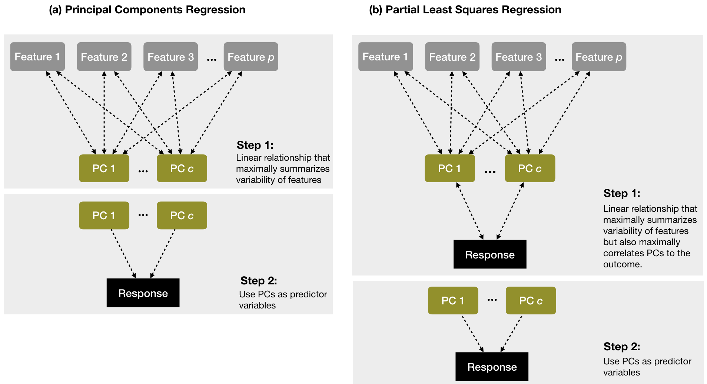

```{r}
#| include: false
knitr::opts_chunk$set(
  echo = TRUE,
  message = FALSE,
  warning = FALSE,
  fig.align = "center",
  fig.height = 9
)
library(tidyverse)
ggplot2::theme_set(ggplot2::theme_light(base_size = 20))
```

## What is the goal of dimension reduction?

We have $p$ variables (columns) for $n$ observations (rows) **BUT** which variables are **interesting**?

. . .

<br>

Specifically: can we find a **smaller number of dimensions** that captures the interesting structure in the data?

- Could examine all pairwise scatterplots of each variable -- tedious, manual process

- Clustering variables based on correlation -- this still doesn't reduce the number of dimensions

- Can we find a combination of the original $p$ variables?

. . .

<br>

__Dimension reduction__: 

- Focus on **reducing the dimensionality** of the feature space (i.e., number of columns)

- While __retaining__ most of the information / __variability__ in a lower dimensional space (i.e., reducing the number of columns)


## Principal components analysis (PCA)

- PCA explores the **covariance** between variables, and combines variables into a smaller set of **uncorrelated** variables called **principal components (PCs)**

. . .

- PCs are **weighted**, (normalized) **linear combinations** of the original variables

  - Weights reveal how different variables are **loaded** into the PCs
  
. . .  
  
- We want a **small number of PCs** to explain most of the information/variance in the data

. . .

<br>

So that no set of variables dominate the total variance in the data, we **standardize all relevant variables** (i.e., *center* and *scale*)!

## Principal components (a little more formal)

Assume $\boldsymbol{X}$ is a $n \times p$ feature matrix that has been **standardized**

. . .

<br>

PCA will give us $p$ principal components that are $n$-length columns, denoted by $Z_1, \dots, Z_p$

. . . 

- The matrix of these principal components is called the **PC matrix** (aka the scores matrix): $Z = (Z_1, \cdots, Z_p)^T$

. . .

- The first PC is the *linear combination* of the $p$ variables that has the *largest possible variance*.

. . .

- Each succeeding component has the largest possible variance under the constraint that it is *uncorrelated* with the preceding components

. . .

<br>

_Often, a small number of principal components ($p^* < p$) can explain a high proportion of the variability in the data_

## Principal components analysis (PCA)

](https://allmodelsarewrong.github.io/images/pcr/pcr-path-diag-scores.svg)


## First two principal components  


{fig-align="center" width="50%"}

## First principal component (PC1)

$$Z_1 = \phi_{11} X_1 + \phi_{21} X_2 + \dots + \phi_{p1} X_p$$
*where*:

- $\phi_{j1}$ is the weight (loading) indicating the contribution of each variable $j = 1, \dots, p$ to PC1

. . .
  
- Weights are normalized: $\sum_{j=1}^p \phi_{j1}^2 = 1$

. . .
  
- $\phi_{1} = (\phi_{11}, \phi_{21}, \dots, \phi_{p1})$ is the **loading vector** for PC1

. . .

<br>

$Z_1$ is the linear combination of the $p$ variables that has the largest variance (among all PCs)


## Second principal component (PC2)

$$Z_2 = \phi_{12} X_1 + \phi_{22} X_2 + \dots + \phi_{p2} X_p$$

*where*:

-  $\phi_{j2}$ is the weight (loading) indicating the contribution of each variable $j = 1, \dots, p$ to PC2
  
. . .  
  
- Weights are normalized: $\sum_{j=1}^p \phi_{j2}^2 = 1$

. . . 
  
- $\phi_{2} = (\phi_{12}, \phi_{22}, \dots, \phi_{p2})$ is the **loading vector** for PC2

. . . 

<br>

$Z_2$ is a linear combination of the $p$ variables that has the **largest variance** BUT subject to constraint it is **uncorrelated with $Z_1$**


## The rest of the principal components

We repeat this same process to create $p$ principal components, such that:

. . .

- **Uncorrelated**: Each PC pair ($Z_j, Z_{k}$) for all $j \neq k$ is uncorrelated with each other

. . .

- **Ordered Variance**: $\text{Var}(Z_1) > \text{Var}(Z_2) > \dots > \text{Var}(Z_p)$

. . .

- **Total Variance**: $\sum_{j=1}^p \text{Var}(Z_j) = p$ (*ideas for why the total variance is $p$?*)
    
    
. . .

<br>


*So how do we estimate the principal components from the observed data?*
<!--    
## Obtaining the principal components

Repeat the same process to create $p$ principal components

* __Uncorrelated__: Each ($Z_j, Z_{j'}$) is uncorrelated with each other

* __Ordered Variance__: $\text{Var}(Z_1) > \text{Var}(Z_2) > \dots > \text{Var}(Z_p)$

* __Total Variance__: $\displaystyle \sum_{j=1}^p \text{Var}(Z_j) = p$

PCA can be

* formulated as an optimization problem

* solved via linear algebra techniques (e.g. eigen decomposition or singular value decomposition (SVD))


## Geometry of PCA

* The loading vector $\phi_1$ with elements $\phi_{11}, \phi_{21}, \dots, \phi_{p1}$ defines a direction in feature space along which the data vary the most

* If we project the observations in our dataset onto this direction, the projected values are called the principal component scores

## Singular Value Decomposition (SVD)

We can factorize that matrix $X$ as follows:

$$
X = U D V^T
$$

*where*:

- Matrices $U$ and $V$ contain the left and right (respectively) **singular vectors of the (scaled) matrix $X$**

- $D$ is the diagonal matrix of **singular values**

. . .

- SVD simplifies matrix-vector multiplication as **rotate, scale, and rotate again**

. . .

$V$ is called the **loading matrix** for $X$ with $\phi_{j}$ as columns. *Note that $Z = X  V$ is the PC matrix!*

-->

## Eigenvalue decomposition (aka spectral decomposition)

With [singular value decomposition (SVD)](https://en.wikipedia.org/wiki/Singular_value_decomposition), we can factorize that matrix $X$ as follows:

$$
X = U D V^T
$$

*where*:

- $V$ are __eigenvectors__ of $X^TX$ (covariance matrix, $^T$ means _transpose_)

. . .

- $U$ are the __eigenvectors__ of $XX^T$

. . .

- The singular values (diagonal of $D$) are square roots of the __eigenvalues__ of $X^TX$ or $XX^T$.

. . .

Here, $Z = UD$ is the PC matrix, which can also be written as: $Z = XV$ since $V$ is an orthonormal matrix ($V^T V = I$)!

  - Thus, $V$ is called the **loading matrix** for $X$ with $\phi_{j}$ as columns

:::{.aside}

For an visual refresher on eigenvalues and eigenvectors, see [3Blue1Brown: Eigenvectors and eigenvalues](https://www.youtube.com/watch?v=PFDu9oVAE-g) 
:::

## Eigenvalues guide dimension reduction

We want to choose $p^* < p$ such that we are explaining variation in the data

. . .

Eigenvalues $\lambda_j$ for $j \in 1, \dots, p$ indicate __the variance explained by each component__. In particular:

. . .

  - $\displaystyle \sum_j^p \lambda_j = p$, meaning $\lambda_j \geq 1$ indicates $\text{PC}j$ contains at least one variable's worth in variability
  
. . .
  
  - $\lambda_j/{p}$: proportion of variance explained by $\text{PC}j$
  
. . .
  
  - Arranged in descending order so that $\lambda_1$ is largest eigenvalue and corresponds to PC1
  
. . .
  
  - Compute the cumulative proportion of variance explained (CVE) with $p^*$ components:
  
$$\text{CVE}_{p^*} = \sum_j^{p*} \frac{\lambda_j}{p}$$

Use a [__scree plot__](https://en.wikipedia.org/wiki/Scree_plot) to plot eigenvalues and guide choice for $p^* <p$ by looking for "elbow" (rapid to slow change) -- *more on this later*


# Example in `R`

## Data: National Women’s Soccer League (NWSL) Team Statistics

Data contains statistics on the regular season performance of each NWSL team between 2016--2022 (excluding 2020 which was cancelled due to COVID)

```{r}
library(tidyverse)
theme_set(theme_light())
nwsl_team_stats <- read_csv("https://raw.githubusercontent.com/36-SURE/2026/main/data/nwsl-team-stats.csv")
glimpse(nwsl_team_stats)
```

```{r}
#| echo: false
ggplot2::theme_set(ggplot2::theme_light(base_size = 20))
```

:::{.aside}
Once again, the data is from the [SCORE Sports Data Repository](https://data.scorenetwork.org/soccer/nwsl-team-stats.html).
:::

## Implementing PCA

Use the `prcomp()` function (based on SVD) for PCA on centered and scaled data

```{r}
nwsl_team_feat <- nwsl_team_stats |> 
  select(cross_accuracy:tackle_success_pct) # extracting relevant metrics

nwsl_team_pca <- prcomp(nwsl_team_feat, center = TRUE, scale. = TRUE) 
summary(nwsl_team_pca)
```


## Computing the principal components

Extract the matrix of principal components

```{r}
nwsl_team_pc_matrix <- nwsl_team_pca$x
head(as.data.frame(nwsl_team_pc_matrix))
```
<br>

. . . 

Note: columns are mutually uncorrelated, and $\text{Var}(Z_1) > \text{Var}(Z_2) > \dots > \text{Var}(Z_p)$ 

```{r}
# cov(nwsl_team_pc_matrix) # see for yourself!
```


## Extracting the loading matrix

```{r}
as.data.frame(nwsl_team_pca$rotation) |> rownames_to_column("statistic")
```


## Visualizing first two principal components

::: columns
::: {.column width="50%" style="text-align: left;"}

Principal components are not interpretable on their own

```{r pca-plot, eval = FALSE}
nwsl_team_stats_pca <- nwsl_team_stats |> 
  mutate(pc1 = nwsl_team_pc_matrix[,1], 
         pc2 = nwsl_team_pc_matrix[,2])

nwsl_team_stats_pca |> 
  ggplot(aes(x = pc1, y = pc2)) +
  geom_point(alpha = 0.5) +
  labs(x = "PC1 (38.5%) ", y = "PC2 (25.7%)")
```

<br>

Make a __biplot__ with arrows showing the linear relationship between one variable and other variables

:::

::: {.column width="50%" style="text-align: left;"}

```{r ref.label="pca-plot", echo = FALSE, fig.height=10}
```

:::
:::


## Making PCs interpretable with biplots

Biplot displays both the space of observations and the space of variables

::: columns
::: {.column width="50%" style="text-align: left;"}

```{r}
#| echo: false
library(factoextra)
```


```{r pca-biplot, eval = FALSE}
library(factoextra) # install.packages("factoextra")
# fviz_pca_var(): projection of variables
# fviz_pca_ind(): display observations with first two PCs
nwsl_team_pca |> 
  fviz_pca_biplot(label = "var",
                  alpha.ind = 0.25,
                  alpha.var = 0.75,
                  labelsize = 5,
                  col.var = "darkblue",
                  repel = TRUE)
```

:::{.fragment}

<br> 

*We can look at three attributes of the arrows*:

1. Direction 

2. Angle
  
3. Length

:::

:::


::: {.column width="50%" style="text-align: left;"}

```{r ref.label = "pca-biplot", echo = FALSE, fig.height=10}

```

:::
:::

## Interpreting a biplot: arrow direction

::: columns
::: {.column width="50%" style="text-align: left;"}

Arrow direction indicates the **sign of the variable's loadings**

:::{.fragment}

- The *arrow direction* for `tackle_success_pct` suggests that as the percent of successful tackles for a team increases, $Z_1$ tends to decrease, but $Z_2$ tends to increase

$\Rightarrow$ Coefficient for `tackle_success_pct` is negative for $Z_1$ but positive for $Z_2$

:::

:::{.fragment}

- The *arrow direction* for `shot_accuracy` suggests that as percent of shots on target increases, both $Z_1$ and $Z_2$ also increase

$\Rightarrow$ Coefficient for `shot_accuracy` is positive for both $Z_1$ and $Z_2$

:::
:::


::: {.column width="50%" style="text-align: left;"}

```{r ref.label = "pca-biplot", echo = FALSE, fig.height=10}

```

:::
:::

## Interpreting a biplot: arrow angle


::: columns
::: {.column width="50%" style="text-align: left;"}

The angle between two vectors displays of the **correlation** between the variables. In particular:

:::{.incremental}

* Right angle ($90^{\circ}$): *variables are uncorrelated* (e.g. `cross_accuracy` and `possession_pct`)

* Acute ($< 90^{\circ}$): *variables are positively correlated* (e.g. `shot_accuracy` and `goal_conversion_pct`)

* Obtuse ($> 90^{\circ}$):*variables are negatively correlated* (e.g. `tackle_success_pct` and `pass_pct`)

:::

:::


::: {.column width="50%" style="text-align: left;"}

```{r ref.label = "pca-biplot", echo = FALSE, fig.height=10}

```

:::
:::

## Interpreting a biplot: arrow length

::: columns
::: {.column width="50%" style="text-align: left;"}

Arrow length indicates how **strongly related** the principal components are with the variables

- The *arrow length* for `shot_accuracy` suggests it has coefficients that are relatively large in the loading (rotation) matrix

:::{.fragment}
- The *arrow length* for `cross_accuracy` suggests it has coefficients that are relatively small in the loading (rotation) matrix
:::

:::


::: {.column width="50%" style="text-align: left;"}

```{r ref.label = "pca-biplot", echo = FALSE, fig.height=10}

```

:::
:::

## Intuition on how many PCs to use

```{r}
summary(nwsl_team_pca)
```

. . .

*As expected*:

- PC1 accounts for the most variation in our data, PC2 accounts for the next most, and so on...

. . .

- Each time we add a new PC dimension, we capture a higher proportion of the variability/information in the data

. . .

- **BUT** that increase in proportion of variance explained decreases for each new dimension we add (i.e., additional PCs will add smaller and smaller variance)

. . .

*It is recommended to keep adding PCs until the marginal gain levels off (i.e. decreases to the point that it isn’t too beneficial to add another dimension to the data)*


## Create a scree plot (or elbow plot)


::: columns

::: {.column width="50%" style="text-align: left;"}

Scree plot shows the proportion of variation explained by each PC

<br>

:::{.fragment}

*Two common rules-of-thumb*:

- Visual: look for the "elbow" (where the proportion of variation starts to become flat)

- Heuristic: horizontal line at $1/p$

:::

<br>

:::{.fragment}
**For us**: we can make a strong argument to use first 3 PCs (but maybe go up to first 5 PCs for another substantial drop in the elbow)
:::


:::
::: {.column width="50%" style="text-align: left;"}

```{r, eval=FALSE, fig.align='center', out.width="90%"}
nwsl_team_pca |> 
  fviz_eig(addlabels = TRUE) +
  geom_hline(
    yintercept = 100 * (1 / ncol(nwsl_team_pca$x)), 
    linetype = "dashed", 
    color = "darkred",
  )
```

```{r, eval = TRUE, echo = FALSE, fig.align='center', out.width="80%"}
nwsl_team_pca |> 
  fviz_eig(addlabels = TRUE) +
  geom_hline(
    yintercept = 100 * (1 / ncol(nwsl_team_pca$x)), 
    linetype = "dashed", 
    color = "darkred",
  ) +
  theme(text = element_text(size = 20))
```


:::
:::

## Remember the spelling...

<blockquote class="twitter-tweet"><p lang="en" dir="ltr">folks. it&#39;s _principal_ (not principle) components analysis.</p>&mdash; Stephanie Hicks, PhD (@stephaniehicks) <a href="https://twitter.com/stephaniehicks/status/1626428875323367424?ref_src=twsrc%5Etfw">February 17, 2023</a></blockquote> <script async src="https://platform.twitter.com/widgets.js" charset="utf-8"></script>

# Principal component regression (PCR)

## Principal component regression (PCR)

](https://allmodelsarewrong.github.io/images/pcr/pcr-path-diagram.svg){fig-align="center"}

## Implement PCR with `pls`

```{r}
nwsl_model_data <- nwsl_team_stats |>
  select(-team_name, -season, -games_played, -goals, -goals_conceded)

# goal_differential will be our outcome (we will talk soon about how to model count data)
```


<br>

. . .

Similar syntax to lm formula but specify the number of PCs (`ncomp`)

```{r}
library(pls) #install.packages("pls")
nwsl_pcr_fit <- pcr(goal_differential ~ ., ncomp = 2,
                    center = TRUE, scale = TRUE, data = nwsl_model_data)
summary(nwsl_pcr_fit)
```

## Tuning PCR with `caret`

:::{columns}

:::{.column}

```{r}
#| warning: false
#| eval: false
set.seed(0622)
library(caret)

cv_model_pcr <- train(
  goal_differential ~ ., 
  data = nwsl_model_data, 
  method = "pcr",
  trControl = trainControl(method = "cv", number = 10),
  preProcess = c("center", "scale"),
  tuneLength = ncol(nwsl_model_data) - 1)

ggplot(cv_model_pcr)
```

:::

:::{.column}

```{r}
#| warning: false
#| echo: false
#| fig-height: 10
set.seed(0622)
library(caret)

cv_model_pcr <- train(
  goal_differential ~ ., 
  data = nwsl_model_data, 
  method = "pcr",
  trControl = trainControl(method = "cv", number = 10),
  preProcess = c("center", "scale"),
  tuneLength = ncol(nwsl_model_data) - 1)

ggplot(cv_model_pcr)
```

:::

:::
## Tuning PCR with `caret`

```{r}
summary(cv_model_pcr$finalModel)
```

## Tuning PCR with `caret`

```{r}
set.seed(0622)

cv_model_pcr_onese <- train(
  goal_differential ~ ., 
  data = nwsl_model_data, 
  method = "pcr",
  trControl = 
    trainControl(method = "cv", number = 10,
                 selectionFunction = "oneSE"),
  preProcess = c("center", "scale"),
  tuneLength = ncol(nwsl_model_data) - 1)

summary(cv_model_pcr_onese$finalModel)
```

# Appendix

## Partial least squares (PLS)

**PCR is agnostic of response variable**



## PLS as supervised dimension reduction

**First principal component** in PCA:

$$
Z_1 = \phi_{11} X_1 + \phi_{21} X_1 + \cdots + \phi_{p1} X_p
$$

. . .

In PLS, we set $\phi_{j1}$ to the coefficient from the **simple linear regression** of $Y$ on $X_j$ for each $j = 1, 2, \dots, p$

. . .

- Remember this slope is proportional to the correlation! $\hat{\beta} = r_{X,Y} \cdot \frac{s_Y}{s_X}$

. . . 

- Thus $Z_1$ in PLS places most weight on variables strongly related to response $Y$

. . .

To compute $Z_2$ for PLS:

- Regress each $X_j$ on $Z_1$: the residuals capture signal not explained by $Z_1$

- Set $\phi_{j2}$ to the coefficient from simple linear regression of $Y$ on these residuals for each variable 

. . .

Repeat process until all $Z_1, Z_2, \dots, Z_p$ are computed (**PLS components**)

. . .

Then, regress $Y$ on $Z_1, Z_2, \dots, Z_{p^*}$ where $p^* < p$ is a tuning parameter


## Tuning PLS with `caret`

:::{columns}

:::{.column}
```{r}
#| eval: false
set.seed(0622)

cv_model_pls <- train(
  goal_differential ~ ., 
  data = nwsl_model_data, 
  method = "pls",
  trControl = 
    trainControl(method = "cv", number = 10,
                 selectionFunction = "oneSE"), 
  preProcess = c("center", "scale"),
  tuneLength = 6)

ggplot(cv_model_pls)
```

:::{.incremental}

- Contrasts with PCR results -- lower RMSE and "optimal" number of components


- Fewer PLS components because they are guided by the response variable

:::{.fragment}
*But how do we summarize variable relationships without a single coefficient?*
:::
:::

:::

:::{.column}
```{r}
#| echo: false
#| fig-height: 10
set.seed(0622)

cv_model_pls <- train(
  goal_differential ~ ., 
  data = nwsl_model_data, 
  method = "pls",
  trControl = 
    trainControl(method = "cv", number = 10,
                 selectionFunction = "oneSE"), 
  preProcess = c("center", "scale"),
  tuneLength = 6)

ggplot(cv_model_pls)
```
:::
:::

## Variable importance

:::{columns}


:::{.column}

**Variable importance** attempts to quantify how influential variables are in the model

- E.g., absolute value of $t$-statistic in regression

**For PLS**: weighted sums of the absolute regression coefficients across components

- Weights are function of reduction of RSS across the number of PLS components

```{r}
#| eval: false
library(vip) #install.packages("vip")
vip::vip(cv_model_pls$finalModel) 
```

:::
:::{.column}
```{r}
#| echo: false
#| fig-height: 11
# alternative with vip
library(vip) #install.packages("vip")
vip::vip(cv_model_pls$finalModel) 
```

:::

:::


## Partial dependence plots (PDP) with `pdp` package

:::{columns}

:::{.column}

PDPs display the change in the **average predicted response as the predictor varies over their marginal distribution**

```{r}
#| eval: false
library(pdp) #install.packages("pdp")
partial(cv_model_pls, "goal_conversion_pct", plot = TRUE)
```

*More useful for non-linear models later on!*
:::

:::{.column}
```{r}
#| echo: false
#| fig-height: 8
library(pdp) #install.packages("pdp")
partial(cv_model_pls, "goal_conversion_pct", plot = TRUE)
```
:::
:::


## [Visualizing PCA](https://www.stevejburr.com/post/scatter-plots-and-best-fit-lines/) in two dimensions

```{r, echo = FALSE, fig.align='center', fig.height=7}
set.seed(123) 
plot_data <- tibble(x = rnorm(50, mean = 100, sd = 20)) |>
  mutate(y =  0.8 * x + rnorm(50, mean = 0, sd = 10))
basic_scatter <- ggplot(plot_data) +
  geom_point(aes(x, y), color = "black")+
  coord_equal()
basic_scatter
```

## [Visualizing PCA](https://www.stevejburr.com/post/scatter-plots-and-best-fit-lines/) in two dimensions

```{r, echo = FALSE, fig.align='center', fig.height=7}
#fit the model
line1 <- lm(y ~ x, plot_data)$coef
#extract the slope from the fitted model
line1.slope <- line1[2]
#extract the intercept from the fitted model
line1.intercept <- line1[1]
basic_scatter_yfit <- basic_scatter +
  geom_abline(aes(slope = line1.slope, intercept = line1.intercept),
              colour = "darkorange", linewidth = 1.2) +
  annotate("text", x = 75, y = 115, label = "y ~ x", color = "darkorange",
           size = 9)
basic_scatter_yfit
```

## [Visualizing PCA](https://www.stevejburr.com/post/scatter-plots-and-best-fit-lines/) in two dimensions

```{r, echo = FALSE, fig.align='center', fig.height=7}
#fit the model
line2 <- lm(x ~ y, plot_data)$coef
#extract the slope from the fitted model
line2.slope <- 1 / line2[2]
#extract the intercept from the fitted model
line2.intercept <- -(line2[1] / line2[2])
basic_scatter_xyfit <- basic_scatter_yfit +
  geom_abline(aes(slope = line2.slope, intercept = line2.intercept),
              colour = "blue", linewidth = 1.2) +
  annotate("text", x = 125, y = 55, label = "x ~ y", color = "blue",
           size = 9)
basic_scatter_xyfit
```

## [Visualizing PCA](https://www.stevejburr.com/post/scatter-plots-and-best-fit-lines/) in two dimensions

```{r, echo = FALSE, fig.align='center', fig.height=7}
pca <- prcomp(cbind(plot_data$x, plot_data$y))$rotation
pca.slope <- pca[2,1] / pca[1,1]
pca.intercept <- mean(plot_data$y) - (pca.slope * mean(plot_data$x))

basic_scatter_y_pca_fit <- basic_scatter_xyfit +
  geom_abline(aes(slope = pca.slope, intercept = pca.intercept),
              colour = "darkred", linewidth = 1.2) +
  annotate("text", x = 75, y = 90, label = "PCA", color = "darkred",
           size = 9)
basic_scatter_y_pca_fit
```

## [Visualizing PCA](https://www.stevejburr.com/post/scatter-plots-and-best-fit-lines/) in two dimensions

**Key idea**: provide low-dimensional linear surfaces that are closest to the observations

```{r fig.width=10, fig.height=5, echo = FALSE, fig.align='center'}
plot_data |>
  #calculate the positions using the line equations:
  mutate(yhat_line1=(x*line1.slope+line1.intercept),
         xhat_line1=x,
         yhat_line2=y,
         xhat_line2=(y-line2.intercept)/line2.slope,
         #https://en.wikipedia.org/wiki/Distance_from_a_point_to_a_line
         a=pca.slope,
         b=-1,
         c=pca.intercept,
         xhat_line3=(b*(b*x-a*y)-(a*c))/((a*a)+(b*b)),
         yhat_line3=(a*(-b*x+a*y)-(b*c))/((a*a)+(b*b)),
         #add the slopes/intercepts to this data frame:
         slope_line1=line1.slope,
         slope_line2=line2.slope,
         slope_line3=pca.slope,
         intercept_line1=line1.intercept,
         intercept_line2=line2.intercept,
         intercept_line3=pca.intercept
         )|> 
  #drop intermediate variables
  select(-c(a,b,c)) |>
  pivot_longer(yhat_line1:intercept_line3, names_to = "key", values_to = "value") |>
  #transpose to a long form
  #gather(key="key",value="value",-c(x,y)) |> 
  # have "yhat_line1", want two colums of "yhat" "line1"
  separate(key,c("type", "line"), "_") |> 
  #then transpose to be fatter, so we have cols for xhat, yhat etc
  pivot_wider(names_from = "type", values_from = "value") |>
  #spread(key="type",value="value") |>
  #relabel the lines with more description names, and order the factor for plotting:
  mutate(line=case_when(
           line=="line1" ~ "y ~ x",
           line=="line2" ~ "x ~ y",
           TRUE ~ "PCA"
         ),
         line = fct_relevel(line, "y ~ x", "x ~ y", "PCA")) |> 
  #filter(line != "x ~ y") |> 
  ggplot() +
  geom_point(aes(x = x, y = y, color = line)) +
  geom_abline(aes(slope = slope, intercept = intercept, color = line), linewidth = 1.2) +
  geom_segment(aes(x = x, y = y, xend = xhat, yend = yhat, color = line)) +
  facet_wrap(~ line, ncol = 3) +
  scale_color_manual(values = c("darkorange", "blue", "darkred")) +
  theme_bw() +
  theme(strip.background = element_blank(),
        legend.position = "none",
        strip.text = element_text(size = 16))
```

. . .

* The above is the **minimizing projection residuals** viewpoint of PCA

* There's another viewpoint---**maximizing variance**. That is, if we project all points onto the solid red line, we maximize the variance of the resulting projected points across all such red lines

## PCA output

```{r}
# str(nwsl_team_pca)
```

Examine the output after running `prcomp()`

* `nwsl_team_pca$sdev`: singular values ($\sqrt{\lambda_j}$)

* `nwsl_team_pca$rotation`: loading matrix ($V$)

*  `nwsl_team_pca$x`: principal component scores matrix ($Z=XV$)

Can use the `broom` package for tidying `prcomp()`

```{r, eval=FALSE}
library(broom)
tidy(nwsl_team_pca, matrix = "eigenvalues") # equivalent to nwsl_team_pca$sdev
tidy(nwsl_team_pca, matrix = "rotation") # equivalent to nwsl_team_pca$rotation
tidy(nwsl_team_pca, matrix = "scores") # equivalent to nwsl_team_pca$x
```

## Proportion of variance explained

```{r}
#| echo: false
library(broom)
```


:::{columns}

:::{.column}

```{r}
#| eval: false
nwsl_team_pca |>
  tidy(matrix = "eigenvalues") |>
  ggplot(aes(x = PC, y = percent)) +
  geom_line() + 
  geom_point() +
  geom_hline(yintercept = 1 / ncol(nwsl_team_feat),
             color = "darkred", linetype = "dashed") +
  scale_x_continuous(breaks = 1:ncol(nwsl_team_pca$x)) +
  scale_y_continuous(labels = scales:: label_percent())
```

:::

:::{.column}
```{r}
#| echo: false
#| fig-height: 10
nwsl_team_pca |>
  tidy(matrix = "eigenvalues") |>
  ggplot(aes(x = PC, y = percent)) +
  geom_line() + 
  geom_point() +
  geom_hline(yintercept = 1 / ncol(nwsl_team_feat),
             color = "darkred", linetype = "dashed") +
  scale_x_continuous(breaks = 1:ncol(nwsl_team_pca$x)) +
  scale_y_continuous(labels = scales:: label_percent())
```
:::
:::

## Cumulative proportion of variance explained

:::{columns}

:::{.column}

```{r}
#| eval: false
nwsl_team_pca |>
  tidy(matrix = "eigenvalues") |>
  ggplot(aes(x = PC, y = cumulative)) +
  geom_line() + 
  geom_point() +
  scale_x_continuous(breaks = 1:ncol(nwsl_team_pca$x)) +
  scale_y_continuous(labels = scales:: label_percent())
```

:::

:::{.column}
```{r}
#| echo: false
#| fig-height: 10
nwsl_team_pca |>
  tidy(matrix = "eigenvalues") |>
  ggplot(aes(x = PC, y = cumulative)) +
  geom_line() + 
  geom_point() +
  scale_x_continuous(breaks = 1:ncol(nwsl_team_pca$x)) +
  scale_y_continuous(labels = scales:: label_percent())
```
:::
:::

## Biplot discussion

::: columns
::: {.column width="50%" style="text-align: left;"}

```{r, eval=FALSE, fig.align='center', out.width="90%"}
nwsl_team_pca |> 
  fviz_eig(addlabels = TRUE) +
  geom_hline(
    yintercept = 100 * (1 / ncol(nwsl_team_pca$x)), 
    linetype = "dashed", 
    color = "darkred",
  )
```

```{r, eval = TRUE, echo = FALSE, fig.align='center', out.width="80%"}
nwsl_team_pca |> 
  fviz_eig(addlabels = TRUE) +
  geom_hline(
    yintercept = 100 * (1 / ncol(nwsl_team_pca$x)), 
    linetype = "dashed", 
    color = "darkred",
  ) +
  theme(text = element_text(size = 20))
```


:::

::: {.column width="50%" style="text-align: left;"}

* A biplot only plots the first 2 PCs, and so we are hiding some data information (~36% of information) that we are better off plotting in some way if possible

  * ~40% of this remaining information is captured by PC3

* Theoretically, we should plot three quantitative variables (e.g., point size, transparency, or even a [3D scatterplot](https://plotly.com/r/3d-scatter-plots/))

* Alternatively, we could make three scatterplots (one for each pair of PCs)

:::
:::
