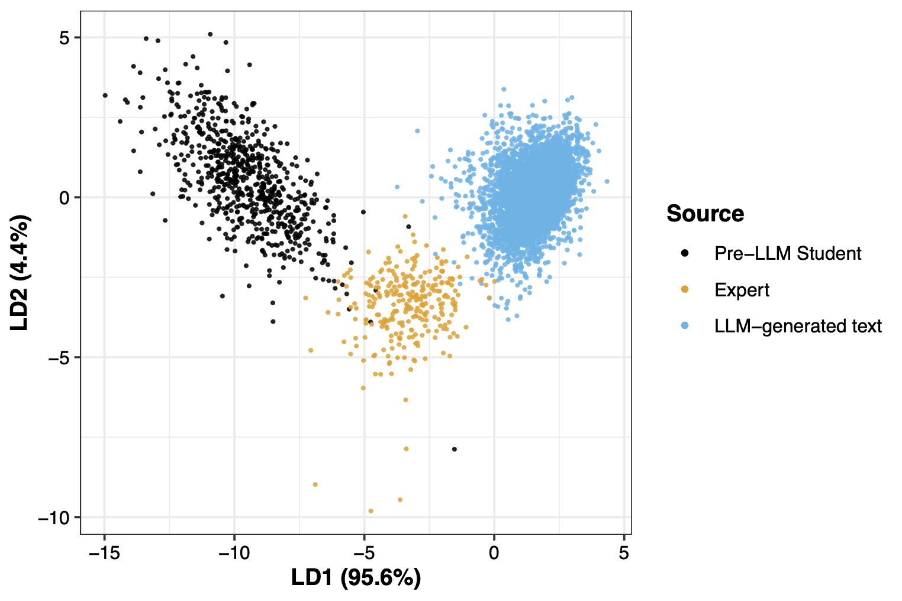
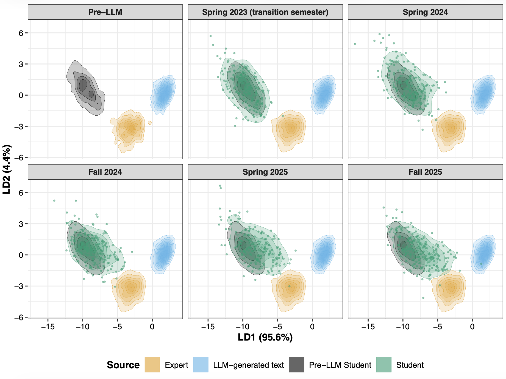

## Principal Components Analysis (PCA) Recap

- **Unsupervised** method of dimensionality reduction that aims to find the directions of maximum variance in a dataset

- End goal is to have a smaller set of variables (principal components) that capture the most important patterns in the data. These principal components 

  - are linear combinations of the features 
  - are mutally uncorrelated

- Keep the principal components that explain a certain percentage of the total variance in the data

## Overview of LDA

- Aims to find the linear combination of features that best separates the classes in a dataset

  - This makes LDA a **supervised learning method** for dimensionality reduction

- End goal is to reduce the dimensionality of the data while preserving the information that is most relevant for class discrimination

```{r out.width='20%', echo = FALSE, fig.align='center'}
knitr::include_graphics("https://miro.medium.com/v2/resize:fit:1400/1*ELmUt0gXZPm3s5bfcr5KOg.png")
```

## Examples of problems using LDA

::: {.incremental}

- Based on a patient's set of medical features, should we classify the patient as healthy or suffering from a particular disease?

- Given a product's various measurements or attributes, should we classify it as defective or non-defective?

- Given the a text's set of stylistic features, is it most likely written by a student, expert, or large language model? [Sara and Erin's preprint](https://arxiv.org/abs/2606.22735)

:::

## LDA for text classification 

```{r out.width='20%', fig.align='center'}

```

## LDA for text classification 

```{r out.width='20%', fig.align='center'}

```

## LDA visually 

Let's say we are interested in deciding whether to give someone a medication based on two features: $x$ and $y$. 

- Blue: responders to the medication
- Red: non-responders to the medication

```{r, echo=F}
library(tidyverse)
dat <- data.frame(
 x = c(1, 1.2, 1.3,1.5, 1.9, 2.3, 2.5, 3.2, 3.4, 3.5, 3.55, 3.7), 
 y = c(3, 0.5, 0.7, 1.5, 3.2, 1.3, 2.9, 2.5, 2.9, 2.95, 0.75, 3.05), 
 class = c("A", "A", "A", "A", "B", "A", "B", "A", "B", "B", "B", "B")
)
ggplot(dat, aes(x=x, y=y, color = class))+
  geom_point(size = 3)+
  theme_bw()+
  coord_fixed()+
  theme(legend.position = "none")
```

## LDA visually

::: columns
::: {.column width="50%" style="text-align: left;"}

- For a **two-class** problem, LDA finds a **single projection direction** that maximizes the separation between classes relative to the variation within classes. 

- The original data are projected onto this axis, reducing the problem from $p$ dimensions (where $p$ = number of predictors, here $p=2$) to one dimension.

- What's the best way to determine the projection direction? 

  - One option (bad) is to ignore $y$ and project the data down onto the $x$ axis.
  
:::
::: {.column width="50%" style="text-align: left;"}

```{r, echo=F}
a <- ggplot(dat, aes(x=x, y=y, color = class))+
  geom_point(size = 3)+
   geom_segment(aes(xend = x, yend = 0), linetype = "dashed", color = "gray") +
  coord_fixed()+
  theme_bw(base_size = 20)+
  theme(legend.position = "none")
```

```{r, echo=F}
#| fig-width: 5
#| fig-height: 5
b <- ggplot(dat, aes(x=x, y= 1, color = class))+
  geom_point(size = 3)+
  geom_hline(yintercept = 1)+
  theme_void(base_size = 20)+
  theme(legend.position = "none")+
  coord_fixed()

library(patchwork)
a/b
```

:::
:::

## LDA visually

-  LDA finds the projection direction that produces the greatest separation between responders and non-responders

- This is perpendicular to the boundary that we might draw if we were separating these points by hand (dashed line on left plot)

  
::: columns
::: {.column width="50%" style="text-align: left;"}

```{r, echo=F}
#| fig-width: 4
#| fig-height: 4
ggplot(dat, aes(x=x, y=y, color = class))+
  geom_point(size = 3)+
  geom_abline(intercept = 4.6, slope = -1.2, linetype = "dashed")+
  #geom_abline(intercept = 0.1, slope = 0.8333)+
  #geom_segment(data = dat_proj, aes(x = x, y = y, xend = x_proj, yend = y_proj), inherit.aes = FALSE, linetype = "dashed")+
  coord_fixed()+
  theme_bw(base_size = 20)+
  theme(legend.position = "none")
```

:::

::: {.column width="50%" style="text-align: left;"}

```{r, echo=F}
#| fig-width: 4
#| fig-height: 4
m <- 0.8333
b <- 0.1
dat_proj <- dat |>
  mutate(x_proj = (x + m * (y - b)) / (1 + m^2),
    y_proj = m * x_proj + b)

ggplot(dat, aes(x=x, y=y, color = class))+
  geom_point(size = 3)+
  geom_abline(intercept = 4.6, slope = -1.2, linetype = "dashed")+
  geom_abline(intercept = 0.1, slope = 0.8333)+
  geom_segment(data = dat_proj, aes(x = x, y = y, xend = x_proj, yend = y_proj), inherit.aes = FALSE, linetype = "dashed")+
   coord_fixed()+
  theme_bw(base_size =20)+
  theme(legend.position = "none")
```

:::
:::

## LDA visually

We can now see the data projected onto the new axis in a way that maximizes the separation between responders and non-responders!

```{r, echo=F}
ggplot(dat_proj,
       aes(x = x_proj, y = y_proj, color = class)) +
  geom_abline(intercept = 0.1, slope = 0.8333) +
  geom_point(size = 3) +
  coord_fixed() +
  theme_bw(base_size = 20)+
  theme(legend.position = "none")+
  labs(x="x", y="y")
```

## Finding the "best" axis

LDA builds the model on two matrices. 

First, the between-group sum-of-square matrix, which measures the differences between the class means:

$$B=\sum_{k=1}^g n_k(\bar{X}_k-\bar{X})(\bar{X}_k-\bar{X})^\top$$

Second, the within-group sum-of-squares matrix, which measures the variation of values around each class mean:

$$W =\sum_{k=1}^g\sum_{i=1}^{n_k} (X_{ki}-\bar{X}_k)(X_{ki}-\bar{X}_k)^\top$$

:::{.aside}

A helpful resource for making the next few slides was [Interactively exploring high-dimensional data and models in R.](https://dicook.github.io/mulgar_book/14-lda.html) 
:::

## Finding the "best" axis

- The linear discriminant space is generated by computing the eigenvectors of $W^{-1}B$.

- This is the $(g-1)$-D space where the group means are most separated with respect to the pooled variance-covariance matrix.

- In other words, LDA asks which direction gives the greatest separation of the groups relative to their within-group spread.

  - The answer is the eigenvector corresponding to the largest eigenvalue of $W^{-1}B$. 

## The pooled covariance matrix

- $W$ can be considered the pooled within-class covariance (or scatter) matrix.

- LDA makes two assumptions 

  - The cluster structure corresponding to each class forms an ellipse, showing that the class is consistent with a sample from a multivariate normal distribution
  
  - The variance of values around each mean is nearly the same. More specifically, the classes have approximately equal covariance matrices.

. . . 

Let $X$ denote the vector of predictor variables for one individual. In the toy example, $X = (x, y)^T$
  
  $$X \vert \text{class}=A \sim \mathcal{N} \left(\begin{pmatrix} \mu_{Ax} \\\mu_{Ay} \end{pmatrix}, \Sigma\right)$$
  $$X \vert \text{class}=B \sim \mathcal{N} \left(\begin{pmatrix} \mu_{Bx} \\\mu_{By} \end{pmatrix}, \Sigma\right)$$

LDA assumes that the covariance matrix $\Sigma = \begin{pmatrix} \sigma_x^2 & \sigma_{xy} \\ \sigma_{xy} & \sigma_y^2 \end{pmatrix}$ is shared across classes. 

## The pooled covariance matrix

- The constant covariance assumption means the multi-dimensional spread and correlation of the features are identical across groups, differing only by their central means. 

- LDA is known to be quite robust and often performs well even if this assumption is slightly violated. 

  - For example, the covariance ellipses for the toy dataset are not equivalent, but we'd likely proceed with LDA.

- If we have evidence the assumption is broken, we'd proceed with **quadratic discriminant analysis**.

```{r}
ggplot(dat, aes(x = x, y = y, color = class)) +
  geom_point(size = 2) +
  stat_ellipse(type = "norm")+
  theme_bw() +
  coord_fixed() +
  theme(legend.position = "none")
```

## Assigning observations a class

Given a new observation $x$, for each class we compute 

$$\delta_k(x) = (x-\mu_k)^\top W^{-1}\mu_k + \log \pi_k$$

where $\pi_k$ is prior probability for class $k$ that might be based on unequal sample sizes, or cost of misclassification.

The LDA classifier rule is to assign a new observation to the class with the largest value of $\delta_k(x)$.

## Adding more dimensions

- The number of axes is equal to $\text{min}(g-1, p)$, where $g$ is the number of classes and $p$ the number of predictors.

- The first axis provides the greatest separation among the classes relative to within-class variation. 

- Subsequent axes explain additional independent patterns of class separation and are ordered according to their discriminating power.

## Data: Shohei Ohtani pitches 

Using by Shohei Ohtani's pitches in 2026, we will explore whether we can classify what pitch Ohtani threw using relase speed and release location.

```{r, echo=T}
ohtani <- read_csv("https://raw.githubusercontent.com/36-SURE/2026/main/data/ohtani.csv")
theme_set(theme_light())
```

## EDA on Ohtani's pitch tendencies

How often does Ohtani throw each pitch, and how do their speeds vary?

::: columns
::: {.column width="50%" style="text-align: left;"}

```{r, echo=T}
ohtani |> count(pitch_type) |> mutate(prop = n/sum(n)) |>
  ggplot(aes(x=fct_reorder(pitch_type, -prop), y = prop))+
  geom_col()+
  labs(x = "Pitch type")+
  theme_light(base_size = 20)
```
:::

::: {.column width="50%" style="text-align: left;"}

```{r, echo=T}
ohtani |>
  ggplot(aes(x=release_speed, y=pitch_type, color=pitch_type))+
  geom_boxplot()+
  labs(x="Release speed (mph)", y="")+
  theme_light(base_size = 20)+
  theme(legend.position = "none")
```

:::
:::

## Step 1: Preparing the data

First, determine class and variables of interest. Our research question will be: *can we discern Shohei Ohtani's pitch types from his release speed and position?*

```{r, echo=T}
ohtani_subset <- ohtani |> dplyr::select(pitch_type, release_speed, release_pos_x, release_pos_y, release_pos_z)
```

Next, create training and test data

```{r, echo=T}
#install.packages("rsample")
library(rsample)

set.seed(623)
data_split <- initial_split(ohtani_subset, prop = 0.75, strata = pitch_type)
train <- training(data_split)
test <- testing(data_split)
```

## Step 2a: Checking multivariate normality assumption

- Testing for exact multivariate normality in high dimensions is difficult.

- You may run multivariate normality tests such as the Marida, Royston, Henze-Zirkler tests with the [MVN package](https://www.rdocumentation.org/packages/MVN/versions/5.9/topics/mvn)

- If a set of variables is multivariate normal, each univariate marginal distribution also follows a normal distribution. 

  - Keep in mind, the reverse isn't true
  
::: columns
::: {.column width="50%" style="text-align: left;"}

```{r, message=F, warning=F, facet, eval = FALSE, echo=T}
train |>
  filter(pitch_type == "FF") |> 
  pivot_longer(cols = c(release_speed:release_pos_z), names_to = "measure", values_to = "value") |>
  ggplot(aes(x=value, fill = measure))+
  geom_histogram()+
  facet_wrap(~measure, scale = "free_x")+
  theme_bw(base_size = 20)+
  theme(legend.position = "none")
```

:::

::: {.column width="50%" style="text-align: left;"}

```{r ref.label = 'facet', echo = FALSE}

```


:::
:::


## Step 2b: Checking constant covariance assumption

- To check the constant covariance assumption, we can use ellipse plots or compare covariance matrices across pitch types. 

- The [boxM](https://arsilva87.github.io/biotools/reference/boxM.html) R function performs the Box's (1949) M-test for homogeneity of covariance matrices obtained from multivariate normal data according to one or more classification factors

  - Keep in mind this test may reject for small differences in large sample sizes.

## Step 2b: Checking constant covariance assumption
  

```{r, echo=T}
cov_ff_actual <- cov(subset(train, pitch_type == "FF", select = c(release_speed:release_pos_z)))
cov_st_actual <- cov(subset(train, pitch_type == "ST", select = c(release_speed:release_pos_z)))

cov_ff_actual
cov_st_actual

# library (biotools)
# train_sub <- train |> filter(pitch_type %in% c("FF", "ST"))
# biotools::boxM(train_sub[, c("release_speed", "release_pos_x", "release_pos_y", "release_pos_z")], train_sub$pitch_type)
```

## Step 3a: Fitting the LDA

What does each part of the output tell us?

```{r fit-lda, echo=T}
library(MASS)
lda_mod <- lda(pitch_type~., train)
lda_mod
```

## Step 3b: Plotting the LDA

::: columns
::: {.column width="50%" style="text-align: left;"}

```{r, init-lda, eval = FALSE, echo=T}
#| fig-width: 4
#| fig-height: 8
prop <- lda_mod$svd^2 / sum(lda_mod$svd^2)
percent <- round(100 * prop, 1)

scores <- predict(lda_mod)$x
scores_df <- data.frame(LD1 = scores[, 1], LD2 = scores[, 2], pitch_type = train$pitch_type)

ggplot(scores_df, aes(x = LD1, y = LD2, color = pitch_type)) +
  geom_point(alpha = 0.7) +
  theme_bw()+
  labs(x = paste0("LD1 (", percent[1], "%)"),
  y = paste0("LD2 (", percent[2], "%)"))+
  theme_bw(base_size = 20)+
  theme(legend.position = "bottom")
```

:::
::: {.column width="50%" style="text-align: left;"}

```{r ref.label = 'init-lda', echo = FALSE}

```

:::
:::

## Step 4: Making predictions

```{r pred-lda, echo=T}
test_preds <- predict(lda_mod, test)$class

#mean(test_preds == test$pitch_type)
table(Predicted = test_preds, Actual = test$pitch_type)
```

## Step 5: What features contribute?

- We *didn't* standardize the variables beforehand, so we cannot use the size of the coefficients to understand which variables drive each axis

  - If we had standardized beforehand, we might be able to interpret like "A one sd increase in release speed changes the LD1 score by about X units, whereas a one sd change release height changes LD1 by only about Y units".

- However, we can calculate the correlation of the LD scores with each variable.

```{r, echo=T}
cor(train |> dplyr::select(-pitch_type), scores)
```

## Connecting to other concepts 

Let's discuss! How does LDA relate to **PCA**? What about **clustering**? 

## Similarities between PCA and LDA {visibility="hidden"}

- Both methods are dimensionality reduction techniques

- Both methods rank the new axes in order of importance

  - PC1 (first new axis that PCA creates) accounts for most variation in the data
  - LD1 (first new axis that LDA creates) accounts for most variation between categories 

- Both methods let you see which variables are driving the new axes

  - PCA: look at the loading scores
  - LDA: which variables correlate with the new axes


