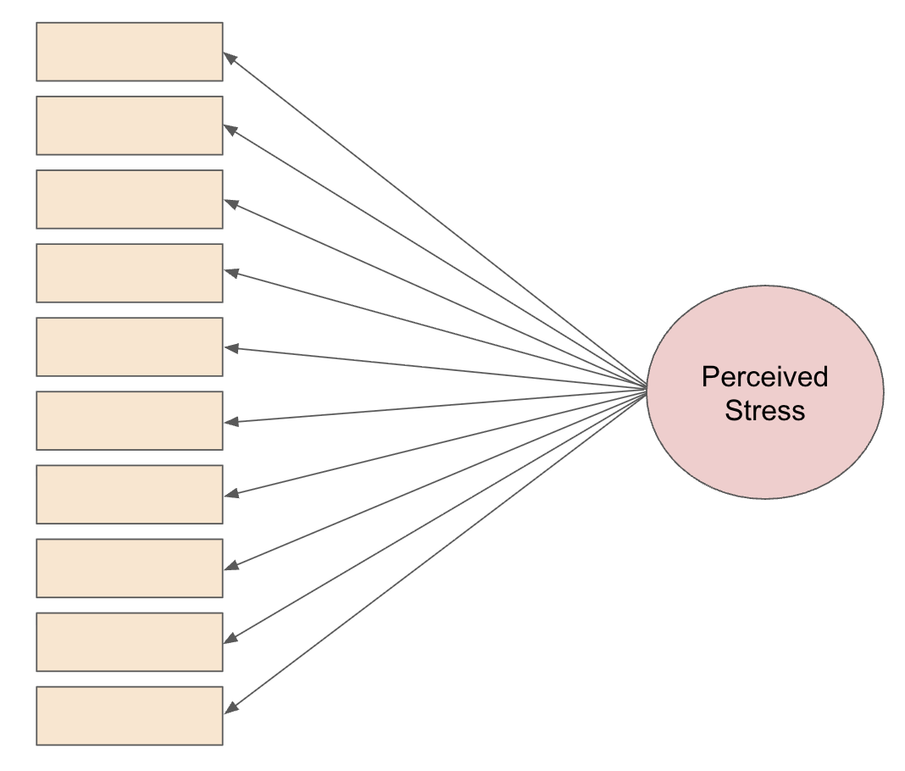

```{r}
#| include: false
knitr::opts_chunk$set(
  echo = TRUE,
  message = FALSE,
  warning = FALSE,
  fig.align = "center",
  fig.height = 9
)
library(tidyverse)
ggplot2::theme_set(ggplot2::theme_light(base_size = 20))
```

## Motivation

- How do we measure something we can't directly observe? For instance, how do we measure...
  
  - Psychology: depression, negative emotion, stress, extraversion
  
  - Economics: quality of life, socioeconomic status 
  
  - Sports: offensive ability, overall athletic ability
  
  - Education: mathematical knowledge, intelligence
  
. . .

- These are known as *latent variables*: a hidden or unobserved variable that influences observed data.

  - For example, mathematical knowledge will influence how you perform on a math test. 
    - No math test entirely captures mathematical knowledge 
    
. . .
  
- So far, we have been working with *observed variables* (e.g. blood pressure, weight, goals scored, etc.), so this poses new challenges.


##  Example: Perceived Stress Scale 


```{r, out.width='60%', fig.align='center', echo=F}
knitr::include_graphics("https://www.researchgate.net/profile/Elham-Akhlaghi-Pirposhteh/publication/356868394/figure/tbl1/AS:1098804736606210@1638986872157/Perceived-Stress-Scale-PSS-14-Questionnaire-35.png")
```

## Example: Perceived Stress Scale


::: columns
::: {.column width="50%" style="text-align: left;"}

- Any of the items will be useful as an indicator of an individual's current perceived state of stress. 

  - But none of them will completely capture an individual's true level of perceived stress.  
  
::: {.fragment}  

- Thus, each item can be considered as an imperfect measure of perceived stress. 

  - By considering the items collectively, we can get an estimate of the individual's underlying latent trait (perceived stress).
  
:::

:::

::: {.column width="50%" style="text-align: left;"}

```{r out.width='100%', fig.align='center', echo=F}

```

:::
:::

## Overview of Factor Analysis

**Dimension reduction**:  used to simplify the data structure by identifying a smaller number of underlying factors from the items

. . .

  - In the previous example, it is commonly accepted the 10 items load onto [one]{.underline} factor measuring perceived stress. 
  
. . .
  
  - Multiple factors may be needed: for example, personality is often measured by 5 factors (conscientiousness, agreebleness, extraversion, neuroticism, openness)

```{r out.width='50%', fig.align='center', echo=F}
knitr::include_graphics("https://devopedia.org/images/article/141/5228.1549391440.jpg")
```

## Overview of Factor Analysis

::: {.incremental}

- In creating the factors, factor analysis helps to identify items for improvement or removal because
they are:

  - redundant (measuring the same thing as another item)
  
  - irrelevant (poorly correlated with the intended underlying constructs, causing low **factor loadings**)
  
  - ambiguous (cross-loading significantly on multiple factors)
  
- Factor analysis informs the calculation of **factor scores**: (composite scores that combine a respondent’s scores for several related items)

  - These factor scores can be used for downstream analyses!
  
    - Example: Are higher levels of perceived stress linked to greater odds of developing a clinical cold?
    
:::

## Factor Analysis vs PCA 

- PCA: finds linear combinations that explain the **most total variance** in variables.

  - FA: Models latent (unobserved) variables that explain the **shared covariance** among observed variables.
  
. . . 
  
- PCA: components are mathematical summaries of the data.

  - FA: represent underlying constructs (e.g. athletic ability, depression)

. . .

- PCA: uses all variation in each variable.

  - FA: separates **shared variance** from **unique/error variance**
  
. . . 

- PCA example research question: "How can we summarize 10 decathlon events with a few components that retain as much variation as possible?"

  - FA asks, "Is there an underlying trait, like overall athletic ability, that explains why performances across events are correlated?"
  
## Motivating example for today: decathlon 

Decathlon is a two-day track and field competition in which athletes compete in ten specific disciplines testing speed, strength, and endurance. 

. . .

**Research Question**: Can we use these 10 events to measure some underlying latent trait(s) about the athletes? 

  - Specifically, do these events wholistically measure overall athletic ability, or more specific traits (power and endurance)?

. . .

Let's start by assuming these events reflect one factor (overall athletic ability).

## Introducing model structure 

- Every event depends partly on both *overall athletic ability* and *event-specific influences*.

- For example: $X_{100m} = F + \varepsilon_{100m}$ 

  - $X_{100m}$: 100m time
  - $F$: overall athletic ability
  - $\varepsilon_{100m}$: unexplained variance in 100m time that overall athletic ability cannot predict
  
- Similarly, $X_{110h} = F + \varepsilon_{110h}$ 

  - $X_{110h}$: 110m high hurdles time
  - $F$: overall athletic ability
  - $\varepsilon_{110h}$: unexplained variance in 110m high hurdles time that overall athletic ability cannot predict
  
## Introducing model structure 

Overall athletic ability may be a better predictor of performance in some events than others. The loading tells us how strongly athletic ability influences performance in a particular event.

$$X_{100m} = \lambda_{100m}F+ \varepsilon_{100m}$$
$$X_{110h} = \lambda_{110h}F+ \varepsilon_{110h}$$

When all observed variables and common factors are standardized to have unit variance, the loading behaves like a correlation.

## Introducing model structure 

$$\begin{bmatrix} x_{100mi} \\ x_{110hi} \\ \vdots \\ x_{jvi} \end{bmatrix} = \begin{bmatrix} \lambda_{100m} \\ \lambda_{110h} \\ \vdots \\ \lambda_{jv}  \end{bmatrix} \begin{bmatrix} F_{1i} \end{bmatrix} + \begin{bmatrix} \varepsilon_{100mi} \\ \varepsilon_{110hi} \\ \vdots \\ \varepsilon_{jvi} \end{bmatrix}$$

::: {.fragment}
**Observed variables** ($\mathbf{x}_i$)

- Outcome for each observed event (for each individual)
- One row per event, one column vector per athlete
:::

::: {.fragment}
**Factor loadings** ($\boldsymbol{\lambda}$)

- Strength of the relationship between each event and the latent factor
- If overall athletic ability is the factor, $\lambda_{100m}$ will indicate how strongly 100m time is influenced by overall athletic ability
- Interpret like linear regression: represents the expected change in the observed variable for a one standard deviation increase in the latent factor $F$
:::

## Introducing model structure 

$$\begin{bmatrix} x_{100mi} \\ x_{110hi} \\ \vdots \\ x_{jvi} \end{bmatrix} = \begin{bmatrix} \lambda_{100m} \\ \lambda_{110h} \\ \vdots \\ \lambda_{jv}  \end{bmatrix} \begin{bmatrix} F_{1i} \end{bmatrix} + \begin{bmatrix} \varepsilon_{100mi} \\ \varepsilon_{110hi} \\ \vdots \\ \varepsilon_{jvi} \end{bmatrix}$$

::: {.fragment}
**Latent factor** ($F_{1i}$)

- Reflects level of (unobserved) overall athletic ability for every athlete *i*
- Every athlete has one value of $F_1$, and the same value is used to predict all 10 event performances
- Assumed to have a linear relationship with underlying variables
:::

::: {.fragment}
**Residuals** ($\boldsymbol{\varepsilon}_i$)

- Variation in each observed variable that cannot be explained by the common factor(s) in the model
- Includes event-specific ability and measurement error: for 100m, reaction time, sprint specific ability, and wind are all not captured by overall athletic ability but impact performance
:::

## Model structure: multiple factor setting 

$$\begin{bmatrix} x_{100mi} \\ x_{110hi} \\ \vdots \\ x_{jvi} \end{bmatrix} = \begin{bmatrix} \lambda_{100m1}&  \lambda_{100m2} \\ \lambda_{110h1} & \lambda_{110h2} \\ \vdots & \vdots \\ \lambda_{jv1} & \lambda_{jv2}  \end{bmatrix} \begin{bmatrix} F_{1i} \\ F_{2i} \end{bmatrix} + \begin{bmatrix} \varepsilon_{100mi} \\ \varepsilon_{110hi} \\ \vdots \\ \varepsilon_{jvi} \end{bmatrix}$$

- Instead of one latent factor, we can specify 2+ (e.g. strength and endurance instead of overall athletic ability)

. . . 

- Each observed variable can now load on multiple latent factors 
  - Each row of loading matrix describes how one observed variable relates to all factors.
  - Each column of loading matrix describes one latent factor's relationship with all variables.

. . .

- Residuals still represent unique variance not explained by any factor

## Model structure: with mean vector 

$$\begin{bmatrix} x_{100mi} \\ x_{110hi} \\ \vdots \\ x_{jvi} \end{bmatrix} = \begin{bmatrix} \mu_{100m} \\ \mu_{110h} \\ \vdots \\ \mu_{jv} \end{bmatrix} + \begin{bmatrix} \lambda_{100m1}&  \lambda_{100m2} \\ \lambda_{110h1} & \lambda_{110h2} \\ \vdots & \vdots \\ \lambda_{jv1} & \lambda_{jv2}  \end{bmatrix} \begin{bmatrix} F_{1i} \\ F_{2i} \end{bmatrix} + \begin{bmatrix} \varepsilon_{100mi} \\ \varepsilon_{110hi} \\ \vdots \\ \varepsilon_{jvi} \end{bmatrix}$$

- By not including population mean vector $\boldsymbol{\mu}$ on previous slides, we have assumed the observed variables have been mean-centered.

- In practice, factor analysis is often performed with a standardized variable and latent factor so that 
  - the loadings are easy to interpret (approximately the correlation between the latent factor and variables)
  - we can make statements about the proportion of variance that the factor explains
  
## The role of covariance

- Factor analysis focuses on modeling a covariance among the observed variables instead of each event independently

- Covariance represents how pairs of variables change together; on the diagonal are the variances of each variable

$$\begin{bmatrix} \text{Var}(100m) & \text{Cov}(100m, 110h) & \dots & \text{Cov}(100m, jv) \\ 
\text{Cov}(110h, 100m) & \text{Var}(110h) & \dots & \text{Cov}(110h, jv)  \\ 
\vdots & \vdots & \ddots & \vdots\\ 
\text{Cov}(\text{jv}, 100m) & \text{Cov}(jv, 110h) & \dots & \text{Var}(jv) 
\end{bmatrix}$$

## The role of covariance

Factor analysis assumes two events should be correlated if they both depend on the latent factor (overall athletic ability)

. . .

Take the 100m and 110h:

$$X_{100m} = \lambda_{100m}F + \varepsilon_{100m}$$
$$X_{110h} = \lambda_{110h}F + \varepsilon_{110h}$$

. . .

<br>

\begin{aligned}
\text{Cov}(100m, 110h) &= \text{Cov}(\lambda_{100m}F + \varepsilon_{100m}, \lambda_{110h}F + \varepsilon_{110h}) \\[5pt]

 &= \text{Cov}(\lambda_{100m}F, \lambda_{110h}F) + \text{Cov}(\lambda_{100m}F, \varepsilon_{110h}) + \\[3pt]

& \quad \space \text{Cov}(\lambda_{110h}F, \varepsilon_{100m}) + \text{Cov}(\varepsilon_{100m}, \varepsilon_{110h})
\end{aligned}

We can simplify this using two assumptions!

## Factor Analysis Assumptions

1. Residuals are independent of the factor: $\text{Cov}(F_{1i}, \varepsilon_j = 0)$

  Knowing an athlete's overall athletic ability tells us nothing about the remaining event-specific deviation.

. . .
  
2. Residuals are uncorrelated: $\text{Cov}(\varepsilon_i, \varepsilon_j) = 0 \quad i \ne j$

  After accounting for overall athletic ability, any remaining variation in one event doesn't explain remaining variation in another event.

. . .

Therefore...

\begin{aligned}
\text{Cov}(100m, 110h) &=  \text{Cov}(\lambda_{100m}F, \lambda_{110h}F) + \text{Cov}(\lambda_{100m}F, \varepsilon_{110h}) + \\[3pt]

& \quad \space \text{Cov}(\lambda_{110h}F, \varepsilon_{100m}) + \text{Cov}(\varepsilon_{100m}, \varepsilon_{110h}) \\[3pt]

&= \text{Cov}(\lambda_{100m}F, \lambda_{110h}F) \\[3pt]
&= \lambda_{100m}\lambda_{110h}\text{Cov}(F, F) \\[3pt]
&= \lambda_{100m}\lambda_{110h}\text{Var}(F)
\end{aligned}

## What does this mean?

We saw $\text{Cov}({100m}, {110h}) = \lambda_{100m}\lambda_{110h}\text{Var}(F)$.

. . . 

*According to our one-factor model*, this means that the only reason that two items are correlated is because they share the same latent factor (overall athletic ability).

. . .

- If either loading is small, $\lambda_{100m}\lambda_{110m}$ is small, so the covariance explained by the factor is small.

. . .

- If either loading is zero, $\text{Cov}(100m, 110h) = 0$, and the factor contributes no covariance between the two events. 

. . .

- If we observe correlations in the data that the factor cannot explain, that suggests our one-factor model is missing something.

  - For example, suppose 100m time and 110m high hurdles time are more highly correlated than our one-factor model predicts. 
    
    - In addition to overall athletic ability, these events may share another underlying trait (e.g. speed). 
    
    - The one-factor model cannot explain this extra correlation, so we may need to add another factor.
    
## A little more about covariance

In matrix notation, our one factor model can be written $\mathbf{x} = \boldsymbol{\Lambda}F + \varepsilon$

. . .

Making the following assumptions: 

- $\text{Var}(F) = 1$, 
- $\text{Cov}(F, \varepsilon) = 0$
- $\text{Var}(\varepsilon) = \Psi$ where $\Psi$ is a $p \times p$ diagonal matrix of residual variances for $p$ items

. . . 

The covariance matrix is 
\begin{aligned}
\mathbf\Sigma &= \text{Var}(\mathbf{x}) \\
&= \text{Var}(\boldsymbol{\Lambda}F + \varepsilon) \\
&= \text{Var}(\boldsymbol{\Lambda}F) + \text{Var}(\varepsilon) \quad \text{since } \text{Cov}(F, \boldsymbol\varepsilon) =0 \\
&= \boldsymbol{\Lambda}\text{Var}(F) \boldsymbol\Lambda^T + \Psi \\
&=  \boldsymbol{\Lambda}\boldsymbol\Lambda^T + \Psi \\
\end{aligned}
    
where $\boldsymbol{\Lambda}\boldsymbol\Lambda^T$ represents the covariance explained by the common factor, and $\Psi$ the unique (residual) variances for each observed variable. So $\boldsymbol\Sigma$ = shared covariance + unique variance

## Data: Decathalon data

Can we use men's decathalon scores to give each individual a measure of *overall athletic ability*?

  - Observed items: performance in each event
  - Latent variable: overall athletic ability

```{r}
library(tidyverse)
ggplot2::theme_set(ggplot2::theme_light(base_size = 20))

dec_performances <- read_csv("https://raw.githubusercontent.com/36-SURE/2026/main/data/dec_performances.csv")
decathlon <- dec_performances |>
  dplyr::select(men_100, men_lj, men_sp, men_hj, men_400, men_110h, men_dt, men_pv, men_jt, men_1500) |>
  separate(men_1500, into = c("min", "sec", "remove"), sep = ":", convert = TRUE) %>%
  mutate(men_1500 = min * 60 + sec) %>%
  select(-min, -sec, -remove) 
```

## Exploring event similarities 

Why are certain variables positively correlated and others negatively correlated?

::: columns
::: {.column width="50%" style="text-align: left;"}

```{r,  message=F, warning=F, cormat, eval = FALSE, echo=T}
round_cor_matrix <-  round(cor(decathlon), 2)

library(ggcorrplot)
ggcorrplot(round_cor_matrix, 
           hc.order = TRUE,
           type = "lower",
           lab = TRUE)
```

:::
::: {.column width="50%" style="text-align: left;"}

```{r, ref.label = 'cormat', echo = FALSE}

```

:::

:::

## Estimation

- Model parameters are estimated by finding the loadings and residual variances that make the model-implied covariance matrix match the sample covariance matrix as closely as possible

  - Loading matrix: determines how much covariance the latent factor creates
  - Residual variance: account for variability unique to each event

. . .
  
- Parameters estimated by **maximum-likelihood**: given our observed data, which values of the loadings and residual variances make these observed data most likely?

. . .

  - Assume the observed variables follow a MVN: $\mathbf{x} \sim \mathcal N(\boldsymbol \mu , \boldsymbol\Sigma(\theta))$, where $\boldsymbol\Sigma(\theta)$ is the model-implied covariance matrix
  
. . .
  
  - Maximize the multivariate normal likelihood $L(\theta) = \prod_{i=1}^n f(\mathbf{x}_i; \boldsymbol \mu, \boldsymbol \Sigma(\theta))$
  

## Fitting factor model: decathlon data

```{r}
library(psych)
fit <- fa(decathlon)
```


Check out fit and the following columns: 

- `MR1`: Factor loading; larger absolute values indicate the variable is a stronger indicator of the factor.

- `h2`: Communality; proportion of the variable's variance explained by the common factor(s).

  - For a one factor model, $h^2 = \lambda^2$

- `u2`: Uniqueness; proportion of the variable's variance not explained by the common factor(s); includes specific variance and measurement error.
  
## How many factors?

- No one way to choose!

. . .

- Scree plot: uses a visual representation of the factors' eigenvalues, which measure the amount of variance in observed variables accounted for by a given factor

  - Standardizing the variables means the total variance is equal to the number of predictors
  
  - For example, and eigenvalue of 3.8 means the factor explains the equivalent variance of 3.8 standardized variables.
  
. . .

- Very simple structure (VSS): identifies a "simple" factor solution where each variable loads highly on only one factor 

  - Complexity 1: assumes every variable loads primarily onto one factor
  - Complexity 2: variables may load onto up to 2 factors
  
. . .

- MAP: measures how much systematic correlation remains after extracting factors 

  - Keep extracting factors until the remaining correlation matrix looks like random noise

. . .

- Domain knowledge is really important!

## How many factors: decathlon data

```{r}
scree(decathlon) #vss(decathlon)
```

Scree, VSS, and MAP collectively tell us we could use either 1, 2, or 3 factors. This makes leveraging domain knowledge especially important! 

## Factor rotation

- Rotation refers to the rotation of the axes in the coordinate system

. . .

- There are infinitely many mathematically equivalent loading matrices. Rotation chooses a solution that makes the output more understandable/interpretable.

. . .

- The chosen rotation doesn't change model fit! It is performed after factor extraction when the covariance matrix and residuals are already determined 

. . .

- **Note**: with only one factor, rotation has no effect!

  - Only one axis, so every rotation method produces the same solution (up to a possible sign change)
  
## Types of rotations

- Orthogonal rotation: rotated axes remain perpendicular, forcing factors to be uncorrelated. 

  - *Varimax* is most popular orthogonal rotation: maximizes variance of squared loadings within each factor, causing each factor to have a few large loadings and many near zero.

  - Pros: Factors are easy interpret, better for use in downstream regression
  
  - Cons: often unrealistic

. . . 

- Oblique rotation: allows factors to correlate freely (e.g. depression and anxiety are correlated)

  - *Promax/oblimin* are most common oblique rotations

  - Pros: realistic
  
  - Cons: loading matrix can sometimes be harder to interpret, correlation in downstream regression
  
. . . 

## Specifying rotation with decathlon data
  
```{r}
fit_varimax <- fa(decathlon, nfactors = 2, rotate = "varimax")
fit_oblimin <- fa(decathlon, nfactors = 2, rotate = "oblimin")
```

Check out the following aspects of the output:

- Do $h2$ (communalities) and $u2$ (uniqueness) differ between the two rotations?

- What latent trait might each factor represent? 

- What is the correlation of the factors with oblimin? Varimax?


```{r}
fit_varimax$Phi
fit_oblimin$Phi
```
  
## Factor scores 

- Once the factor model is finalized, we know parameters $\boldsymbol\Lambda$, $\boldsymbol \Psi$.

. . .

- Factor scores [estimate]{.underline} each individual's level of the latent trait given their item responses 

  - Example interpretation: based on all 10 event performances, Athlete $A$ is estimated to have an overall athletic ability 1.47 standard deviations above the average athlete
  
. . . 
  
- The most common method to extract scores is the *regression estimator*

  - Assume $f \sim N(0,1)$, $\varepsilon \sim \mathcal N (\textbf{0}, \boldsymbol\Psi)$
  
  - The latent factor and items take a joint multivariate normal distribution distribution: 

$$\begin{bmatrix} \mathbf{f} \\ \mathbf{x} \end{bmatrix}  \sim \mathcal N \left(0, \begin{bmatrix} 1 & \boldsymbol\Lambda^T \\
\boldsymbol\Lambda & \Lambda\Lambda^T + \boldsymbol\Psi\end{bmatrix}\right)$$

. . .

  - Using properties of the MVN distribution, $\hat f = \mathbb{E}[\mathbf f |\mathbf{x}] = \boldsymbol\Lambda^T(\boldsymbol\Lambda \boldsymbol\Lambda^T + \boldsymbol\Psi)^{-1}\mathbf{x}$
  
    - The factor scores are a weighted combination of observed variables, where items with strong loadings and strong residual variances contribute more
    
## Extracting scores: decathlon data

```{r}
fit$scores |> as.data.frame() |>
  ggplot(aes(x=MR1))+
  geom_histogram()
```

Feel free to do some exploration! How do the scores correlate with overall decathlon score? What about with the score on each event?
    
## Using factor scores in downstream regression

- Once scores have been estimated, they can be treated as predictors or outcomes in many statistical models (e.g. linear/logistic regression, bagging/boosting algorithms, clustering)

. . .

- This offers several advantages

  - combine multiple correlated variables into a single latent construct 
  
  - reduces dimensionality and multicollinearity 
  
  - often easier to interpret than analyzing many individual variables 


## But, be cautious of measurement error

- Because factor scores are estimates (not directly observed), they contain measurement error!

- Ignoring this uncertainty can lead to biased SEs and attenuated regression coefficients.

- Amount of bias will depend on the *reliability* of the latent factor (proportion of variance explained by the factor)

  - Higher loadings, smaller residual variance: less attenuation

```{r, out.width='50%', fig.align='center', echo=F}
knitr::include_graphics("https://www.refsmmat.com/courses/707/lecture-notes/regression-assumptions_files/figure-html/fig-regression-dilution-1.png")
```

:::{.aside}

Learn more about measurement error in regression with [Alex Reinhart's notes](https://www.refsmmat.com/courses/707/lecture-notes/regression-assumptions.html#sec-random-x).
:::

## Extension: Confirmatory Factor Analysis 

- When using scores in downstream regression, it is good practice to verify the measurement model (the factor model) beforehand using **confirmatory factor analysis**

. . .

- This lets you specify which items load on which factors, which loadings are fixed to zero, etc.

. . .

- You can also get tests of model fit (Root Mean Square Error of Approximation, Comparative Fit Index): too much to discuss these today, but happy to talk more!


## Extension: Structural Equation Modeling

- To prevent downstream attenuation, **structural equation modeling (SEM)** skips estimating the factor scores first and instead of estimates everything simultaneously. 

  - This propagates uncertainty is propagated throughout the estimation by estimating measurement and regression parameters together
  
. . .
  
- I'm new to this and still learning how it works mathematically and in practice!

## Extension: Erin's research w/ Weijing Tang, Phoebe Lam

- In psychology, people of various backgrounds (e.g. age, sex, education) often endorse items at different rates for a given level of the latent trait. This is known as **differential item functioning** (DIF).

  - Example: With age, maybe people are more willing to say (admit) they are nervous and stressed, for a constant level of perceived stress.
  
  - Example: For a given level of underlying depression, females are significantly more likely to endorse "I cry a lot" than males.
  
. . .

- This poses difficulties: as the amount of DIF increases, the correlation between your latent variable and moderator (e.g. age, sex, education) increases.

. . .

- Our research: demonstrates that uses traditional standardization methods in psychology in the presence of DIF and impact (true differences in underlying latent trait among groups) results in

  - biased regression coefficient when using scores in downstream analyses 
  
  - artificially inflated or deflated corresponding confidence intervals 

## Extension: Erin's research w/ Weijing Tang, Phoebe Lam

- A solution to this is moderated nonlinear factor analysis (MNLFA)

  - Generalizes traditional latent variable models to allow for simultaneous correction of DIF over multiple background variables

  - Nonlinear: background variables are allowed to correct DIF in a nonlinear fashion

. . .
  
- In short, this allows intercepts and loadings to vary by group

  - Intercept moderation: for a given level of depression, females cry more than males
  
  - Loading moderation: crying is a better indicator of depression in males than females
  
. . .

... and much more that I am happy to talk about if anyone is interested in learning more!


