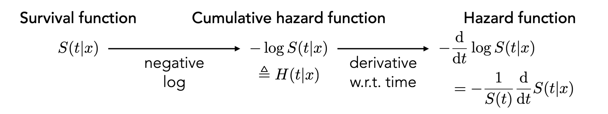

```{r}
#| include: false
knitr::opts_chunk$set(
  echo = TRUE,
  message = FALSE,
  warning = FALSE,
  fig.align = "center",
  fig.height = 9
)
library(tidyverse)
ggplot2::theme_set(ggplot2::theme_light(base_size = 20))
```

# Background

## Motivation

*Previously*:

- Considered problems of the form: "model the relationship between $X$ and $Y$", where:

  - $X$ and $Y$ are completely observed
  
  - Make assumptions about the distribution of $Y$ and the shape of the relationship


- Example: use game- and shot-level features to predict goal probability

. . .

*But not every statistical problem is of this form!*

Suppose we want to model the **time-to-event**, where:

- That time might be **incompletely observed** for certain observations/units ($Y$ is not completely observed)

-  Each observation/unit can experience a certain event a **maximum of one time**

. . .

**The field of survival analysis is about modeling time-to-event outcomes!**

## Examples of time-to-event outcomes

- Time until injury

- Time until an athlete transfers

- Time until death

- Time until a patient is discharged from the hospital

- Time until a user cancels a subscription service

- Time until a convicted criminal reoffends

- Time until a PhD student graduates

. . .

In survival analysis:

- We are interested in modeling the **rate** of the event-of-interest (not just if the event happened)

- Generically, we call the event-of-interest **failure** (or **death**), i.e, we are interested in modeling failure (death) rates and risk of failure (death) for each observation

## Two possible outcomes

Suppose observe each observation $i$ beginning at time zero. For each observation $i$, there are two possible outcomes:

. . .

1. The observation "fails" (aka has the event occur) at time $T_i$. This is known as the *failure time* or the *survival time* (since that is how long the observation survives)


. . .

2. The observation reaches time $C_i$ without failure (aka without the event occurring), and no longer observe the observation after that time to know when the event occurs

. . .

<br>

Case 2 is called **censoring** because the true time-to-event $T_i$ is *censored* or unknown to us --- all we know is that $T_i > C_i$ 

. . .

<br>

Technically, we focus on **right-censoring**, which is when we only know that $T_i > C_i$.[^1]


[^1]: There are other [types of censoring](https://tinyheero.github.io/2016/05/12/survival-analysis.html#censoring), such as left-censoring (where $T_i < C_i$) and interval censoring (where $T_i \in [c_{i1}, c_{i2}]$).


## So basically...

{width="80%"}


## Fundamental challenge: censoring

- Censoring can happen for various reasons:

  - *Example 1*: a player leaves a team for financial reasons

  - *Example 2*: a player leaves a team because of recurring minor injuries or reduced fitness

. . .

- Censoring is effectively a **missing data problem** since we are missing the true time-to-event (outcome)

. . .

*So, why not just do a complete case analysis, where we filter out censored observations?*

. . .

- Filtering out censored observations is problematic for two reasons:

  - **It throws away useful information**: we lose useful information that they survived up until time $C_i$

  - **It can bias analysis**: an observation may be censored for reasons that are related to the event-of-interest (aka it may be *informative*)
  
  
## Survival analysis problem setup

In survival analysis, we are interested in modeling $T_i$ *while* accounting for censoring

. . .

<br>

**Data**: Suppose we have $n$ i.i.d observations of the following form:

$$(\mathbf{X}_1, Y_1, R_1), \dots, (\mathbf{X}_n, Y_n, R_n)$$
where:

- $\mathbf{X}_i$: feature vector for unit $i$ (e.g., age, position, minutes player)

- $Y_i$: either the observed time-to-event $T_i$ or the censoring time $C_i$ depending on what happened first ($Y_i = \min\{T_i, C_i\}$)

- $R_i$: status of whether the event-of-interest occurred

. . .


$$
R_i =
\begin{cases}
1 \quad \text{if } Y_i = T_i, \\
0 \quad \text{if } Y_i = C_i
\end{cases}
$$


## Survival function

The survival function is defined as follows:

$$
S(t \mid \mathbf{x}) := \displaystyle \text{Pr}(T > t \mid \mathbf{x}) = \text{Pr}(\text{survive beyond time } t \mid \mathbf{x})
$$

. . .

<br>

*Note*:

- If we start observing every unit $i$ at $t = 0$, then $S(0 \mid \mathbf{x}) = 1$

. . .

- $S(t \mid x)$ declines as $t \to \infty$:

  - For some events-of-interest that will necessarily happen (e.g., death): $S(t \mid \mathbf{x}) \to 0$ as $t \to \infty$
  
  - For others events-of-interest where the event does not necessarily happen (e.g., injury): $S(t \mid \mathbf{x})$ declines to some positive value (between zero and one) as $t \to \infty$
  
. . .  
  
- We are predicting *whole curves per feature vector* $\mathbf{x}$, not just a single value! 
  
  
## Interpreting the survival curve
  

:::{columns}

::: {.column}


What the time-to-event outcome is matters for our interpretation:

- For time until injury, longer is considered "better" 

- For time until a patient is discharged, longer is often considered "worse"


:::{.fragment}

From the survival curve:

- The **median** survival time of $\mathbf{x}$ is where $S(t \mid \mathbf{x}) = 1/2$ 

- The **mean** survival time of $\mathbf{x}$ is the area under the survival curve: $\displaystyle \int_0^\infty S(t \mid \mathbf{x}) dt$

:::

:::

::: {.column}

```{r}
#| echo: false
#| warning: false
#| fig-height: 11
surv_df <- tibble(
  t = seq(0, 10, length.out = 500),
  S = 0.55 * exp(-0.9 * t) + 0.45 / (1 + exp(1.1 * (t - 6)))
)

median_time <- surv_df |>
  slice_min(abs(S - 0.5), n = 1)

surv_df |>
  ggplot(aes(x = t, y = S)) +
  geom_area(fill = "deepskyblue3", alpha = 0.25) +
  geom_line(linewidth = 1.4, color = "deepskyblue3") +
  geom_segment(aes(x = 0, xend = median_time$t,
                   y = 0.5, yend = 0.5),
               linetype = "dashed",
               color = "gray60",
    linewidth = 1) +
  geom_segment(aes(x = median_time$t, xend = median_time$t,
                   y = 0, yend = 0.5),
               linetype = "dashed",
               color = "gray60",
    linewidth = 1) +
  geom_point(data = median_time,
             aes(x = t, y = S),
             size = 4,
             color = "gray60")+
   labs(x = expression(t), y = expression(S(t ~ "|" ~ x)))

```


:::

:::

## Kaplan-Meier curves

**Kaplan-Meier curves** are a popular estimator of survival curves

. . .

<br>

Let's ignore the feature vector for now, so that our data is of the form: $(Y_1, R_1), \dots (Y_n, R_n)$

. . .

<br>

First, we find all unique observed times in which event-of-interest occurred

$$
0 < \tau_{(1)} < \tau_{(2)} < \dots < \tau_{(L)}, \qquad L = \text{# of unique event times}
$$

. . .

Let:

- $n[m]$ denote number of observations that are "at risk" right before time $\tau_{(m)}$

- $d[m]$ denote the number of observations that "die" at time $\tau_{(m)}$


## Kaplan-Meier curves

For observations "at risk" at the beginning of time $\tau_{(m)}$, the probability of surviving that time is:

$$
p_m = \frac{n[m] - d[m]}{n[m] }
$$

. . .

E.g., the probability that an observation survives to the second time $\tau_{(2)}$, given they survived the first time $\tau_{(1)}$ is:

$$
p_2 = \frac{n[2] - d[2]}{n[2]}
$$

. . .

The probability that (at the outset) an observation survives to the second time $\tau_{(2)}$ is:

$$
\begin{aligned}
\text{Pr}(T > \tau_{(2)}) &=  \text{Pr}(T > \tau_{(1)}) \cdot \text{Pr}(T > \tau_{(2)} \mid T > \tau_{(1)}) = \frac{n[1] - d[1]}{n[1]} \cdot \frac{n[2] - d[2]}{n[2]} = p_1 \cdot p_2
\end{aligned}
$$

## Kaplan-Meier curves

Therefore, the Kaplan-Meier estimate for the probability of surviving the first $t$ days is:

$$
\hat{S}(t)_{\text{KM}} = \prod_{m = 1, \dots, L \text{ s.t. } \tau_{(m)} \leq t} \frac{n[m] - d[m]}{n[m]} = \prod_{m = 1, \dots, L \text{ s.t. } \tau_{(m)} < t} p_m
$$

. . .

- The Kaplan-Meier curve is a **non-parametric** estimator of the survival function --- doesn't assume a parametric form!

- We can derive [point-wise confidence intervals for Kaplan-Meier curves](https://web.stanford.edu/~lutian/coursepdf/unit5.pdf)

- There are extensions that allow us to add in feature vectors, i.e., that estimate $S(t \mid \mathbf{x})$ using [$k$ nearest neighbor or kernel approaches](https://arxiv.org/html/2410.01086v1#S4) 

. . .

<br>

In practice, people often **compare Kaplan-Meier curves across different levels of a categorical variable** (e.g., position) in order to estimate the difference in survival probabilities between levels

## Hazard functions

**Hazard rate**: instantaneous rate of failure at time $t$ for units that have survived up to time $t$. *When do not include features:*

$$
\begin{aligned}
\displaystyle h(t) &:= \lim_{\Delta t \to 0}  \frac{\text{Pr}(t \leq T \leq t + \Delta t \mid T \geq t)}{\Delta t} \\
\displaystyle  &= \lim_{\Delta t \to 0}  \frac{\text{Pr}(t \leq T \leq t + \Delta t)}{\text{Pr}( T \geq t) \Delta t} \\
\displaystyle  &= \lim_{\Delta t \to 0} \frac{S(t) - S(t + \Delta t)}{\Delta t} \cdot \frac{1}{S(t) } \\
&= - \frac{S(t)}{S(t)}
\end{aligned}
$$

. . .

Recall that $\displaystyle - \frac{d}{dt}\text{log}(S(t)) = - \frac{S(t)}{S(t)}$. Therefore:

. . .

$$\displaystyle  h(t) = - \frac{d}{dt}\text{log}(S(t)) \Leftrightarrow  S(t) = \exp\left\{- \int_{0}^t h(u) du \right\}$$

## Hazard functions

**Cumulative hazard**: the integral of the hazard function. When do do not include features:

$$
\displaystyle H(t) := \int_{0}^t h(u) du
$$

Therefore, $\displaystyle S(t) = \exp\{- H(t)\} \Leftrightarrow  H(t) = - \log(S(t))$

. . .

<br>

**Put together, using features** $\mathbf{x}$:

<br>



## Cox proportional hazards model

- We are often interested in how an **observation’s features are associated with its survival** (aka inference)

. . .

- Nonparametric survival estimators (like Kaplan-Meier curves) are useful but do not directly help us answer this question

  - *Except in cases where we only have a single categorical predictor and we can estimate different Kaplan-Meier curves for each factor level* 

. . .

Assume the following factorization holds:

$$
h(t \mid \mathbf{x}) = h_0(t) \cdot \exp\{ \mathbf{x} \beta \}
$$

where $h_0(t)$ is the **baseline hazard function**, $\mathbf{x}$ is a feature vector, and  $\beta$ is the associated parameter vector (just like in GLMs)

. . .

- Considered a **semi-parametric model** since typically no parametric form is assumed for the baseline hazard function $h_0$ 


## Proportional hazards assumption

Cox proportional hazards (PH) model assumes that:

$$
h(t \mid \mathbf{x}) = h_0(t) \cdot \exp\{ \mathbf{x} \beta \}
$$

implies that the **hazard is proportional to the baseline hazard $h_0$ for all $\mathbf{x}$**. Hence,

. . .

$$
\begin{aligned}
\displaystyle S(t \mid \mathbf{x}) &= \exp\left\{- \int_{0}^t h(u \mid \mathbf{x}) du \right\} \quad \text{(our starting place)}\\
&=  \exp\left\{- \int_{0}^t h_0(u) \cdot \exp\{ \mathbf{x} \beta \} du \right\} \\
&= \exp\left\{- \exp\{ \mathbf{x} \beta \} \cdot \int_{0}^t h_0(u)  du \right\} \\
&= \left\{e^{-\int_{0}^t h_0(u)  du}  \right\}^{\exp\{ \mathbf{x} \beta \}} \\
&= S_0(t)^{\exp\{ \mathbf{x} \beta \}}, \quad S_0(t) := e^{-\int_{0}^t h_0(u)  du}
\end{aligned}
$$

. . .

**Under PH assumption, all survival curves must be powers of a baseline survival curve $S_0(t)$**


## Proportional hazard implications for the survival curve

Under PH assumption, survival curves must be powers of each other

- When $\mathbf{x} \beta = 0$, we get the baseline survival curve

- When $\mathbf{x} \beta > 0$ means *shorter* survival than the baseline

- When $\mathbf{x} \beta < 0$ means *longer* survival than the baseline


:::{.aside}
Note that $\mathbf{x} \beta = \beta^T \mathbf{x}$, where $^T$ denotes transpose.
:::


## Testing proportional hazards

1. For categorical variables, we can check whether their $\log(-\log(\text{survival functions}))$ are **"parallel"** (i.e., don't cross, get closer or farther apart together over time)

. . .

2. For any variable, we can analyze the **Schoenfeld residuals**. For observation $i$ that fails at $t_i$ and feature $k$:

$$
\text{Schoenfeld resid}_i = x_{ik} - \bar{x}_k(\beta, t_i)
$$

where:

- $x_{ik}$: $k$th feature for observation $i$

- $t_i$: observed "death" or "failure" time for observation $i$

- $\bar{x}_k(\beta, t_i)$: model-weighted average (or expected) value of the $k$th covariate among observations who are "at risk" right before $t_i$

. . .

**If PH assumption holds, Schoenfeld residuals should show no systematic trend over time**

## Interpreting coefficients 

- We can calculate **hazard ratio (HR)** for any desired change in features, such as increasing a feature by one:

$$
\widehat{\text{HR}} = \frac{h(t \mid x_1 + 1, \dots, x_p)}{h(t \mid x_1, \dots, x_n)} = \frac{h_0(t) \exp(\beta_0 + \beta_1 (x_1 + 1) + \dots + \beta_p x_p)}{h_0(t) \exp(\beta_0 + \beta_1 x_1  + \dots + \beta_p x_p)} = \exp(\beta_1)
$$

. . .

- Recall we can compute the 95% confidence interval for $\beta_1$ as:

$$
\displaystyle [\hat{\beta}_1 -  1.96 \cdot \text{SE}(\hat{\beta}_1), \hat{\beta}_1 +  1.96 \cdot \text{SE}(\hat{\beta}_1)]
$$

. . .

- So, the corresponding 95% confidence interval for $\text{HR}$ is:

$$
\displaystyle [ \exp(\hat{\beta}_1 -  1.96 \cdot \text{SE}(\hat{\beta}_1)), \exp(\hat{\beta}_1 +  1.96 \cdot \text{SE}(\hat{\beta}_1))]
$$


:::{.aside}
We can also perform hypothesis testing for $\beta_1$ and HR using z-tests and drop-in-deviance tests, just like we did for GLMs!
:::


## Assessing calibration via concordance index

The Cox PH model ranks data points by their hazard

$$
\begin{aligned}
\mathbf{x}_1 &\longrightarrow \mathbf{x}_1 \beta \\
\mathbf{x}_2 &\longrightarrow \mathbf{x}_2 \beta \\
&\cdots \\
\mathbf{x}_n &\longrightarrow \mathbf{x}_n \beta
\end{aligned}
$$

. . .

*Example*: if $\mathbf{x}_1 \beta > \mathbf{x}_2 \beta$, then observation $1$ has higher hazard than observation $2$.

. . .

We compute the **concordance index** by:

1. Enumerating every pair of observations where at least one observation had a failure (i.e. exclude pairs where both observations are censored)

. . .

2. Computing the fraction of all such pairs where the unit with the earlier failure had a higher hazard

. . .

*Measure of goodness-of-fit/predictive ability*

# Example in `R`

## Data: Liverpool Football Club injuries

Injury data for Liverpool FC men's first team (2017-2018 and 2018-2019 seasons), courtesy of the `injurytools` package

```{r}
library(tidyverse)

injury_data <- read_csv("https://raw.githubusercontent.com/36-SURE/2026/main/data/liverpool_injury_data_17-19.csv") |>
  mutate(positionb = str_split_i(position, "_", 1)) |>
  filter(positionb != "Goalkeeper") 
#glimpse(injury_data)
```

<br>

**Goal**: estimate time until first injury for (non-Goalie) players given player-level attributes such as age and position

:::{.aside}
Data was web-scraped from [https://www.transfermarkt.com/](https://www.transfermarkt.com/).
:::

## Fitting a Kaplan-Meier curve 

:::{columns}

:::{.column}

We can fitting the Kaplan-Meier curves using `survfit()` and `Surv()`  

```{r}
library(survival) # install.packages("survival")
km_fit <- survfit(Surv(tstop_day, status) ~ seasonb,
                  data = injury_data) 
km_fit
```

Plotting the Kaplan-Meier curve using `ggsurvplot()` 

```{r}
#| eval: false
library(survminer) # install.packages("survminer")
ggsurvplot(km_fit,  palette = c("#E7B800", "#2E9FDF"),
           surv.median.line = "hv",
           xlab = "Time (in calendar days)") 
```

:::

:::{.column}
```{r}
#| echo: false
#| fig-height: 11
library(survminer) # install.packages("survminer")
ggsurvplot(km_fit,  palette = c("#E7B800", "#2E9FDF"),
           surv.median.line = "hv", xlab = "Time (in calendar days)") 
```
:::
:::

## Fitting the Cox PH model

We can fit Cox PH model with `coxph()` function:

```{r}
library(gtsummary)
injury_data_sub <- injury_data |> filter(season == "18-19")

cfit <- coxph(Surv(tstop_day, status) ~ positionb + age + yellows,
              data = injury_data_sub)

tbl_regression(cfit, exponentiate = TRUE)
```


## Interpreting the Cox PH model

The estimated HR for `Midfield` is $3.79$:

> For Liverpool men's FC first team players, midfielders were estimated to have 3.79 times the hazard of injury compared with attackers during the 2017/2018 and 2018/2019 seasons, holding all other model variables constant (95% CI: [0.95, 15.1]).

. . .

<br>

The estimated HR for `age` is $1.02$

> For Liverpool men's FC first team players, a one-year increase in age was associated with 1.02 times increase in the hazard of injury, holding the other model variables constant (95% CI [0.84, 1.24]).

## Schoenfeld residual diagnostics

:::{columns}

:::{.column}

:::{.incremental}

`cox.zph()` tests whether the association of a given covariate $X$ and the hazard is constant over time (i.e., whether PH assumption holds)

- $H_0$ : The association between $X$ and the hazard is constant over time

- $H_1$:  The association between $X$ and the hazard is *not* constant (i.e., varies) over time

:::

:::{.fragment}
*Given the global p-value is $0.21$, we fail to reject that the association between our model covariates and the hazard is constant over time.*

:::

:::
:::{.column}
```{r}
ggcoxzph(cox.zph(cfit))
```
:::
:::

## Diagnosing non-PH via Kaplan-Meier curves

```{r}
ggsurvplot(survfit(Surv(tstop_day, status) ~ positionb,
                   data = injury_data_sub), fun="cloglog",
           title = "Complementary Log-Log")
```

PH assumption for `positionb` definitely could be violated...(but it is hard to tell given how little data we have) 

## Handling non-proportional hazards

*If the variable violating PH assumption is categorical*:

- **Stratify** on the variable that violates PH (i.e., fit models separately) 

. . .

-  Fit **Kaplan-Meier curves separately** and perform a [Wilcoxon test](https://en.wikipedia.org/wiki/Wilcoxon_signed-rank_test) -- *note*: this test is only valid if the survival curves don’t cross

. . .

*If the variable violating PH assumption is continuous*:

- Fit a model with a **time dependent covariate**. For example:

```{r}
library(broom)
cfit_new <- coxph(Surv(tstop_day, status) ~ positionb + age + tt(age) + yellows,
                  data = injury_data_sub, tt = function(x, t, ...) x * t)
# tidy(cfit_new)
```

:::{.aside}
For more ideas, check out the paper, ["Time-varying covariates and coefficients in Cox regression models"](10.21037/atm.2018.02.12)
:::

## Diagnosing (non-)linearity

:::{columns}

:::{.column}

We can assess if the features are linearly related to the log hazard via **martingale residuals**. 

*For observation $i$ with feature vector $\mathbf{x}_i$:*


$$
M_i = R_i - H(Y_i \mid \mathbf{x}_i)
$$

where:

- $Y_i$: $\min\{T_i, C_i\}$

- $R_i$: indicator of whether the event occurred (aka if $Y_i = T_i$)

- $H(\cdot)$: cumulative hazard function

:::

:::{.column}

```{r}
#| echo: true
#| fig-width: 9
ggcoxdiagnostics(cfit, type = "martingale") + theme_light(base_size = 20)
```

:::
:::

:::{.aside}
Intuitive interpretation is that martingale residuals compare the number of observed events for each observation against the expected number under the model, given by $H(\cdot)$ (technically, $H(\cdot)$ is not a expected count, but close enough for our purposes).
:::

## Computing the concordance index

We can use `concordance()` or `glance()` to view the concordance index for our model

```{r}
concordance(cfit) #glance(cfit), # could also compute on held-out data
```


# Appendix

<!--

## Log-rank test

We can test whether like to know if two levels of a categorical variable produce the same probability of survival by comparing their survival curves:

- $H_0$: $S_1(t) = S_2(t)$ for all times $t$

- $H_1$: $S_1(t) \neq S_2(t)$ at some time $t$

Consider a particular event time $\tau_{(m)}$:

```{r}
#| echo: false
library(gt)
library(tibble)

logrank_table <- tibble(
  outcome = c("died", "survived", "at risk"),
  `Group 1` = c("$d[m]_{1}$", "$n[m]_{1} - d[m]_{1}$", "$n[m]_{1}$"),
  `Group 2` = c("$d[m]_{2}$", "$n[m]_{2} - d[m]_{2}$", "$n[m]_{2}$"),
  Total = c("$d[m]$", "$n[m] - d[m]$", "$n[m]$")
)

logrank_table |>
  gt() |>
  cols_label(
    outcome = "",
    `Group 1` = md("Group 1"),
    `Group 2` = md("Group 2"),
    Total = md("Total")
  ) |>
  fmt_markdown(columns = everything()) |>
  tab_style(
    style = cell_text(align = "center", size = px(24)),
    locations = cells_body(columns = everything())
  ) |>
  tab_style(
    style = cell_text(align = "center", size = px(26)),
    locations = cells_column_labels(columns = everything())
  ) |>
  cols_align(
    align = "center",
    columns = everything()
  )
```

. . .

*Note*: since we have a $2 \times 2$ table with fixed margins, we only need to consider one group

## Log-rank test

- If survival is similar for the two groups, we'd expect:

$$\displaystyle d[m]_1 \approx \frac{d[m]}{n[m]} n[m]_1$$

that is, the number of deaths in Group 1 to be proportional to its share in the at risk set

. . .

- To estimate the overall difference between the observed and expected death counts, we sum over all unique event times:

$$
\sum_{m = 1}^L d[m]_1 - \sum_{m = 1}^L \frac{d[m]}{n[m]} n[m]_1
$$

This difference is then used to perform [log-rank tests](https://st47s.com/Math150/Notes/06-surv.html#logrank)!

- Wilcoxon test is very similar to the log-rank test but it uses a different derivation for the variance

- [[ADD]]

-->

## Visualizing time-dependent covariates

```{r}
zph.tt <- cox.zph(cfit,  transform = function(t) t)
plot(zph.tt["age"])
abline(
  a = as.numeric(coef(cfit_new)["age"]),
  b = as.numeric(coef(cfit_new)["tt(age)"]),
  col = "red",
  lty = 2,
  lwd = 2
)
```


## Proportional hazards with survival curves

With no features $h_1(t) = h_0(t)e^\beta$. Hence, given the baseline survival curve $\displaystyle S_0(t) = e^{-\int_0^t h_0(u) du}$:

$$
\begin{aligned}
S_1(t) &= e^{-\int_0^t h_0(u)e^\beta du} \\
&= e^{-e^\beta \int_0^t h_0(u) du} \\
&= \left[e^{-\int_0^t h_0(u)du}\right]^{e^\beta} \\
\end{aligned}
$$

Thus,

$$
\ln[-\ln(S_1(t))] = \beta + \ln[-\ln(S_0(t))]
$$


*Under PH, there is no "slope" just an intercept difference -- hence the word "parallel"!*

## Proportional hazards with Schoenfeld residuals

We want $\text{Pr}(i\text{th observation w/ }\mathbf{x}_i \text{ dies at }t_i \mid \text{at least one death at }t_i)$:

$$
\begin{aligned}
&= \frac{\text{Pr}(i^{th} \text{ observation w/ } \mathbf{x}_i \text{ dies at } t_i)}{\text{Pr}(\text{at least one death at } t_i)} \\
&= \frac{\text{hazard at } t_i}{\text{sum over all patients at risk at time } t_i} \\
&= \frac{h_i(t_i)}{\sum_{j:t_j \geq t_i} h_j(t_i)} \\
&= \frac{e^{\mathbf{x}_i \beta }}{\sum_{j:t_j \geq t_i} e^{\mathbf{x}_j \beta}} 
\end{aligned}
$$


We define:

$$
w_i(\beta, t_i) := \frac{e^{\mathbf{x}_i \beta }}{\sum_{j:t_j \geq t_i} e^{\mathbf{x}_j \beta}} \quad \text{and} \quad \bar{x}_k(\beta, t_i) := \sum_{j: t_j \geq t_i} x_{jk} w_i(\beta, t_i)
$$


## Related topics/extensions

- [Accelerated failure time models (AFT models)](https://en.wikipedia.org/wiki/Accelerated_failure_time_model)

- [Frailty models](https://pmc.ncbi.nlm.nih.gov/articles/PMC7534210/)

- [Deep survival models](https://arxiv.org/abs/2410.01086)

## Resources

- [George Chen's monograph on deep survival analysis models](https://arxiv.org/abs/2410.01086)

- [Alex Reinhart's notes on survival analysis](https://www.refsmmat.com/courses/707/lecture-notes/survival-analysis.html)

- [Jo Hardin's notes on survival analysis](https://st47s.com/Math150/Notes/06-surv.html)

- [Notes on Cox proportional hazards model estimation](https://web.stanford.edu/~lutian/coursepdf/unit7.pdf)


## Dataset preprocessing via `injurytools`

```{r, warning = F}
## 17/18
library(injurytools)
df_exposures1718 <- prepare_exp(df_exposures0 = 
                                  raw_df_exposures |> filter(season == "17/18"),
                                person_id     = "player_name",
                                date          = "year",
                                time_expo     = "minutes_played") |> 
  mutate(seasonb = date2season(date))
df_injuries1718 <- prepare_inj(df_injuries0   =
                                 raw_df_injuries |> filter(season == "17/18"),
                               person_id      = "player_name",
                               date_injured   = "from",
                               date_recovered = "until")
injd1718 <- prepare_all(data_exposures = df_exposures1718,
                        data_injuries  = df_injuries1718,
                        exp_unit = "matches_minutes")

injd1718 <- injd1718 |> 
  mutate(seasonb = date2season(tstart)) |> 
  ## join to have info such as position, age, citizenship etc.
  left_join(df_exposures1718, by = c("person_id" = "person_id", 
                                     "seasonb"   = "seasonb")) 

## create injd1718_sub:
##  - time to first injury
##  - equivalent tstart and tstop in calendar days
injd1718_sub <- injd1718 |> 
  mutate(tstop_day = as.numeric(difftime(tstop, tstart, units = "days"))) %>%
  group_by(person_id) |>  ## important
  mutate(tstop_day = cumsum(tstop_day),
         tstart_day = lag(tstop_day, default = 0)) |> 
  ungroup() |> 
  dplyr::select(person_id:tstop_minPlay, tstart_day, tstop_day, everything()) |> 
  filter(enum == 1) ## time to first injury

## 18/19
df_exposures1819 <- prepare_exp(df_exposures0 = 
                                  raw_df_exposures |> filter(season == "18/19"),
                                person_id     = "player_name",
                                date          = "year",
                                time_expo     = "minutes_played") |> 
  mutate(seasonb = date2season(date))
df_injuries1819 <- prepare_inj(df_injuries0   = 
                                 raw_df_injuries |> filter(season == "18/19"),
                               person_id      = "player_name",
                               date_injured   = "from",
                               date_recovered = "until")
injd1819 <- prepare_all(data_exposures = df_exposures1819,
                        data_injuries  = df_injuries1819,
                        exp_unit = "matches_minutes")

injd1819 <- injd1819 |> 
  mutate(seasonb = date2season(tstart)) |> 
  ## join to have info such as position, age, citizenship etc.
  left_join(df_exposures1819, by = c("person_id" = "person_id", 
                                     "seasonb"   = "seasonb")) 

## create injd1819_sub:
##  - time to first injury
##  - equivalent tstart and tstop in calendar days
injd1819_sub <- injd1819 |> 
  mutate(tstop_day = as.numeric(difftime(tstop, tstart, units = "days"))) %>%
  group_by(person_id) |>  ## important
  mutate(tstop_day = cumsum(tstop_day),
         tstart_day = lag(tstop_day, default = 0)) |> 
  ungroup() |> 
  dplyr::select(person_id:tstop_minPlay, tstart_day, tstop_day, everything()) |> 
  filter(enum == 1) ## time to first injury

injd_sub <- bind_rows("17-18" = injd1718_sub,
                      "18-19" = injd1819_sub,
                      .id = "season")
```


