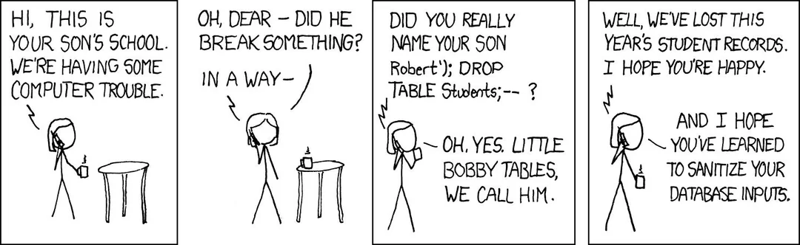
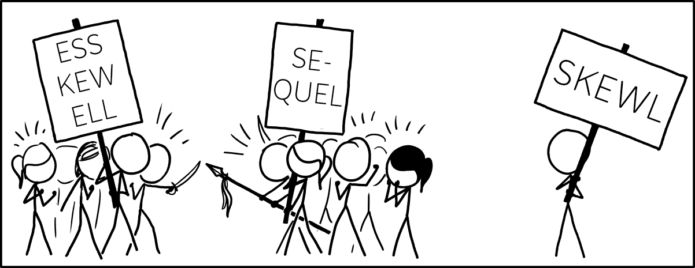

```{r}
#| include: false
knitr::opts_chunk$set(
  echo = TRUE,
  fig.align = "center",
  fig.height = 9
)
library(tidyverse)
ggplot2::theme_set(ggplot2::theme_light(base_size = 20))
```

# Background

## Recall: data science workflow

[{width="700"}](https://r4ds.hadley.nz/intro)


. . .

- So far, we have primarily focused on *tidy, understand,* and *communicate* steps, taking the *import* step for granted

. . .

- In industry, most data live in **SQL databases** and are too big to live in our laptops

. . .

<span style="font-size: 25x;">

</span>**Therefore**: being able to (efficiently) extract data from SQL databases is vital for success

## Why aren't R/Python alone sufficient for this purpose?

- SQL databases allow you to persistently store and organize data

. . .


- Can handle large volumes of data and easily scalable

. . .

- Support a streamlined **E**xtract-**T**ransform-**L**oad (**ETL**) process for streaming data

. . .

- Provide **access management restrictions** to specific data, e.g., health records

. . .

- Allow for **explicit linkages** across tables (primary and foreign keys)

. . .

- Enable **indexes** to be defined on tables for efficiency, e.g., date/time fields


. . .

<br>

**Typical workflow:** use R for accessing subsets of data from a SQL database for modeling

## What is a database?

> A database is an organized collection of data that is managed by a database management system (DBMS)

. . .

- A **DBMS** is the software with which users interact to obtain or analyze data stored in a database

- Contrast to a **file-based system** that manage and organize data as individual files on storage


. . .

Advantages of DBMSs include:

- Control of data redundancy

- Ensure data consistency across users

- Improved security and control over data-sharing

- Improved data integrity

- Economy of scale

. . .

**BUT**...DBMSs also can be more complex, costly, and have a higher impact of failure


## Intro to SQL (Structured Query Language)

- SQL provides a consistent grammar (**S**tructured **L**anguage) for asking and answering questions (**Q**ueries) about collected data

- Allows us to communicate with data stored in a database via a (relational) DBMS


{width="50%" fig-align="center"}

:::{.aside}
For a visual explanation of SQL and related concepts/terms, check out Data with Baraa's ["What is SQL?"](https://www.blog.datawithbaraa.com/p/what-is-sql).

:::

## SQL dialects

SQL has multiple **dialects**, such as:

- MySQL

- SQLite *(what we use today)*

- DuckDB

- PostgreSQL

- Google BigQuery

- Microsoft Access SQL

. . .

- Multiple dialects allow SQL to be **tailored to the specific needs and capabilities** of different DBMSs

. . .

- *Different SQL dialects are quite similar to each other* 

. . .

- So, while we use SQLite today, you will be able to quickly pickup whichever dialect your institution/employer uses

## SQL tables are nouns, on which you ask targeted queries

- SQL tables are just **2D representations of data**

. . .

- A collection of **columns (variables)** and **observations**

. . .

- These are similar to data frames/tibbles in `R`

  - You've already worked with them in `R` - yay!

. . .

```{r}
#| echo: false
library(nycflights13)
library(gt)
gt(head(flights, n = 3))
```


## SQL grammar has built-in keywords (verbs)

SQL keywords are *verbs* which allow you to **systematically query** tables

. . .

*Example*: starting with `flights` data from `nycflights13` package

  - Each row represents a flight departed from NYC in 2013
  
  - 336,000+ observations and 19 columns (variables)

::: {columns}

:::{.column}

:::{.fragment}

**SQL code**

```{sql}
--| eval: false

SELECT dest, month,
  MIN(arr_delay) AS mnd,
  MAX(arr_delay) AS mxd,
  AVG(arr_delay) AS avd
FROM flights
GROUP BY dest, month
ORDER BY dest, month DESC
LIMIT 6;
```

*We will go through what each of these functions does during this presentation!*

:::

:::

:::{.column}

:::{.fragment}

```{r}
#| echo: false
library(nycflights13)
library(gt)
flights |>
  select(dest, month, arr_delay) |>
  group_by(dest, month) |>
  summarize(mnd = min(arr_delay),
            mxd = max(arr_delay),
            avd = mean(arr_delay)) |>
  arrange(dest, desc(month)) |>
  ungroup() |>
  head(n = 6) |>
  gt()
```

:::
:::

:::

## SQL keywords map onto `dplyr` verbs

](../images/sql-dplyr-mapping.png){width="800"}

. . .

:::{.aside}
*This isn't a coincidence*: [`dplyr` developed this precise relationship to SQL by design](https://r4ds.had.co.nz/relational-data.html)
:::

## Today: `nycflights13` database

:::{columns}

:::{.column}

](https://docs.ropensci.org/dittodb/articles/relational-nycflights.svg)

:::

:::{.column}

*Contains flight info for NYC departures to various US destinations in 2013*

- `flights`: all NYC departures in 2013

- `weather`: hourly data for each airport

- `planes`: construction info for each plane

- `airports`: airport names and locations

- `airlines`: two letter carrier codes/names


:::

:::

## Establishing a SQL connection within `R`

We use [`SQLite`](https://sqlite.org/): "small, fast, self-contained, high-reliability, full-featured, SQL database engine"


```{r}
#install.packages(c("DBI", "dittodb", "RSQLite", "nycflights13")) need to install all these
library(DBI)
library(dittodb)
library(RSQLite)

# establishing connection via sqlite
# ":memory:" is a special path that creates an in-memory database
# other database drivers require more details (like user, password, host, port, etc.)
con_air <- DBI::dbConnect(RSQLite::SQLite(), ":memory:") 
# creates a database including a few tables from the nycflights13 dataset with con_air connection
dittodb::nycflights13_create_sql(con_air)
```

. . .

The function `dbListTables()` tells us what tables exist in the airlines database

```{r}
DBI::dbListTables(con_air)
```


## SQL tables as a `tibble`


A `tbl` is different than a `tibble`

- `tbl` is a *pointer* to a remote object

- `tibble` is a dataframe *in your local environment*

```{r}
flights_tbl <- tbl(con_air, "flights")
dim(flights_tbl)  #head(flights_tbl, n = 3) 
```

. . .

We can use `dplyr` syntax on `tbl` objects

```{r}
dist_sum <- flights_tbl |>
  summarize(min_year = min(distance), max_year = max(distance))
```

. . .

Since `flights_tbl` is a `tbl`, the work done above was done in SQL: 

```{r}
show_query(dist_sum)
```


## SQL tables as a `tibble`

`collect()` copies a SQL table from its remote server location to the local memory location in R

```{r}
flights_tibble <- flights_tbl |> dplyr::collect()

# dim(flights_tibble)
head(flights_tibble, n = 3)
```

. . .

A `tibble` (locally in R) takes up much more memory than a `tbl` (pointing to remote object in SQL)

```{r}
flights_tbl |>
  object.size() |>
  print(units = "Kb")
```


```{r}
flights_tibble |>
  object.size() |>
  print(units = "Kb")
```


## Different ways to query in Quarto


1. Using the `dbplyr` R package (loaded with `tidyverse`) will directly translate `dplyr` code into SQL

```{r}
#| eval: false
flights_tbl |>
  summarize(min_year = min(distance), max_year = max(distance)) # what we previously did
```

. . .

2. Using the `DBI` R package, we can send SQL queries through an `r` chunk


```{r}
#| eval: false
DBI::dbGetQuery(con_air,
                "SELECT MIN(distance) AS min_year,
                MAX(distance) AS max_year
                FROM flights")
```


. . .

3. Using a `sql` chunk, we can write actual SQL code inside a Quarto document

```{sql}
--| connection: con_air
--| eval: false

SELECT MIN(distance) AS min_year,
       MAX(distance) AS max_year
FROM flights
```


. . .

<br>

*We will primarily use the third option today*

## SQL queries ordering

Queries in SQL start with `SELECT` keyword and consist of several keywords which *must* be written in the following order:

- `SELECT`

- `FROM`

- `JOIN`

- `WHERE`

- `GROUP BY`

- `HAVING`

- `ORDER BY`

- `LIMIT`


A semicolon (;) is typically used to indicate the termination of a SQL statement 


## `SELECT` to subset columns from a table

**Syntax**: `SELECT <column_name> FROM <table_name>`

. . .

<br>

Let's look at 10 rows and all variables from the `flights` table:


```{sql}
--| connection: con_air
--| eval: false

SELECT * FROM flights LIMIT 10;
```


. . .

<br>

*Notes*:

- It’s best practice to always use `LIMIT` when just selecting columns from a table

- The asterisk (*) means return all (any) columns

- SQL will return any 10 rows, so the original flights order may not be preserved


## `SELECT` to subset columns from a table

Let's look at 10 rows and only the `dep_time`, `arr_time`, and `flight` variables from the `flights` table:

```{sql}
--| connection: con_air
--| eval: false
SELECT dep_time, arr_time, flight FROM flights LIMIT 10;
```

. . .

<br>

The equivalent `dplyr` code is:

```{r}
#| eval: false
flights |> select(dep_time, arr_time) |> head(10)
```

. . .

<br>

*Notes*:

- The original flights ordering is preserved in `dplyr`

- SQL operates on sets of observations, which are an unordered collection

- We'll later control ordering explicitly in SQL using `ORDER BY`

## `SELECT` to create new variables

Suppose we want to measure of average speed (in miles per hour) for each flight:


```{sql}
--| connection: con_air
--| eval: false
SELECT flight, distance/(air_time/60) AS speed FROM flights LIMIT 10;
```

. . .

`AS speed` says that we want to name our new column `speed`, instead of `distance/(air_time/60)`

. . .

<br>

In `dplyr`, we have the `mutate()` verb

```{r}
#| eval: false
flights |> 
  mutate(speed = distance/(air_time/60)) |>
  select(flight, speed) |>
  head(10)
```


. . .

<br>

**Takeaway**: `SELECT` in SQL serves to pick existing columns *or* to create new ones

## We can also aggregate on columns via `SELECT`

SQL has built in aggregate functions: `MIN`, `MAX`, `COUNT`, `SUM`, `AVG`, ... (some depend on specific SQL dialect, like `MEDIAN`)

<br>

. . . 

Let's get the minimum and maximum air time for the flights in our SQL table (*luckily `air_time` is in minutes not hours...*)

```{sql}
--| connection: con_air
--| eval: false
SELECT MIN(air_time) AS min_ar, MAX(air_time) AS max_ar FROM flights;
```

. . .

<br>

Like `dplyr`, SQL also has a `COUNT` function. We can use it to get the total number of observations in our table

```{sql}
--| connection: con_air
--| eval: false
SELECT COUNT(*) AS num_obs FROM flights;
```


## Filtering observations `WHERE` a criteria is met


Suppose we want to filter to only observations that originated from JFK airport and limit our results to ten rows (keeping all columns):

. . .

```{sql}
--| connection: con_air
--| eval: false
SELECT * FROM flights WHERE origin = "JFK" LIMIT 10;
```

*Note*: SQL uses `=` NOT `==`

<br>

. . .

Like in base R, we can use `!` to negate the equal sign statement

```{sql}
--| connection: con_air
--| eval: false
SELECT * FROM flights WHERE origin != "JFK" LIMIT 10;
```

. . .

SQL supports other logical operators, such as: `<`, `<=`, `>`, `>=`


## `WHERE` to find value IN or NOT IN a range?

Find 20 records which have a tail number matching either "N593JB" or "N532UA":

```{sql}
--| connection: con_air
--| eval: false
SELECT * FROM flights WHERE tailnum IN ("N593JB", "N532UA") LIMIT 20;
```


. . .

<br>

Find 10 records which are:

- From neither December nor January

- Have an arrival delay greater than 120 minutes

```{sql}
--| connection: con_air
--| eval: false

SELECT * FROM flights WHERE month NOT IN (1, 12) AND arr_delay > 120 LIMIT 10;
```


## Missing values in SQL

`NULL` refers to missing values in SQL

. . .

We have a substantial number of observations that are missing `wind_gust` variable: 

```{sql}
--| connection: con_air
--| eval: false

SELECT COUNT(*) AS num_obs FROM weather WHERE wind_gust IS NULL;
```

<br>

. . .


We can remove the missing values using `wind_gust is NOT NULL` 


```{sql}
--| connection: con_air
--| eval: false

SELECT * FROM weather WHERE wind_gust IS NOT NULL LIMIT 20;
```

. . .

*Note:* `wind_gust != NULL` does not work as `NULL` values don’t match this way in SQL

. . .

This is different from base R and `dplyr`

## `GROUP BY` variables and do aggregate calculations


Let's get the minimum, maximum, and average arrival delay by month, day, and destination:

```{sql}
--| connection: con_air
--| eval: false
SELECT dest, month, day,
       MIN(arr_delay) AS mnd,
       MAX(arr_delay) AS mxd,
       AVG(arr_delay) AS avd
FROM flights
GROUP BY dest, month, day
LIMIT 10;
```


## Filtering aggregated values with `HAVING` 

Given number of plane engines, how many had less than 200 manufacturers?

```{sql}
--| connection: con_air
--| eval: false

SELECT engines, COUNT(*) AS tot_num
 FROM planes
 GROUP BY engines
 HAVING tot_num < 200;
```

## `ORDER BY` columns when displaying output

Get minimum, maximum, and average arrival delay by month day and destination:

```{sql}
--| connection: con_air
--| eval: false
SELECT dest, month, day,
       MIN(arr_delay) AS mnd, MAX(arr_delay) AS mxd,
       AVG(arr_delay) AS avd
FROM flights
GROUP BY dest, month, day
ORDER BY dest, month DESC, day
LIMIT 10;
```

Like `dplyr`, the ordering in SQL is ascending by default, unless you specify descending with `DESC`


. . .

<br>

*Try it yourself*: which destination had the longest average delays?


```{sql}
--| connection: con_air
--| eval: false
--| echo: false
SELECT dest, AVG(arr_delay) AS avd
FROM flights
GROUP BY dest
ORDER BY avd DESC;
```

## Spot the syntax mistakes 

```{sql}
--| connection: con_air
--| eval: false
FROM flights
GROUP BY dest
SELECT AVG(arr_delay) AS avd
ORDER BY DESC avd;
```


```{sql}
--| connection: con_air
--| eval: false
--| echo: false
SELECT dest, AVG(arr_delay) AS avd
FROM flights
GROUP BY dest
ORDER BY avd DESC;
```


## Other handy SQL functions

`DISTINCT` can be used to obtain only the unique values (or combinations) from a table. 

. . .

Getting the first ten records of unique carrier and flight number combinations, ordered by carrier and then flight number: 

```{sql}
--| connection: con_air
--| eval: false
SELECT DISTINCT carrier, flight FROM flights ORDER BY carrier, flight LIMIT 10;
```

. . .

<br>

We also can use `CASE WHEN` in SQL (*analogous to `case_when()` in `dplyr`*)

. . .

Creating a new factor variable called `delay_type`:

```{sql}
--| connection: con_air
--| eval: false
SELECT year, month, day, arr_delay,
       CASE WHEN arr_delay < 0 THEN "Early"
       WHEN arr_delay = 0 THEN "On Time"
       WHEN arr_delay > 0 THEN "Late"
       ELSE "Unknown"
  END AS delay_type
FROM flights LIMIT 10;
```


## Subqueries in SQL

- **Subqueries** are queries that are nested inside another SQL query

- Help us get more automation over filtering

. . .

Suppose we want to count total flights with destination codes starting with "M", grouped by code

- We could first get all destination codes starting with "M" (`LIKE "M%"` does wildcard matching)

```{sql}
--| connection: con_air
--| eval: false
SELECT DISTINCT dest FROM flights WHERE dest LIKE "M%"
```

. . .

- Then, we could manually type out this list in are query but this is **tedious** are **prone to error**

```{sql}
--| connection: con_air
--| eval: false
SELECT dest, COUNT(*) as tot_flights
 FROM flights
 WHERE dest IN ("MIA", "MCO", "MSP", "MSY", "MKE", "MEM", "MYR", "MDW",
 "MHT", "MSN", "MCI", "MTJ", "MVY")
 GROUP BY dest
```

*Additional worry: what if a new destination code is added that starts with "M"?*

## Subqueries in SQL

```{sql}
--| connection: con_air
--| eval: false
SELECT dest, COUNT(*) as tot_flights
 FROM flights
 WHERE dest IN (SELECT DISTINCT dest FROM flights WHERE dest LIKE "M%")
 GROUP BY dest
```

. . .

<br> 

Takeaway: subqueries result in more **automated**, **scalable**, and **expressive code**


## Relating information between tables in SQL

How to get the count of total flights in Jun/Jul by plane carrier name?

```{sql}
--| connection: con_air
--| eval: false
SELECT carrier, COUNT(*) as tot_flights
 FROM flights
 WHERE month IN (6, 7)
 GROUP BY carrier
```

<br>

. . .

Almost there...but we want the carrier name, not carrier code

. . .

<br>

*How can we modify our query to obtain and use this carrier name information?*

. . .

**We can use joins!**


## Joining in SQL

- Recall that SQL is a query language that works on **relational databases**

- The syntax for tying together information from multiple tables is done with a `JOIN` clause

. . .

<br>

:::{columns}

:::{.column}
A `JOIN` clause **requires four pieces of information**:

- The name of the first table you want to `JOIN`

- The type of `JOIN` being used

- The name of the second table you want to `JOIN`

- The condition(s) under which the records in the first table should match records in the second table
:::

:::{.column}

:::{.fragment}
](../images/join-types-1.png)
:::
:::

:::

## Interlude: keys in SQL

Keys are useful for the following:

- Creating relationships between two tables

- Keeping data consistent and valid in the database

- Helping in fast retrieval of data

- Maintaining uniqueness in a table

. . .

- **Primary key**: constraint that uniquely identifies each record in a table (e.g., `studentID`)

  - Must be unique and not null
  
  - Only one allowed per table


- **Foreign key**: constraint that establishes a link between two tables

  - Refers to the primary key in another table
  
. . .

**These are extremely useful for joining/relating two tables in a SQL database!**

:::{.aside}
There are also candidate keys, unique keys, composite keys, super keys, alternate keys, and more.
:::

## Joining in SQL

- `airlines`: carrier code is a `PRIMARY KEY` since it **uniquely identifies** each observation


- `flights` carrier code is a `FOREIGN KEY` that corresponds to the carrier code `PRIMARY KEY` in `airlines` --- it is **not a unique identifier** of observations in `flights`

. . .

<br>

We can use the idea of a `LEFT JOIN` to link the keys:

```{sql}
--| connection: con_air
--| eval: false
SELECT al.name AS airline, COUNT(*) as tot_flights
FROM flights AS fl
LEFT JOIN airlines AS al
  ON al.carrier = fl.carrier
WHERE month IN (6, 7)
GROUP BY al.name
```

*Note*: we use table aliases (e.g., "al" for "airlines") to avoid reference ambiguities

. . .

*This gives us the airline names based on the carrier code column!*


## Saving SQL query outputs as R objects

We can use `--|output.var: "name_of_variable"` inside the `{sql}` chunk to save query output to the R environment

```{sql}
--| connection: con_air
--| results: hide
--| output.var: "tot_airline_flights"

SELECT al.name AS airline, COUNT(*) as tot_flights
FROM flights AS fl
LEFT JOIN airlines AS al
  ON al.carrier = fl.carrier
WHERE month IN (6, 7)
GROUP BY al.name
```

. . .

This allows us to use query output for further analysis or visualizations in R

```{r}
head(tot_airline_flights, n = 3)
```


## Destructive actions in SQL

In SQL, you can run commands that **alter database schemas** or **permanently erase and modify data** without automatically generating backups.

<br>

. . .

These are called **destructive actions**. Examples include:

- `DROP`: deletes entire database objects (like tables, views, indexes, or the entire database) along with their data and structural definitions

- `TRUNCATE`: instantly removes all rows from a table, resetting the table to its initial empty state

- `DELETE`: removes rows from a table

- `UPDATE`: modifies existing data in the database

Running `DELETE` (or `UPDATE`) without a `WHERE` clause will delete (or overwrite) every single row in the table


## SQL best practices

Before running any destructive action, you should:

- Verify the statement with `SELECT`

- Use a [SQL transaction block](https://www.geeksforgeeks.org/sql/sql-transactions/) for testing 

. . .

**Terminate the SQL connection** when finished

```{r}
DBI::dbDisconnect(con_air, shutdown = TRUE)
```




## Protecting your username and password

In practice, we will often have to put in credentials to connect to a SQL database

```{r}
#| eval: false
con_air <- DBI::dbConnect(
  RSQLite::SQLite(),
  dbname = "airlines",
  host = ???,
  user = ???,
  password = ???
)
```

. . .

*So, how do we do this without leaking our username/password?*

. . .

- Edit the `.Renviron` file

```{r}
#| eval: false
#| message: false
# For a specific project (recommended)
usethis::edit_r_environ(scope = "project")
```

. . .

- Then use `Sys.getenv()` to safely pull the variables into our SQL connection wrapper without sharing our username or password

```{r}
Sys.getenv("SQL_PASSWORD")
```

# Appendix

## SQL command typology

:::{columns}

You may hear SQL commands split into subsets by their purpose:

:::{.column}

- **Data Definition Language (DDL)**: commands to create and define the structure of a database

  - `CREATE`, `ALTER`, `DROP`
  
- **Data Manipulation Language (DML)**: commands to  handle data within tables

  - `INSERT`, `UPDATE`, `DELETE`
  
- **Data Query Language (DQL)**:  commands to retrieve or query data from tables

  - `SELECT`, `WHERE`, `LIMIT`


:::

:::{.column}


:::

:::

## Resources

List of resources consulted for building these slides: 

- [Foundations of Data Science in R course notes](https://ds002r-fds.netlify.app/notes)

- [USCOTS 2025 data technologies breakout GitHub](https://github.com/nicholasjhorton/uscots2025-sql-data-technologies/tree/main)

- [Data Engineering: A practical approach to SQL](https://cmu-sure-2023.netlify.app/data_eng/05-class-data-eng)


{width="70%"}
